# Public Cloud

A public cloud service provides the following

- Scalability
- Performance
- Fault tolerance

##  History

It started with Amazon marketplace. In 2006 Amazon Web Services (AWS) launched. Started with S3 and EC2.

AWS EC2 allows you to have VM's.
RDS(Releaional DB service) was launched in 2009.
In managed service, capex is low but the opex is high.

2012 DynamoDB was launched. its is a non-relational DB service.

There are over 200 services offerred by AWS now.

##  AWS Global Infrastructure

AWS has divided the world into different regions. Currently ther are roughly 33 regions spread across the world. Each region has multiple availability zones, which are isolated data centers that provide high availability and fault tolerance. AWS also has edge locations for content delivery and latency reduction.

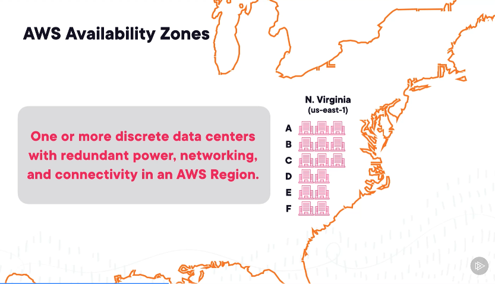

Split of AZ's in a region.

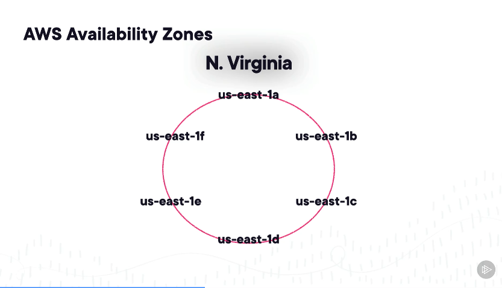

AWS Local zones are local DC's  and they are geographically closer to major cities.
This will also help with data residency restriction.

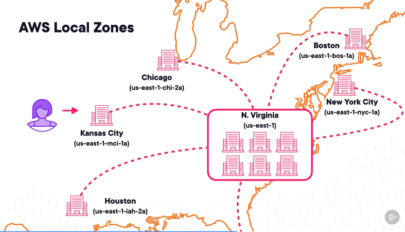

Edge Locations

They are largely owned by telecom companies.
These are used to cache objects in a CDN and provide a shortcut to the AWS network backbone.
There are 1000's of Edge locations at telecom companies around the world.

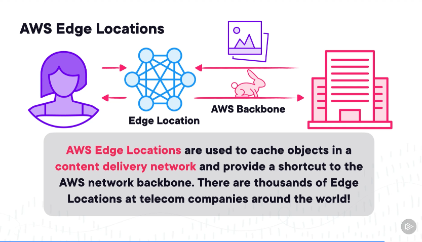

How companies provision Resources.
All AWS resources are contained in an AWS Account.
They are the collection of resources. Different users are given access to the account.
They will be able to spin various resources in this account based on the roles assigned to them.

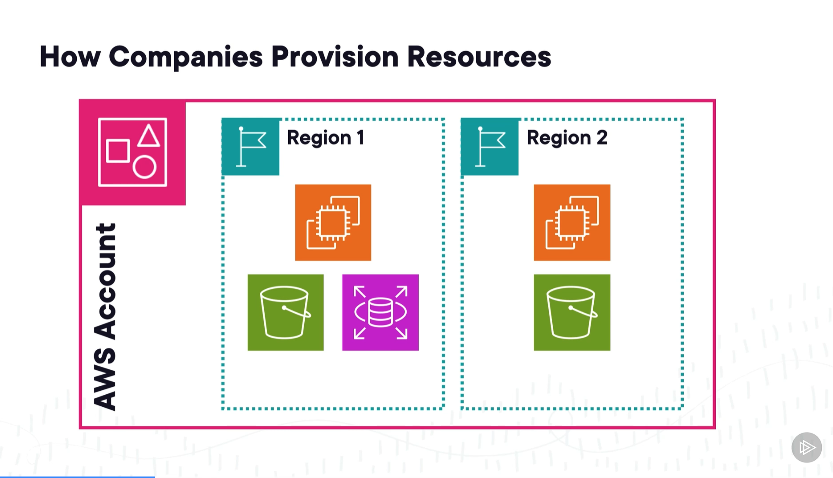

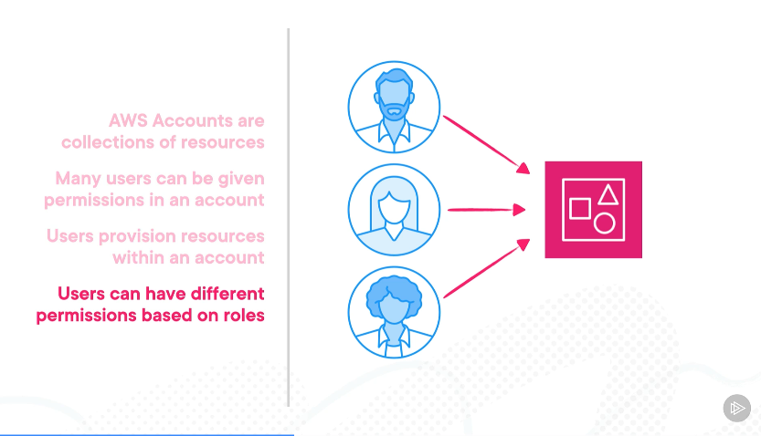

Additionally, an organisation can have multiple AWS accounts and they will be completely distinct and unrelated to each other.
Companies can build and organisation and have multiple AWS accounts. This way, they can have a common billing.

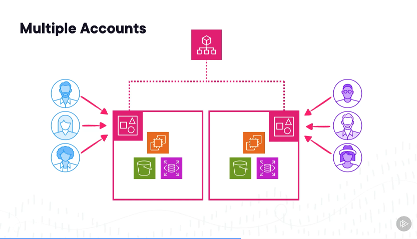

The accounts can be separated based on various needs of the organisation.

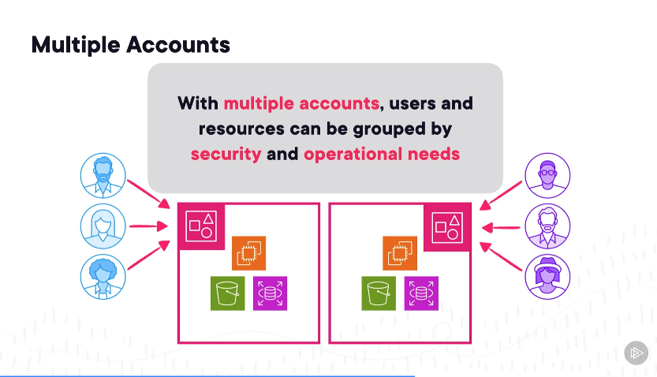

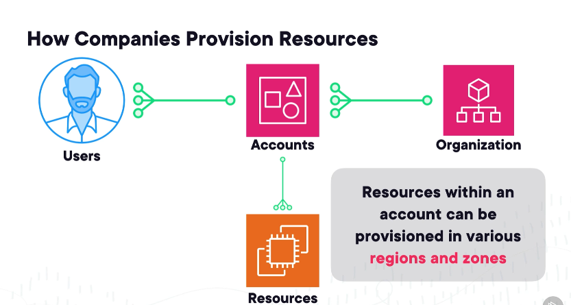

##  Setting up your AWS Account

To set up an AWS account, you can follow these steps:

1. Go to the AWS website (<https://aws.amazon.com/>) and click on "Create an AWS Account."

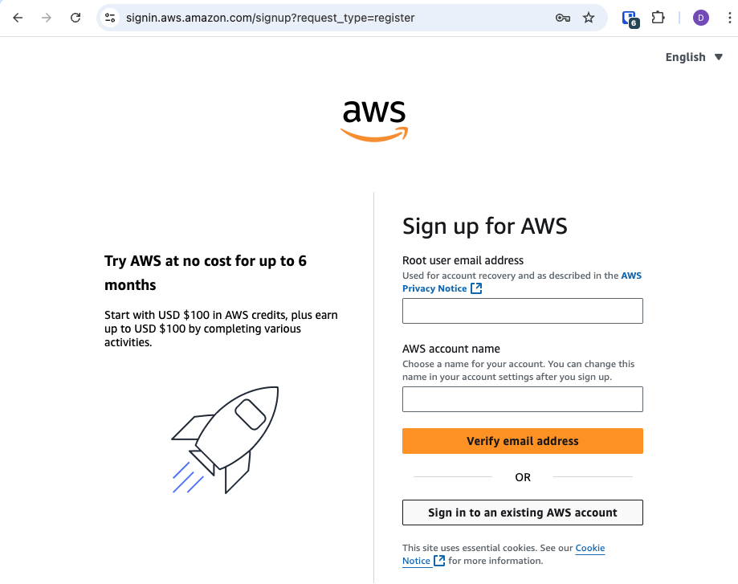

1. Create a root and admin account.

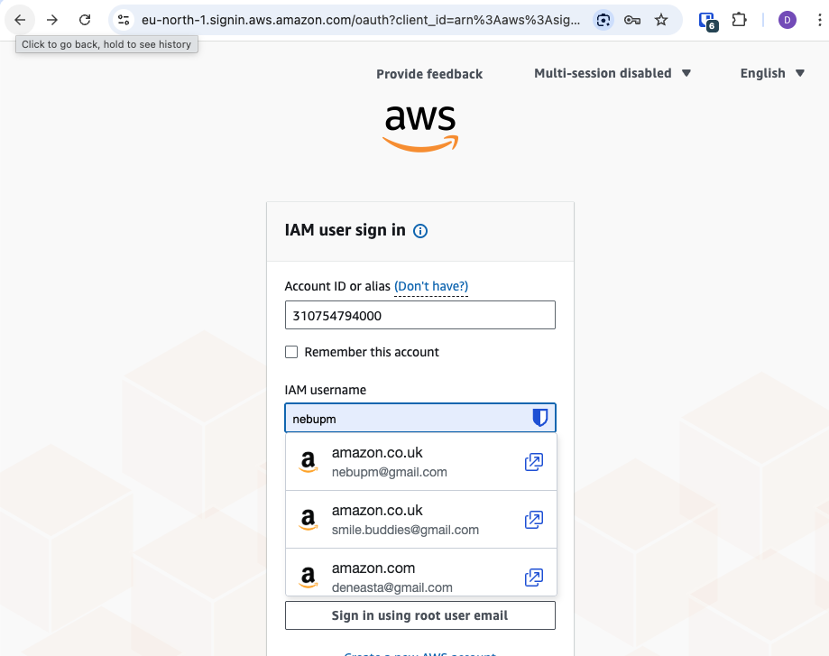

1. Set up billing and payment information.
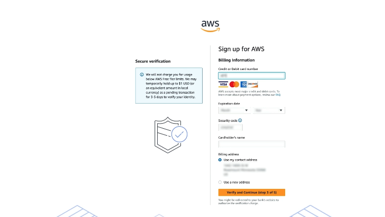

2. Set up IAM users and roles for secure access to your AWS resources.

### Key AWS Services

VPC - Networking
EC2 - VM's
S3 -  Data Storage.

## AWS IAM Fundamentals

AWS Identity and Access Management (IAM) is a service that allows you to manage access to AWS resources securely. With IAM, you can create and manage AWS users and groups, and use permissions to allow or deny their access to AWS resources.

What is an Identity

- Identifies who or what you are
- Allows control of access to AQWS services
- Can be either permanent or temporary.

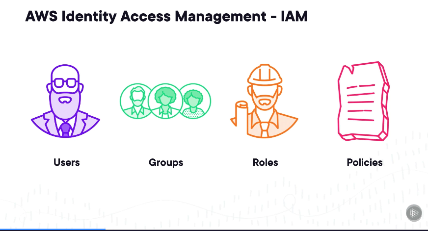

What is the difference betwen Authentication and Authorisation.

Authentication --> Who you are? Using your credentials.
Authorisation --> What you are allowed to do?

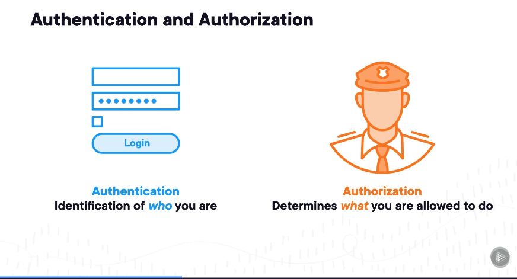

## ARN - Amazon Resource Name

ARN is a unique identifier for AWS resources. It follows a specific format that includes the service, region, account ID, and resource type. ARNs are used to specify resources in IAM policies and API calls.

ARN Format: arn:partition:service:region:account-id:resource-type/resource-id
Example ARN: arn:aws:s3:::my-bucket/my-object

###  Root User

This should be well protected and it has to be well protected. The Auth is controlled by AWS. The password policies etc are decided by AWS.
There is a different link to loging as root user.

###  IAM User

IAM users are created within an AWS account and are used to provide access to AWS resources. Each IAM user has a unique name and can have its own permissions and credentials. IAM users can be assigned to groups, which can simplify the management of permissions.

This user can be used on a daily basis.

### IAM Groups

It is a container for the usre accounts. It is a collection of IAM users. You cannot use a group to login to AWS.
ITs key benefit is ease of administration of users.

###  IAM Policies

IAM policies can be identity or resource based.
Identity based policies are attached to users, groups or roles. They specify what actions the identity can perform on which resources.
Resource based policies are attached to resources and specify who can access the resource and what actions they can perform. Example, controlling the access to S3 objects.

IAM policies are written in JSON format and consist of statements that define the permissions. Each statement includes an effect (allow or deny), an action (the specific AWS service actions), and a resource (the AWS resources to which the permissions apply).

IAM Policy Syntax

Version
Statement

- Effect : allow or Deny
- Action : What action to allow or Deny
- Resource : Which resources???

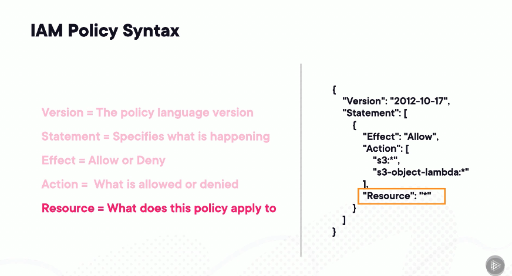

### IAM Roles

Roles allow you to have permissions when you just need it. It lasts as long as you need it and when you need it. Its not a permanent permission.

#### Identity Roles

Allows an IAM user to assume a role and this way gain the permission thats part of the role.

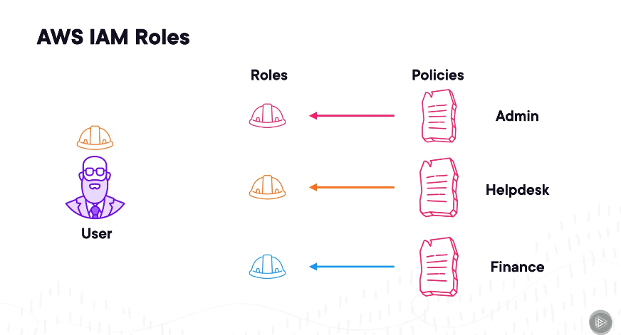

A trust relationship is needed for a role to be assumed by the user.

- User will login to management console with their creds
- The console will will then check the creds with IAM and ensure the login.
- It will then check the permissions and IAM will issue a token to the user with is used to authenticate them with the management console.
- IAM will also check what level of authorisation the user has. This information is also baked into the session token.
- When the user wants to assume a role, it will then pass this token to the STS (Security Token Service).
- STS will  check if the user has the right permissions to assume the role(i.e. trust relationship is already established).
- STS will issue a temporary security creditial in the form of
  - Access key
  - Security access key
  - Temporary Token

IAM roles are temporary and they do not persist.
Some of the key features are

- Permissions are temporary
- Security credentials are temporary
- Wec an access resources in a different AWS account
- Credentials change automatically
- Cannot be managed by groups

#### Service Roles

Service roles allow AWS services to assume a role and perform actions on your behalf. For example, an EC2 instance can assume a service role to access S3 buckets or DynamoDB tables.

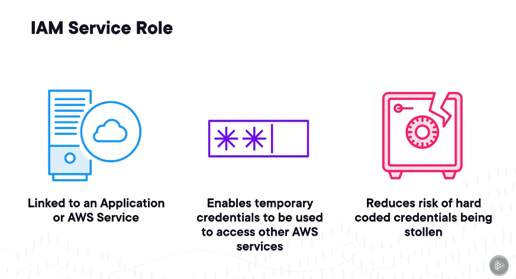

###  IAM Credential Report

It will allow you to download all credentians in a csv format.
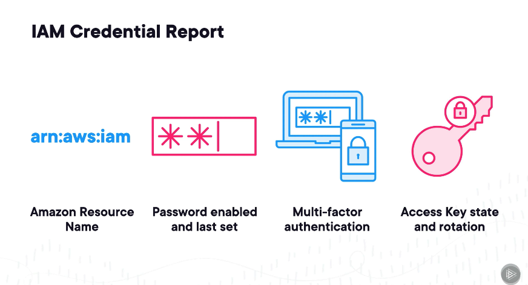

##  AWS Cloudtrail

Monitors actions taken by the yser accounts and roles.

- viewable
- searchabkle
- enables autiting and govrnenace
- 90 days of data by default

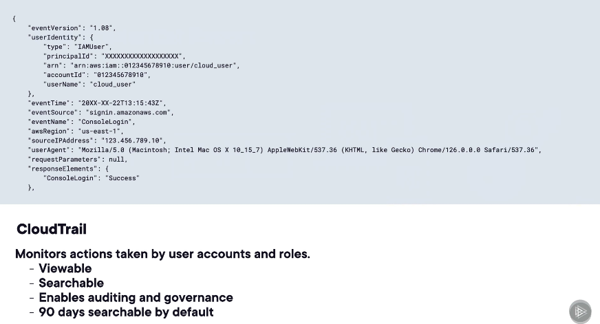

##  AWS Compute

What is an EC2 instance?
It is a virtual machine. It provides on-demand and scalable compute capability. Different size and configuration dependent on instance type.

### EC2 Components

Covers both x86 and ARM architectures.
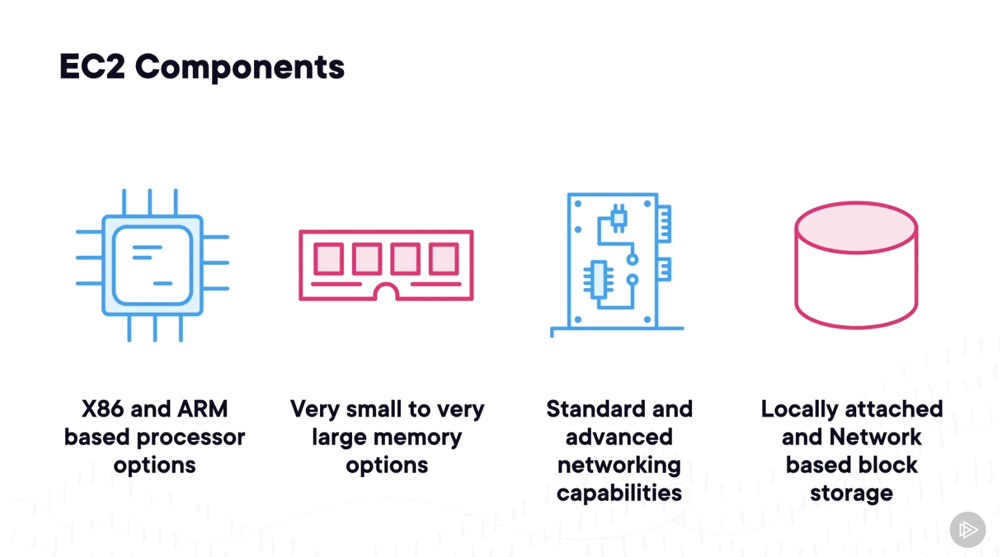

####  EC2 instance Types

##### T-Series - Bursty, low-average CPU

T‑Series instances are EC2 instances designed for workloads that:

- Run most of the time at low CPU usage
- Occasionally need short bursts of high CPU performance

They are called burstable general purpose instances because:

- They provide a baseline level of CPU
- They can burst above that baseline temporarily when needed

Bursting is controlled by CPU credits.
CPU credit basics: 1 CPU credit = 1 vCPU running at 100% for 1 minute

Instances earn credits while below baseline, Instances spend credits while bursting

What happens in practice?

- Idle or light load → credits accumulate
- Sudden spike → credits are consumed
- Long sustained load → credits run out

When credits are exhausted (standard mode), CPU is throttled back to baseline.
In unlimited mode, you can continue to burst beyond your credit balance for an additional charge.

##### M-Series - Balanced, steady workloads

M‑Series instances are EC2 instances designed for general-purpose workloads that require a balance of compute, memory, and networking resources. They are ideal for applications that need consistent performance and can handle a wide variety of workloads.

##### C-Series - Compute optimized, high CPU

C‑Series instances are EC2 instances designed for compute-intensive workloads that require high CPU performance. They are ideal for applications that need a high ratio of CPU to memory, such as batch processing, video encoding, gaming, scientific modeling, and distributed analytics.

##### R-Series (U/X/Z) - Memory optimized, high RAM

R‑Series instances are EC2 instances designed for memory-intensive workloads that require high RAM performance. They are ideal for applications that need a high ratio of memory to CPU, such as in-memory databases, real-time big data analytics, and high-performance computing (HPC) applications.

##### P-Series (P/G/Trn/Inf/DL/F/VT) - GPU optimized, high GPU

P‑Series instances are EC2 instances designed for workloads that require high GPU performance. They are ideal for applications that need to perform complex computations, such as machine learning, artificial intelligence, scientific simulations, and 3D rendering.

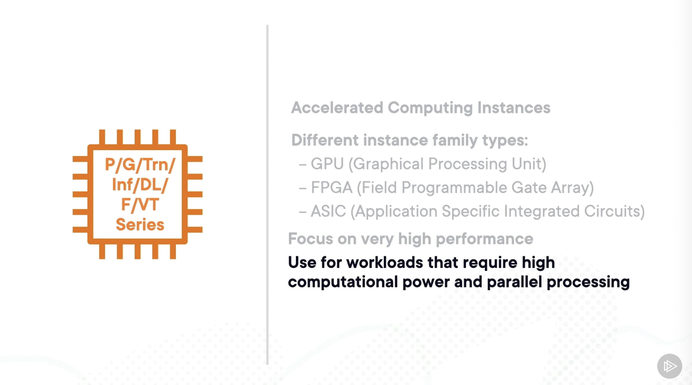

##### L-Series (OL/LS/Lm/D/H) - Storage Optimized Instances

L‑Series instances are EC2 instances designed for workloads that require high storage performance and capacity. They are ideal for applications that need to handle large amounts of data, such as big data analytics, data warehousing, and log processing.

##### Hpc-Series - High performance Compure Optimized

Hpc‑Series instances are EC2 instances designed for high-performance computing (HPC) workloads that require low latency and high throughput. They are ideal for applications that need to perform complex computations, such as scientific simulations, financial modeling, and engineering design.

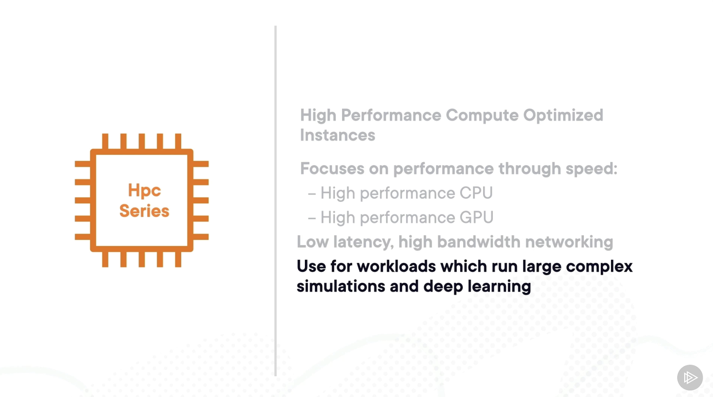

##### Naming Conventions

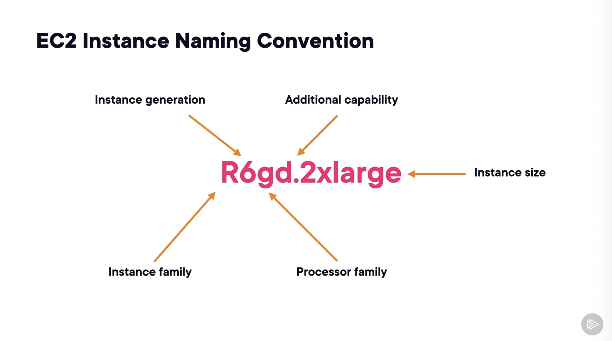

### AMI's - Amazon Machine Images

An Amazon Machine Image (AMI) is a pre-configured template that contains the necessary information to launch an EC2 instance. It includes the operating system, application server, and applications. AMIs can be created by AWS, third-party vendors, or users themselves.

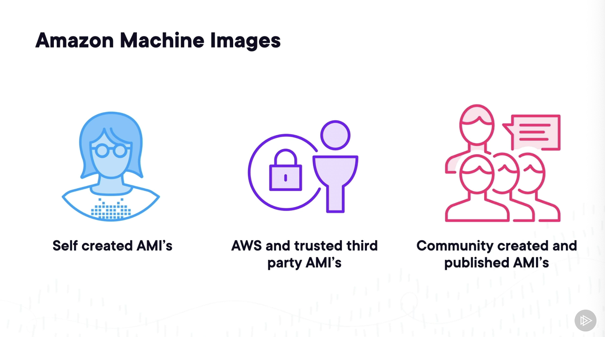

AMI's are Regional. So, it should be pushed to all the regions when needed.

### Creating and Updating EC2 instances

Define your AMI to create your instance
Then choose instance type. Usually the CPU/Mem etc. Then decide the Storage and Networking requirement. Finally, use the security group and keypair to help with the connectivity and access controls.

###  Resizing an EC2 instance

Change the shape of the instance. In order to do this the instance should be in stopped state.

- Stop the instance
- Select the instance and then click on Actions
- Select Instance Settings -> Change instance type.
- Start the server.

### EC2 Snapshots

EC2 snapshots are point-in-time backups of your EC2 instances. They capture the state of your instance, including the operating system, applications, and data. Snapshots can be used for backup and recovery, as well as for creating new instances from existing ones.
Take note of your AZ of the instance.

The snapshot is stored in a safe and secured area in the S3 bucket.

To create a snapshot of an EC2 instance, you can follow these steps:

1. Open the Amazon EC2 console at <https://console.aws.amazon.com/ec2/>.
2. Create Snapshot in the EC2 dashboard.
3. Create Volume from Snapshot. Make sure the AZ is the same as the EC2 instance.
4. This will create a volume.
5. Then attach this new volume to the EC2 instance.
6. Do your restore bit.

#### Disk Details

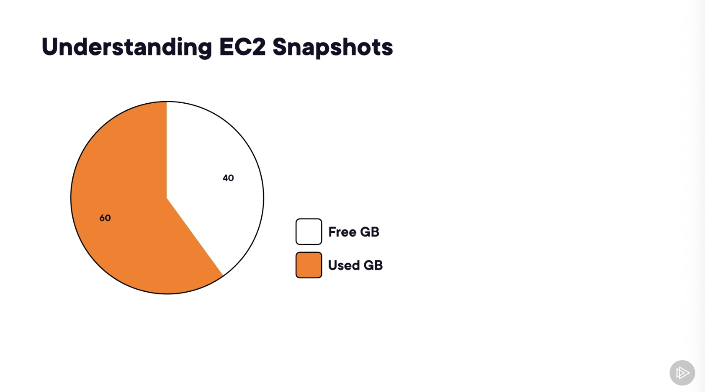

#### Snapshot 1

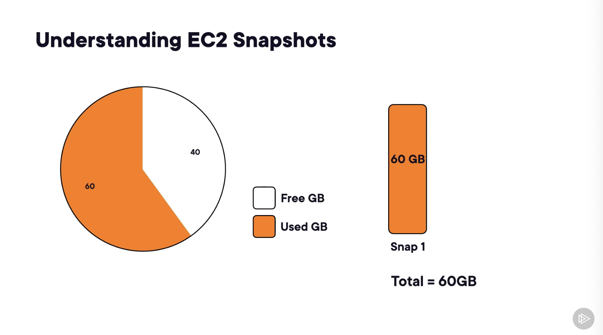

#### Snapshot 2

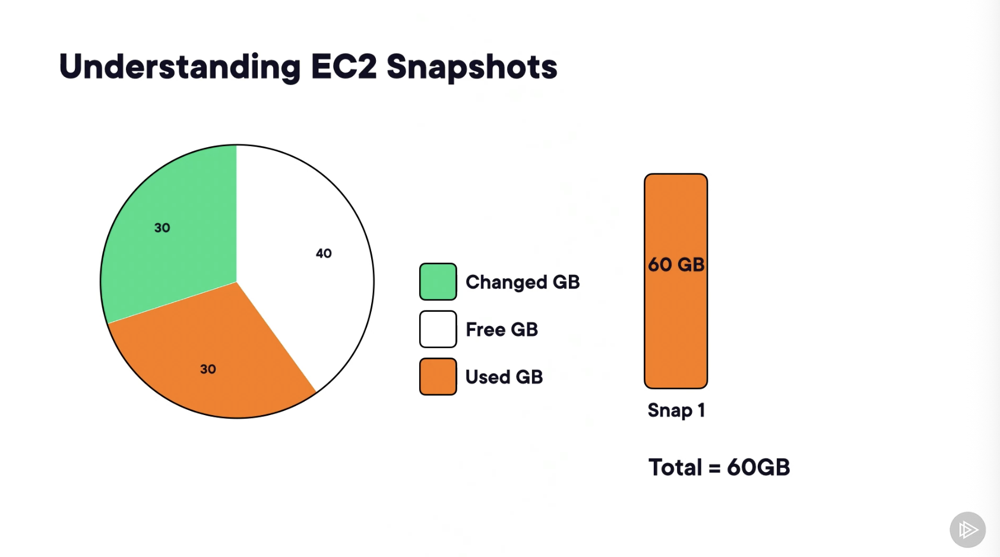
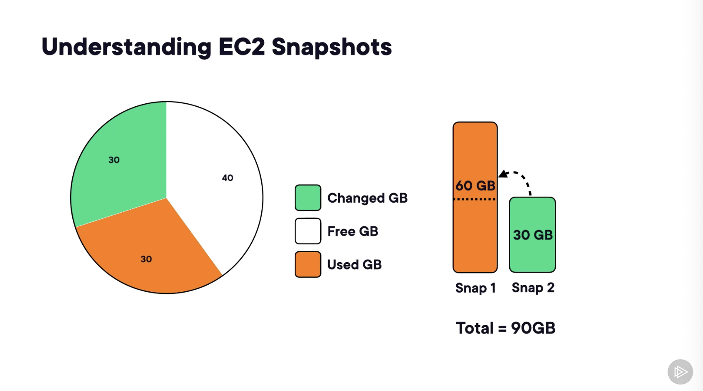

#### Snapshot 3

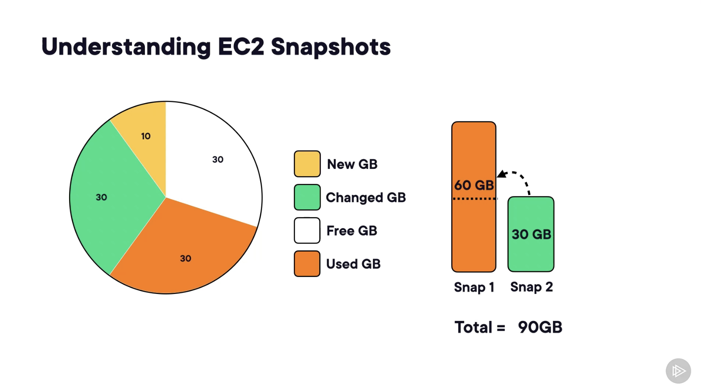

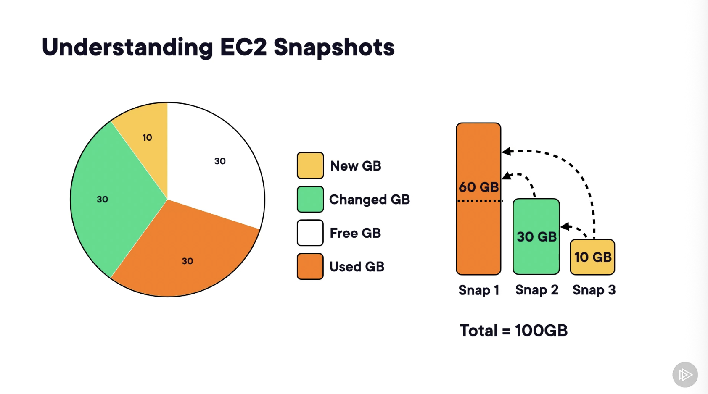

## Containers and Serverless

### What are Containers

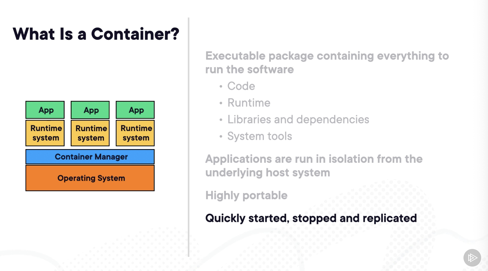

### Containers Vs EC2

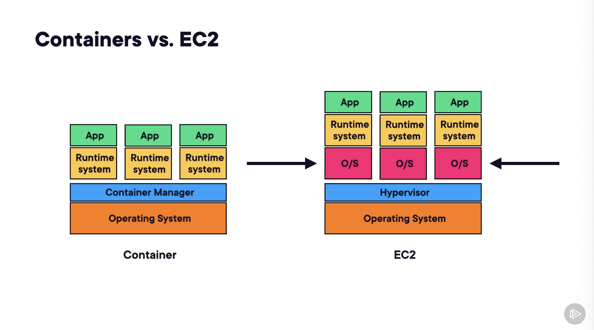

### AWS Container Services

- Elastic Container Service
- Elastic Kubernetes Service
- Fargate : AWS serverless option.
- Elastic Container Registry (fully managed docker container registry)

### AWS Serverless Services

Lambda is a fully managed compute service.
User create functions that responds to events.

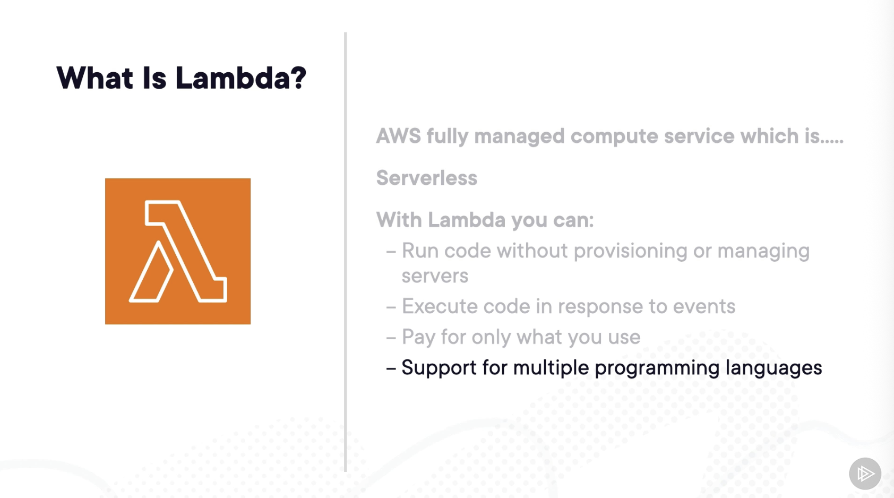

##  EC2 Pricing Model

On-Demand
Savings Plans
Spot Instances
Reserved Instances
    - Standard
    - Convertible
    - Schedule reserved instances
Dedicated Hosts

###  Pricing Considerations

- Instance Type, Size and OS
- Pricing Model
- Region (develop and test in cheaper regions)
- Storage
- Data Transfer
- Networking (Elastic IP's, Endpoints etc)

###  Serverless (Lambda) pricing

- Pay per use
- Billed for requests and duration
- Considerations
  - Architecture : x86 or ARM
  - Memory
  - Ephemeral storage

## AWS Networking

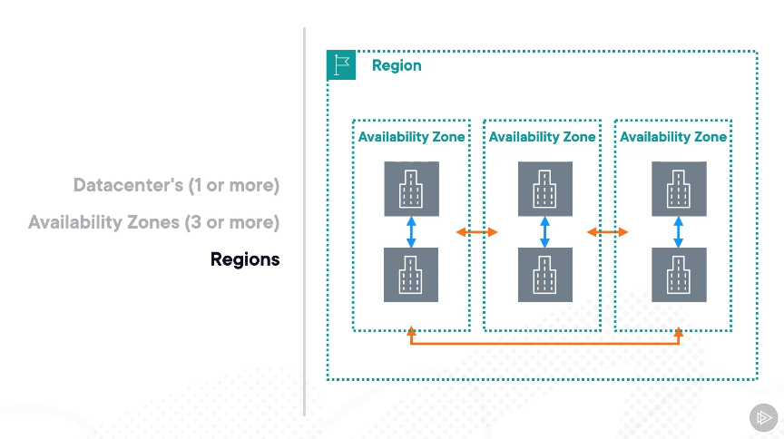

Each AZ is atleast 60 miles apart from each other.

### VPC - Virtual Private Cloud

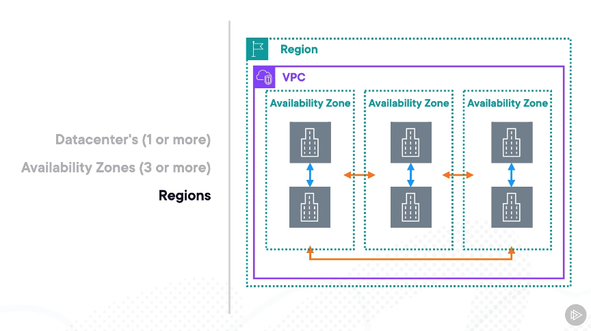

A VPC is a virtual network dedicated to your AWS account. It allows you to launch AWS resources into a virtual network that you've defined. You have complete control over your virtual networking environment, including selection of your own IP address range, creation of subnets, and configuration of route tables and network gateways.

- AWS uses internet gateway to connect to internet.
- an IGW to be created and attached to the VPC.
- A route should be available to the IGW so all the traffic goes into the internet.

#### Direct connect Connectivity

One of the challenges if using IGW is that all the traffic going in and out of the VPC travels over the public internet.
It allows you to have a direct connection between an on premise network and AWS. This can be a direct connect or Hosted connecition (through the network provider).
This reduces congestion and provides security to the connectivity.

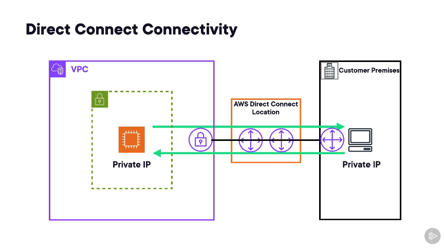

#### Site to Site VPN Connectivity

It is a secure and encrypted connection between an on-premises network and an AWS VPC over the public internet. It allows you to extend your on-premises network to the cloud, enabling secure communication between your on-premises resources and AWS resources.

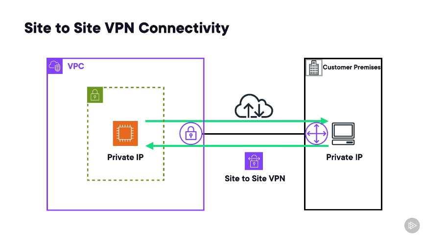

### DNS in AWS

#### Route 53

AWS has a service called Route 53. it provides DNS registration, management and traffic routing.

#### Route 53 Private Resolver

It is a feature of Route 53 serviec. It is a DNS recursive resolution service.
it receives DNS queries from the VPC end points and tries to resolve the DNS query.
the Private resolved service is always assigned VPC IP + 2.
For example if the VPC CIDR is 10.0.0.0/16, then the Private Resolver service is always at 10.0.0.2 ip address.
It is a regional DNS service.

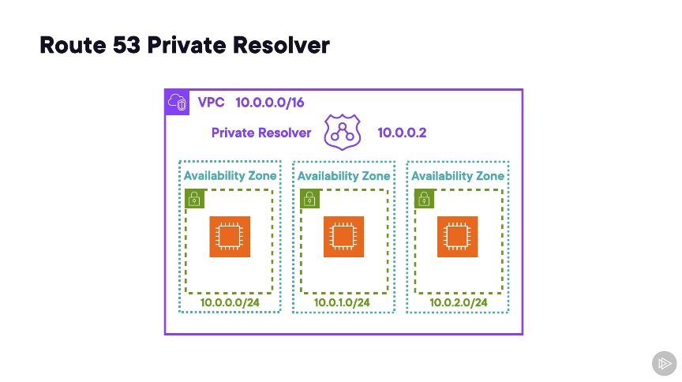

Within the configuration of the VPC there are two attributes.

- enableDnsHostnames : It controls if VPC's support assigning public DNS names for instances with public IP Addresses.
- enableDnsSupport : Controls if the VPC supports DNS resolution through the Amazon Private resolver within the VPC.
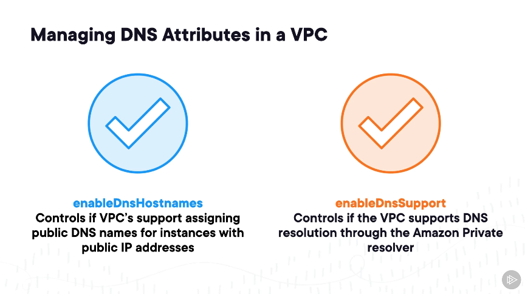

VPC alowablke range is as large as /16 to  as small as /28.
Certain IP's are reserved.

- Network address (first IP)
- Broadcast Address : Last address
- Second IP is for the Router
- Third IP is for the DNS
- Fourth IP is for the future use.

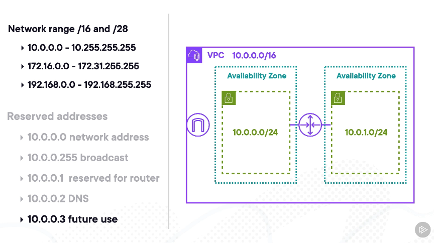

#### Controlling Access within VPC's

#####  NACLS - Network ACL

It is a stateless firewall that controls inbound and outbound traffic at the subnet level. It allows you to set rules that either allow or deny traffic based on source and destination IP addresses, ports, and protocols.

- Allo and Deny Rules
- 5 Tuple rules (Source, Destination, Source Port, Dest Port and Protocol)
- Default and custom NACL's
- All subnets created are automatically associate to the default NACL.
- A subneet can be associate to one NACL at a time.
- Processes Lowest Numbe First.Once a rule is matched, no further rules are processes.

##### Security Groups

It is a stateful firewall that controls inbound and outbound traffic at the instance level. It allows you to set rules that either allow or deny traffic based on source and destination IP addresses, ports, and protocols.

- Works on implicit Deny.
- So, we always add allow rules.
- Security groups can be aggregated.

## Data Transfer Costs

Data transfer costs can be a significant part of your AWS bill, especially if you have applications that transfer large amounts of data in and out of AWS. Here are some key points to consider about data transfer costs:

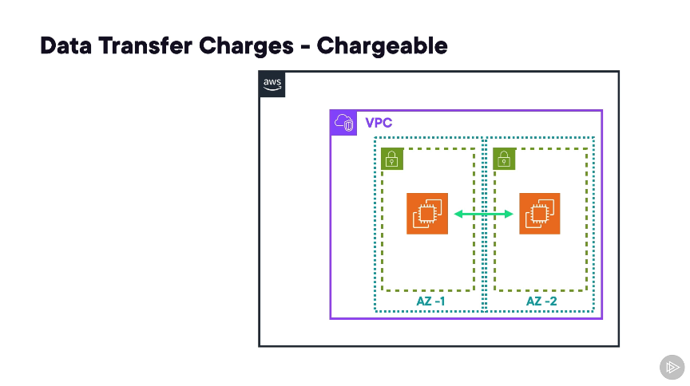

- Data transfer between AWS services within the same region is generally free.
- Data transfer between different AWS regions is charged based on the amount of data transferred and the source and destination regions.
- Data transfer to and from the internet is charged based on the amount of data transferred and the source and destination.
- Data transfer between VPCs in the same region is charged based on the amount of data transferred and the source and destination VPCs.
- Data transfer between VPCs in different regions is charged based on the amount of data transferred and the source and destination regions.
-

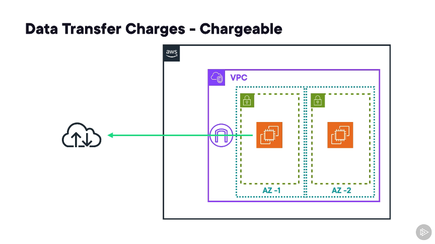

Free when between EC2 instances in the same AZ.
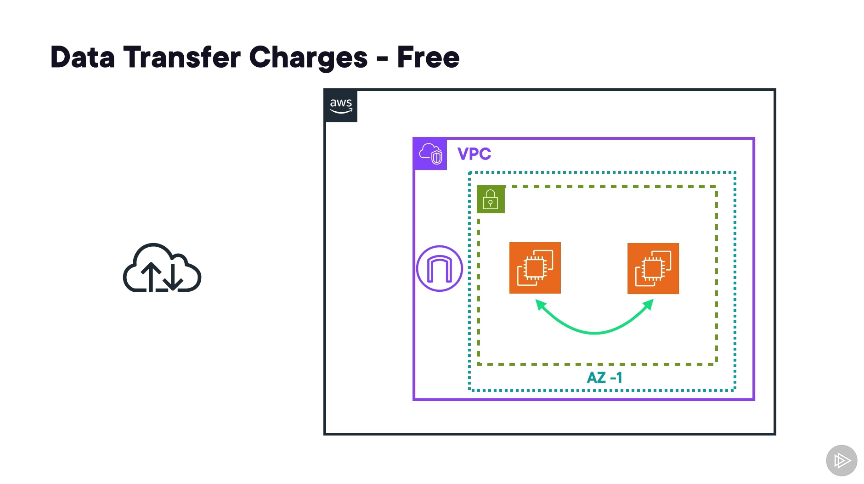

## AWS Storage

### EBS - Elastic Block Storage

EBS is a block-level storage service that provides persistent storage for EC2 instances. It allows you to create volumes and attach them to your EC2 instances, providing durable and high-performance storage for your applications.

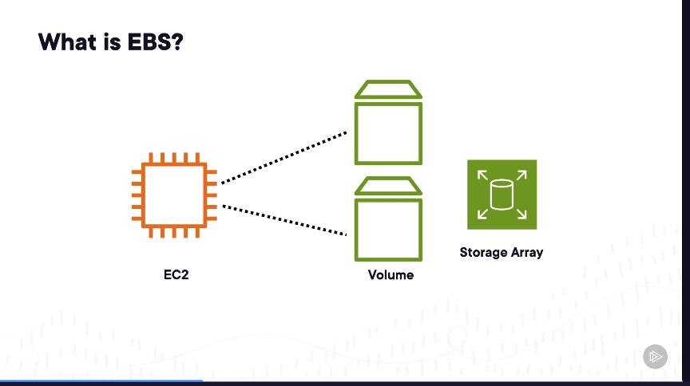

| Multiple EC2 instances can attach to a single volume using Multi-Attach.

#### EBS Types

- SSD
- HDD
- Instance Storage

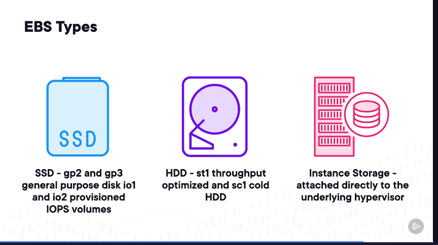

#####  General purpose SSD's

it comes in two offerrings gp2 and gp3.
gp3 allows us to configure IOPS.
They are good for boot drives, general FS, small to medium sized DB's.

#####  Provisioned IOPS io1 and io2

They are good for large DB's and latency sensitive applications.
They can be expensive(io2).

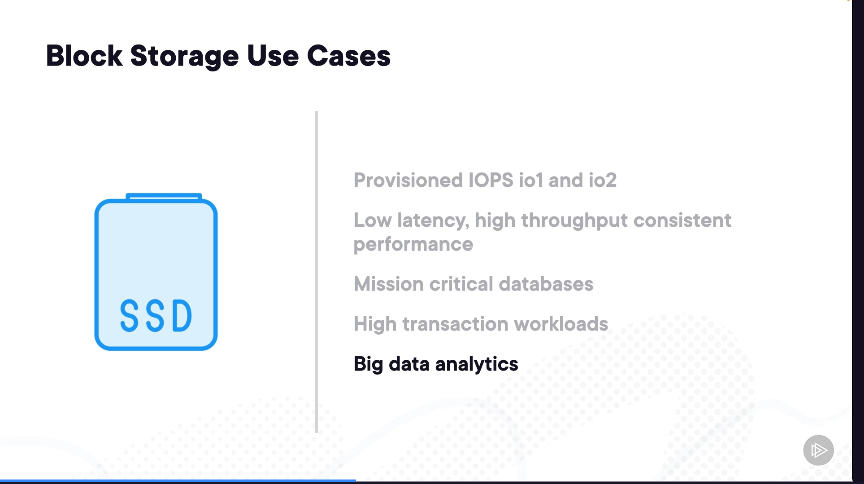

#####  Throughput Optimised st1

Read and write intensive worlkoads which do no need high IOPS or low latency.
It is good for big data, log processing and data warehousing, Sequential data processing, Streaming workloads.

#####  Cold HDD sc1

Infrequently accessed data with low cost and low performance requirements.
Long term archive.

##### Instance Store (Ephemeral Storage)

Temp storage where data loss is acceptable. Cacje drove fpr wprloads.

### EFS - Elastic File system

Supports Linux not Windows. highly scalable, available and durable.
Regional or One Zone redundancy.
Communication is throuhg NFS protocol only. No SMB is supported.

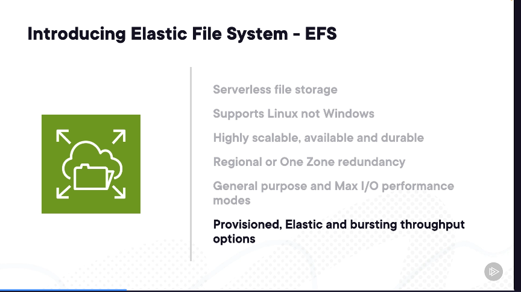

#### EFS Storage Classes

This is configured using life-cycle management.

- Standard : Lowest level latency
- Infrequent Access : Slow amd cheap.
- Archive

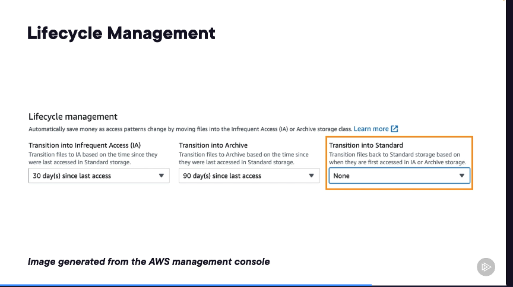

Use cases

Web and content management
Application development
Big Data and Analytics
Container Storage
Content Distribution
Migration (staging area for migration)

### S3 - Simple Storage Service

S3 is an object storage service that provides scalable and durable storage for a wide range of use cases, including backup and restore, archiving, big data analytics, and content distribution. It allows you to store and retrieve any amount of data from anywhere on the web.

It stores the object as a flat file. i.e with no directory structure.
These are infinitely scalable.
Pay as you go Pricing.
Highly durable and available.
Highly accessible.

####  S3 Tiering Options

- S3 Standard : General purpose storage for frequently accessed data.
- S3 One Zone-IA : For infrequently accessed data that does not require multiple Availability Zone resilience.
- S3 Standard-IA (Infrequent Access) : For data that is accessed less frequently but requires rapid access when needed.
- S3 Glacier : For data archiving and long-term backup with retrieval times ranging from minutes to hours.
- S3 Glacier Deep Archive : For long-term data archiving with retrieval times of 12 hours or more.
- S3 Intelligent Tiering : Automatically moves data to the most cost-effective access tier based on usage patterns.

#### S3 pricing

Storage Class : Storage costs based on the amount of data stored and the storage class.

Data transfer costs based on the amount of data transferred in and out of S3.

Requests : Put/Copy/Delete/Get/List reuqests

Data Retrieval

Replication cost.

#### S3 Static Websire Hosting

S3 can be used to host static websites. It is a cost effective solution for hosting static content such as HTML, CSS, JavaScript, and images. You can configure your S3 bucket to serve as a static website and use Amazon Route 53 to route traffic to your website.

#### S3 Lifecycle Rules

S3 lifecycle rules allow you to automate the transition of objects between different storage classes and the expiration of objects based on specified criteria. This can help you optimize costs and manage your data more efficiently.

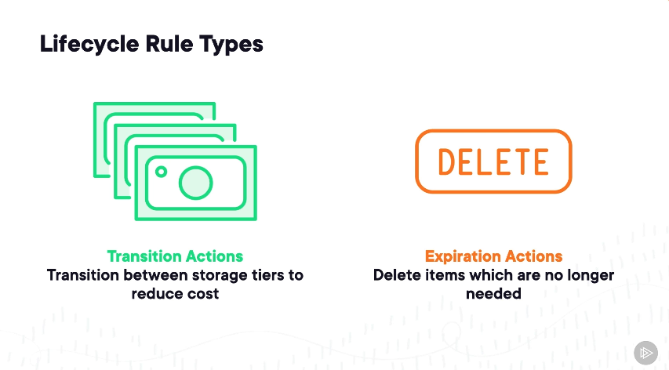

#### S3 Replication

S3 replication allows you to automatically replicate objects from one S3 bucket to another bucket in the same or different AWS region. This can help you improve data durability, availability, and disaster recovery.

## AWS Database Fundamentals

Amazon RDS (Relational Database Services).

- MySQL
- PostgreSQL
- MariaDB
- OracleBYOL
- SQL Server

NoSQL DB's

Graph style databases
Document Store
Key-Value Database (Dynamo DB)
  Primary Key (Primary Key and Sort Key) and Attributes(properties)

### Amazon Aurora

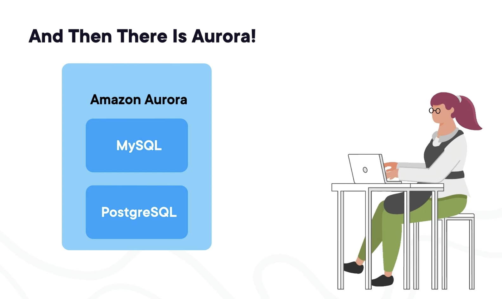

Made up of MySQL and PostgreSQL.

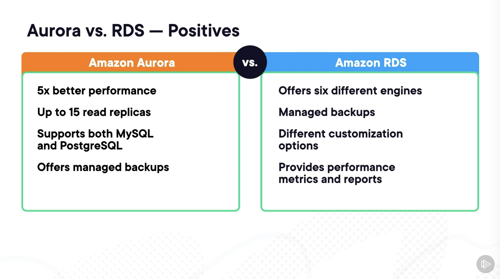

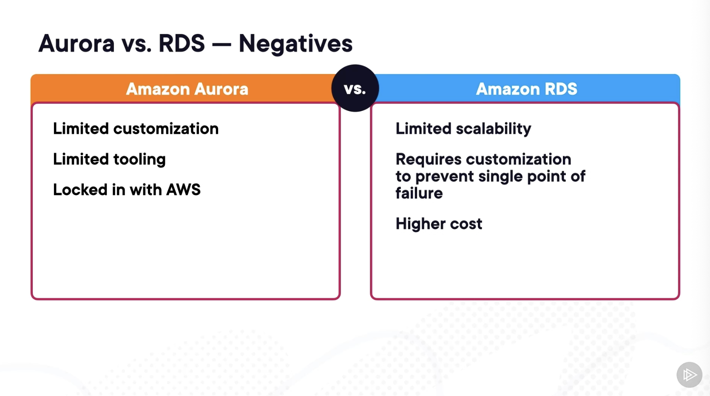

## AWS Monitoring

Cloudwatch enabled service

- Compute
- Storage and Contrent Delivery
- Database and Analytics
- Additional services.

### What is Cloudwatch

CloudWatch is a monitoring and observability service provided by AWS that allows you to collect, analyze, and visualize metrics, logs, and events from your AWS resources and applications. It helps you gain insights into the performance and health of your applications and infrastructure.

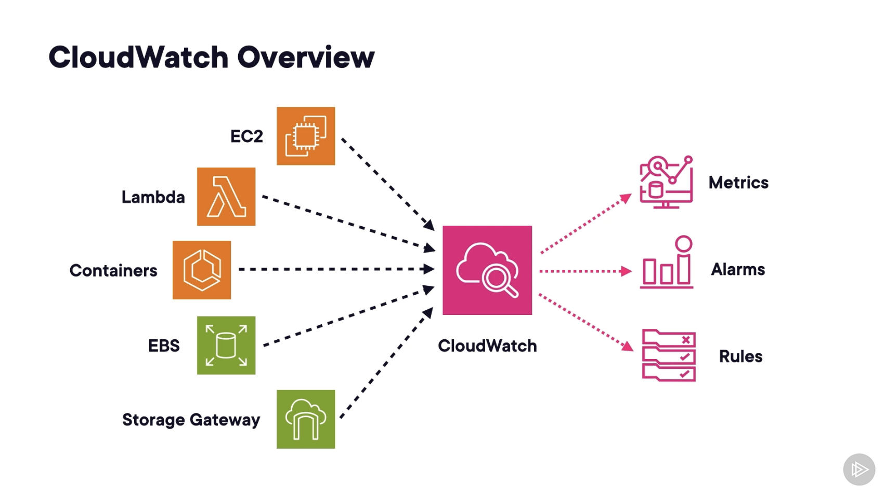

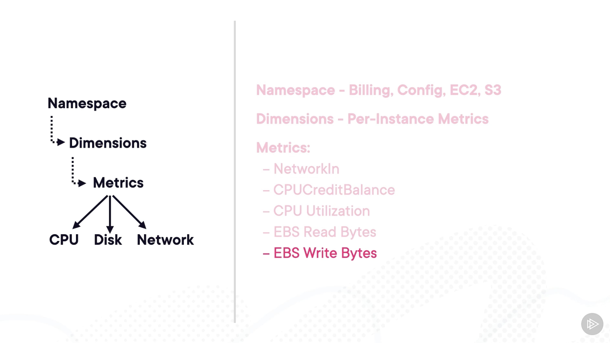

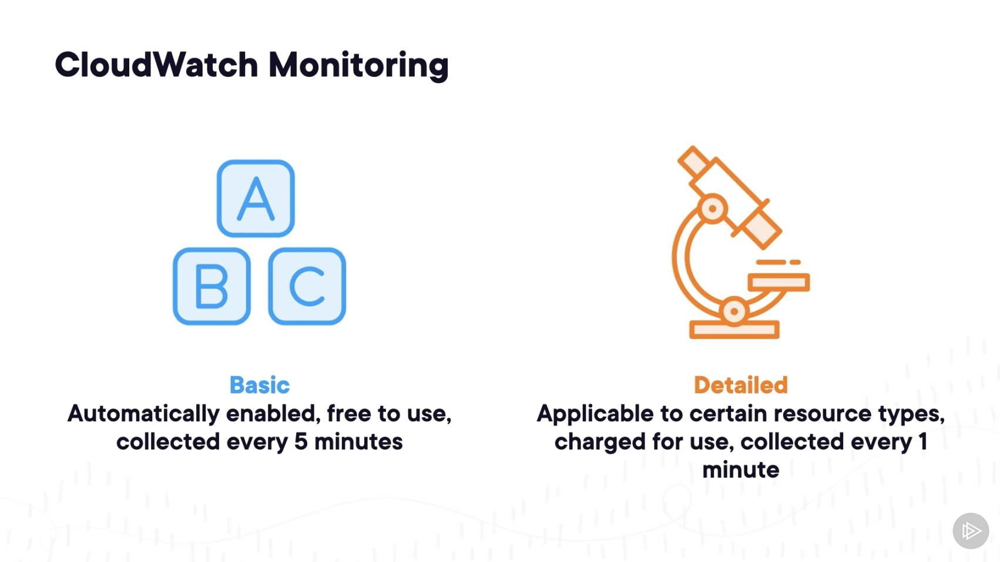

#### CloudWatch Agent

The CloudWatch Agent is a software component that you can install on your EC2 instances or on-premises servers to collect additional system-level metrics and logs. It allows you to monitor the performance and health of your instances and applications in more detail.

#### Cloudwatch Alarms

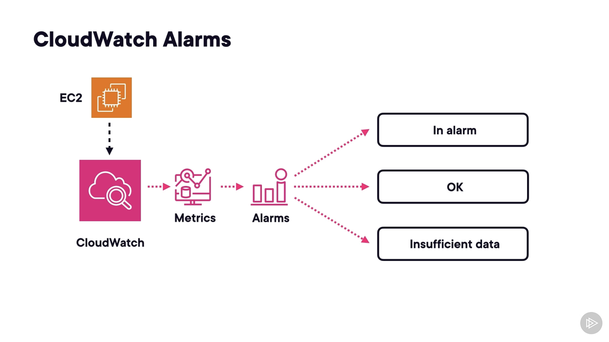

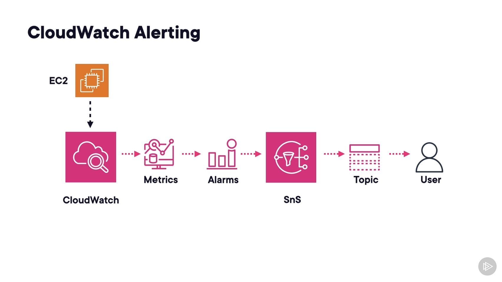

## AWS Security and Compliance

AWS MFA : Multi Factor Authentication
AWS IAM
VPN : Helps secure the connectivity in open wifi world.
DDos : AWS Sheild will provide DDoS protection

### GRC: Governance, Risk and Compliance

AWS has a shared responsibility model for security and compliance. AWS is responsible for the security of the cloud infrastructure, while customers are responsible for the security of their applications and data in the cloud.

### AWS Security Tools

#### AWS Shield

provides DDos protection service.
Standard(Free) and Advanced(paid) mode.

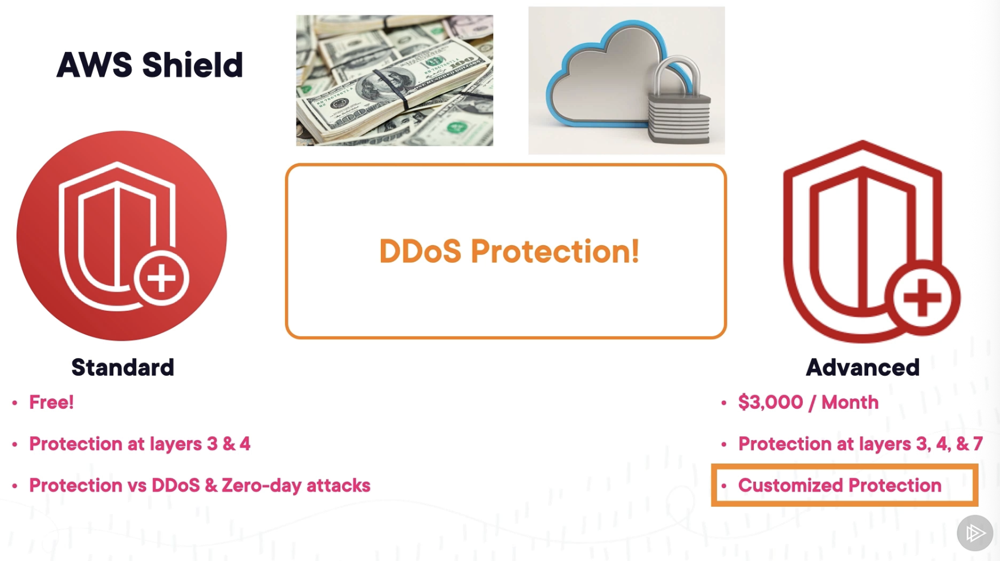

#### AWS Guardduty

It is a threat detection service that continuously monitors for malicious activity and unauthorized behavior to protect your AWS accounts and workloads.

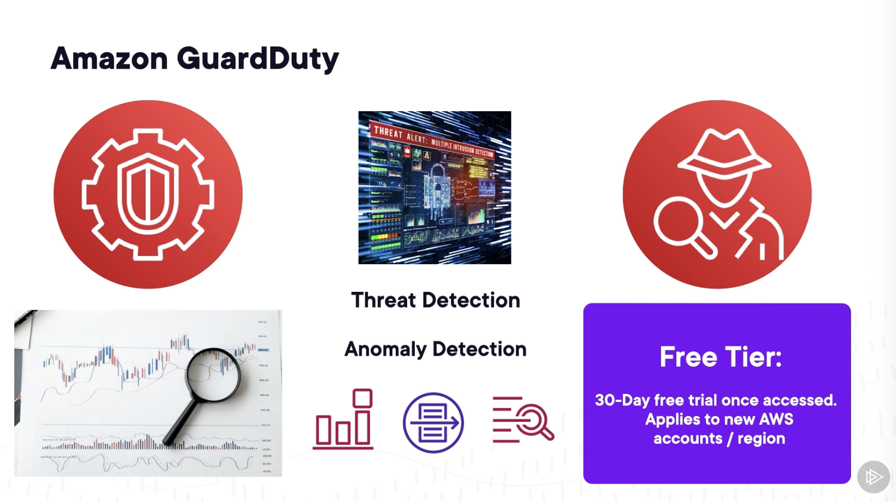

#### AWS Secrets Manager

It is a service that helps you protect access to your applications, services, and IT resources without the upfront cost and complexity of managing your own hardware security module (HSM) infrastructure. It enables you to easily rotate, manage, and retrieve database credentials, API keys, and other secrets throughout their lifecycle.

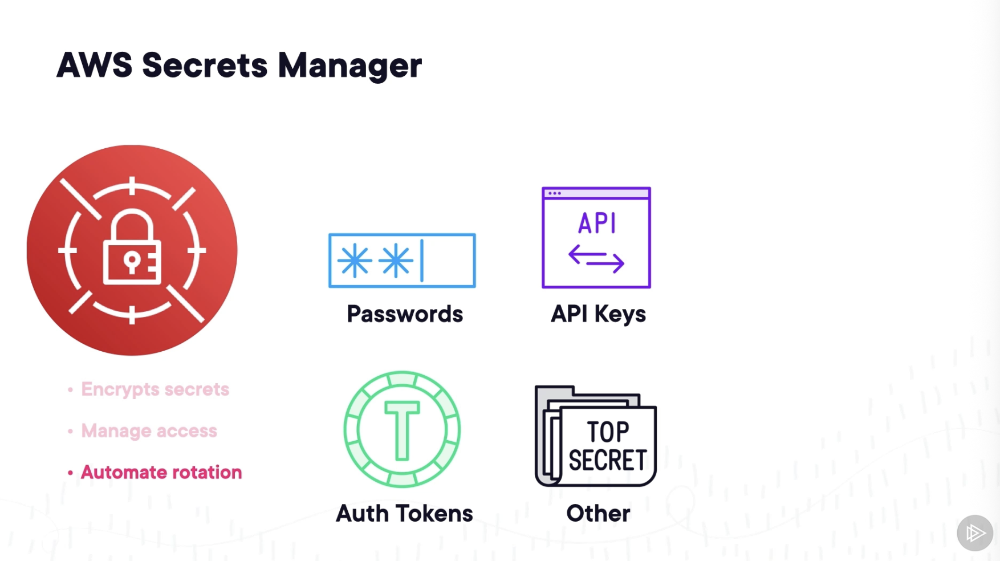

### AWS Auditing Tools

#### AWS Cloudwatch

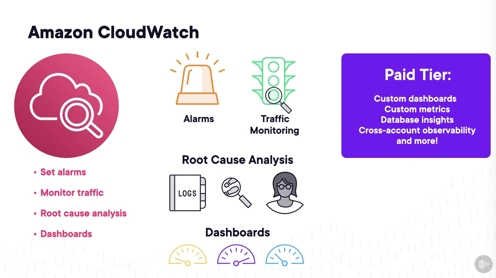

#### AWS Cloudtrail

It is a service that enables governance, compliance, operational auditing, and risk auditing of your AWS account. With CloudTrail, you can log, continuously monitor, and retain account activity related to actions across your AWS infrastructure.

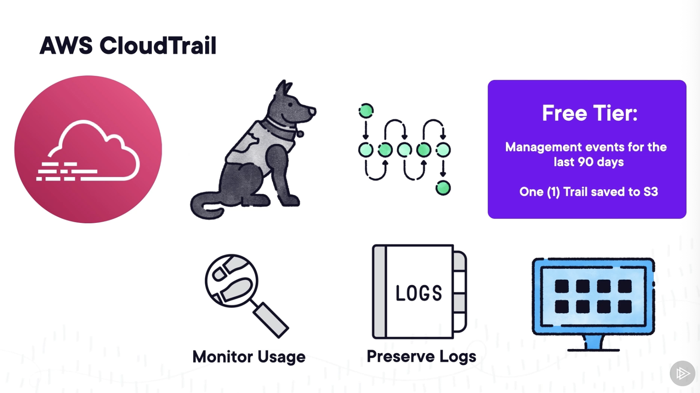

#### AWS Audit manager

It is a service that helps you continuously audit your AWS usage to simplify how you assess risk and compliance with regulations and industry standards. It automates evidence collection to reduce manual effort and provides pre-built frameworks to help you get started quickly.

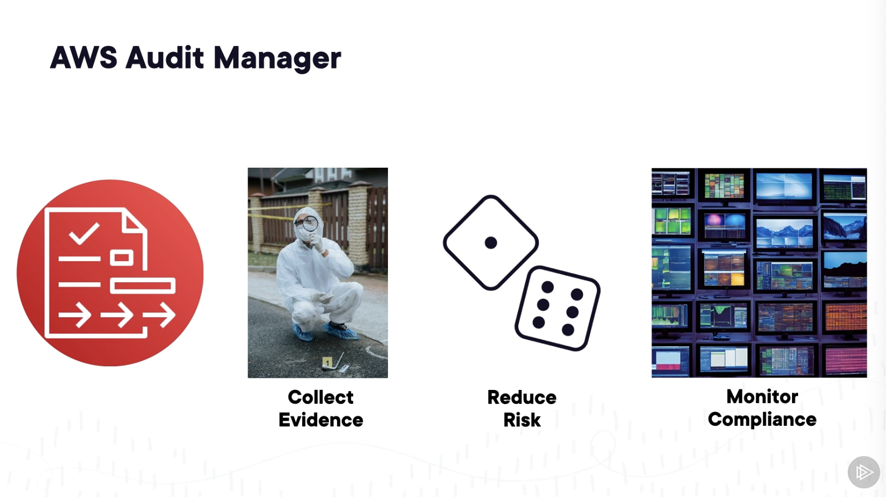

### Amazon Sagemaker

A fully manager service for developers and data scientists. It enables users to prepare, build, traing, tunbe and deploy ML models from scratch.,
It supports supervised, unsupervised, reinforcement and deep learning.
