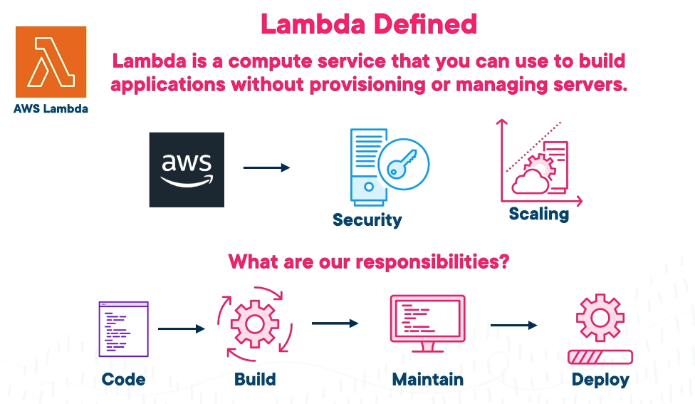
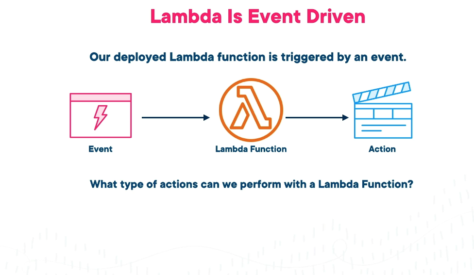
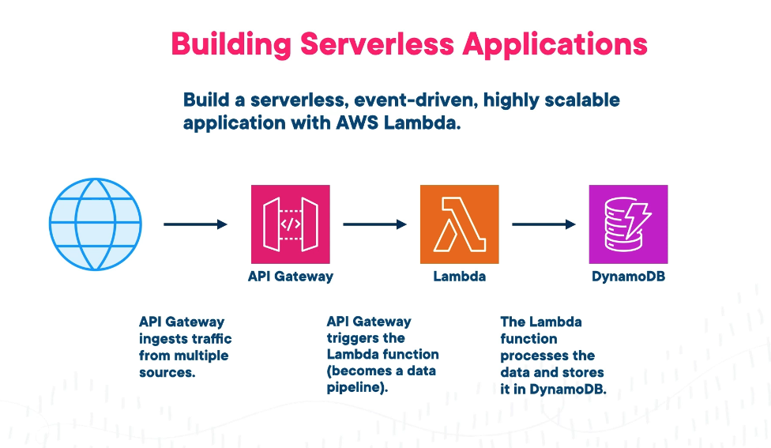
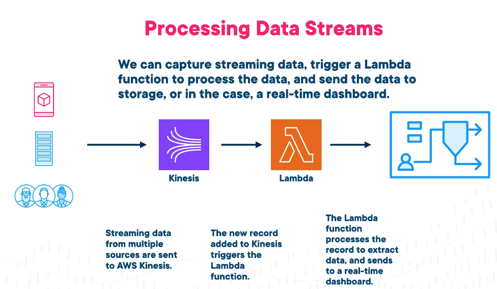
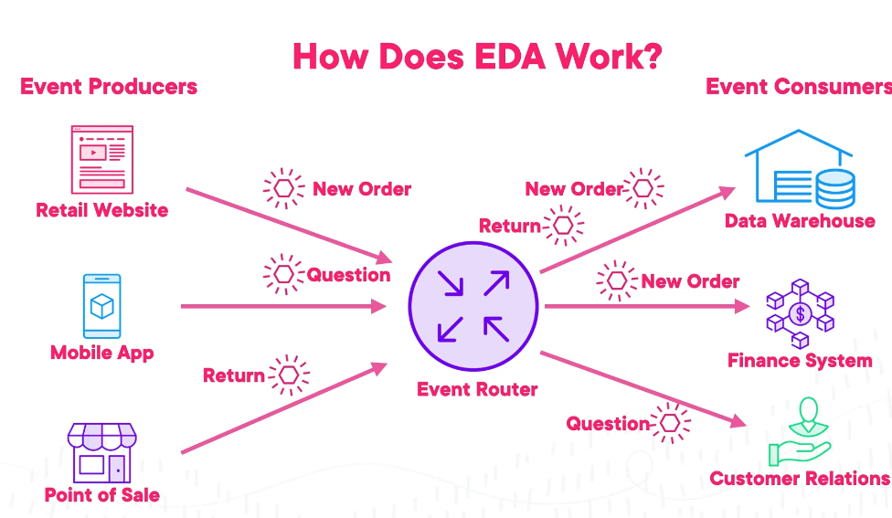
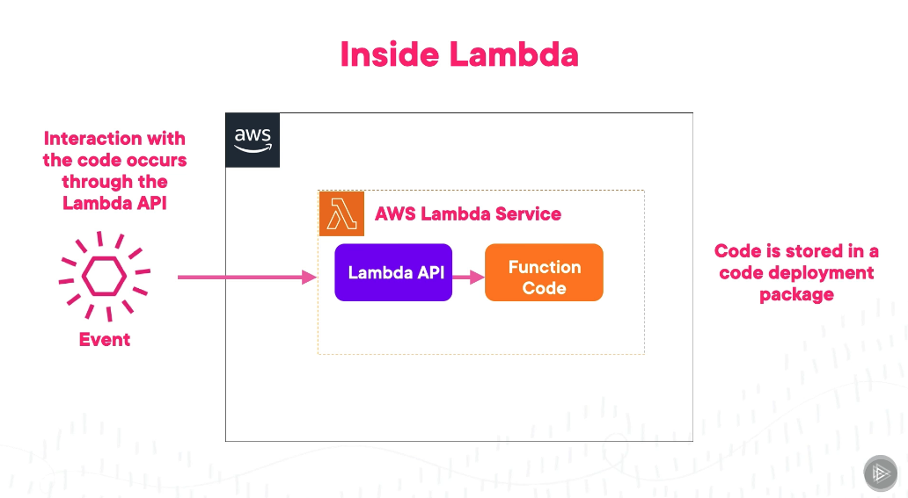
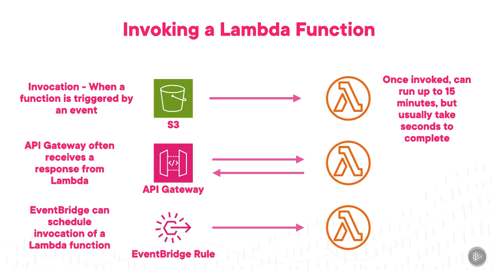
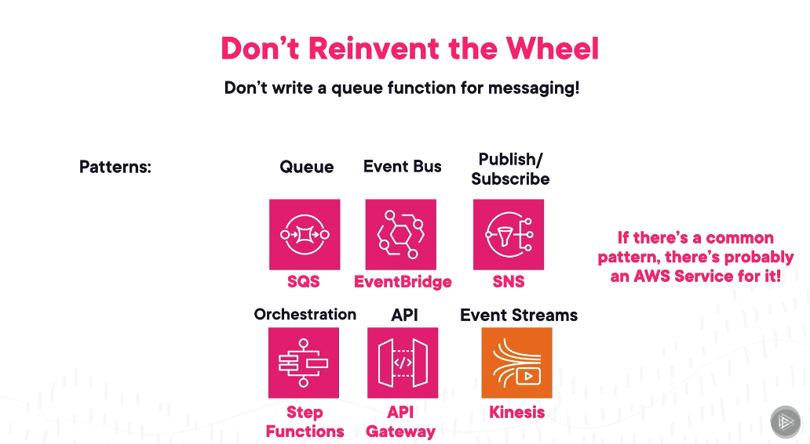
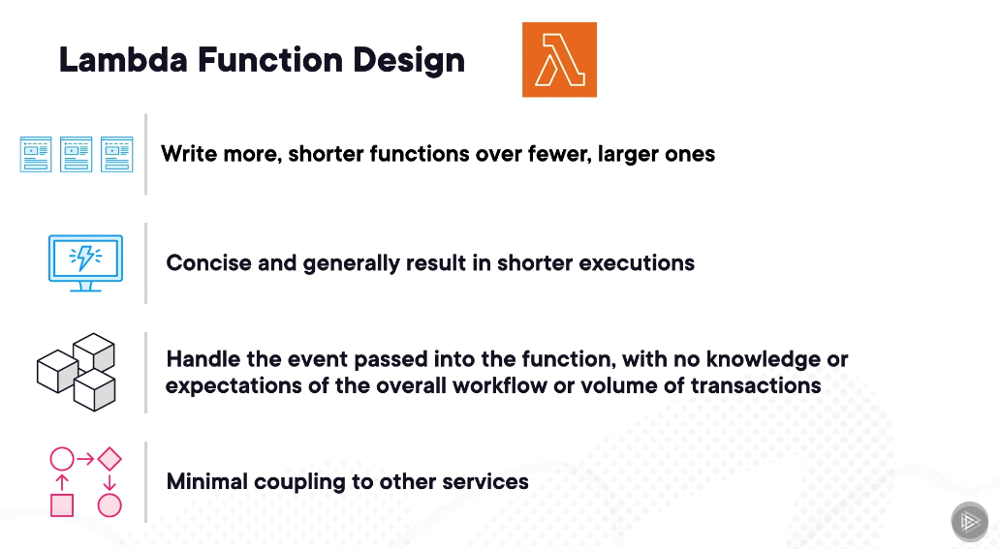

# Why Lambda?

## Introduction to Lambda

What is AWS Lambda.
A uses dont need to worry about the EC2 instances. They just need to worry about lambda service,

This is a compute settice that we can use ti build apps without provisioning or managing servers.\

Lambda is Event Driven.
A deployed lambda functiuon sis triggerred by an event
What tume of actions can we perform with a lambda function.

We can

- run a cronjob
- Update a DB
- Chain multiple API;s and get a needed result.

## Compare EC2 and Lambda

### EC2 Instance

EC2 is a cloud computing service to propvide VM's called instnces.
We are able to decide

- Shape of the instance
- Local Storage
- Local network
WS offers over 750 EC2 instance types.
There are 5 compute types
Compute optimised
Memory optimised
Storage optimised
General Purpose
Accelerated Computing

EC2 usage and costs
They are generally intended for long term operations that can last years.

### Lambda

Lambda function are for short term or very short term. 
This lasts the lifeccle of the function.

AWS manages all aspects of the infra.
Pey per execution.
Always avallable.
User has to have IAM roles. AWS will take care of the hardware
Function code is the only dependency.
Scales dynamically and automatically by AWS.

## Different use cases thats relevant to Lambda

- File Processing : Upload a photo to S3 bucket.
- Mobile and Web App development
- Automate Backups
- Operate serverless websites
- Data Analytics
  
Event Drien Functions.
we have a photo sharing app. Lambda can be used to resize the image.
We can use Lambda to automate backups. We can trigger a lambda function to backup our data every day at 1 am. 
We can also use it to operate serverless websites. We can use Lambda to serve our website content without having to manage any servers.

We can also use it for data analytics. We can use Lambda to process and analyze large amounts of data in real-time.

## LAmbda function Architecture

It has 3 key components.

- Lambda Handler
- Lambda Event Object
- Lambda Context Object

Lambda Handler is the main function that gets executed when the Lambda function is invoked. It is the entry point for the Lambda function.

Event driven architeure
it has 3 components

- Event Producer : Publishes an event to a router. It doesnt case about the consumer.
- Event Router : Can receive multiple events. Its duty is to filter and put them to the relevant comsumers.
- Event Consumers

## EDA - Event Driven Architecture

Scalability
Flexibility
Fault Tolerance
Extensibility

Event Producers --> Event Router --> Event Consumer

### Inside LAmbda

AWS Lambda Service is same as Event Router.
Event Producers can be S3, API Gateway, DynamoDB, etc.
Event Consumers can be Lambda functions, Step Functions, etc.

Examples:

### Design patterns

We have have following design patterns.

#### lambda Function design standards

