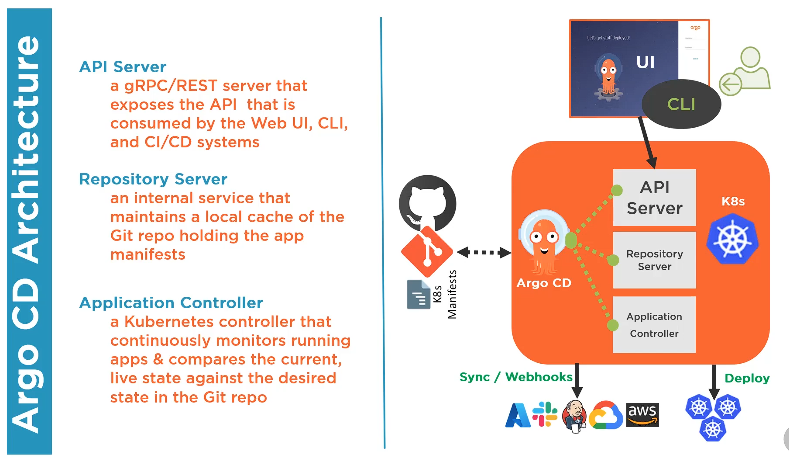
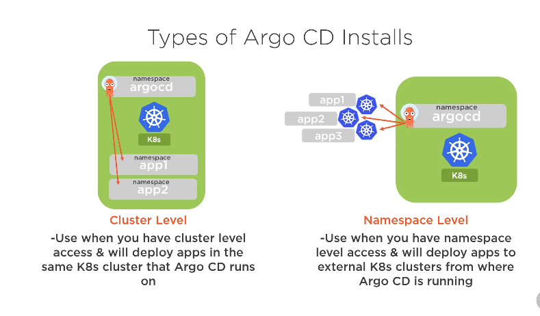

# Argo Continuous Development

## Introduction

Argo Continuous Development (Argo CD) is a declarative, GitOps continuous delivery tool for Kubernetes. It allows you to manage your applications and infrastructure as code, ensuring that your desired state is always in sync with the actual state of your cluster.

- HELM is a package manager for K8s. It is a deployment tool for automating creating, packaging, configuration and deployment of apps and configuration to K8s clusters.

- Kustomize : This is a standalone tool to customisze the creation of K8s objects through a file called kustomization.yaml. This is a template free wat to customise application configuration taht is built into kubectl.

## GitOps Core Concepts

### What is GitOps

It is an operating model pattern for CNA and K8s, storing application and declarative infrastructure code in Git as the source of truth used to automated Continuous delivery.

Describe everything: Code, config, monitoring and Policy and then keep it in version control.
One should be able to compare desired with actual state to fire diff alerts.
Make operational changes by pull requests.

### Principles

- Git is the source of truth for entire system
- Desired system state is versioned in Git
- System state is described declaratively
- Git as the single place for operations (Create, Change, Delete)
- Autonomous agents enforce desired state and alert on drift (Argo CD is an example)
- Automated delivey of approved system state changes
  
### Three pillars of GitOps

#### Pipelines

    CI, CD and Release Automation
    Git as source of truth

Structure of GitOps Repo

- 1 repo per application/service
- Use a separate branch per env(this will map to a K8s namespace or cluster)
- push changes such as changin image name, health checks etc to staging/feature branch first.
- Rolling out to prodution involves a merge. Use git merge -s ours branchname. This is to skip staging only changes
- use protected branches to enfore code review requirements.

Deployment Operator : Weave Flux.

#### Observability

- Monitoring
- Logging
- Tracing and Visualisation

Holistic view of the real system state right now.
Observability driven deployment: Never accept a pull request if you dont have a way to verify that it does what its supposed to.

#### Control

- Everything via Git (Updates, policy, security)
- Orchestration
- Diff and Sync

Automation is Convergence.

### GitOps Architecture Components

1. Source Control System
2. Git Repo
3. Container/Helm Registry
4. Operator : Flux or ArgoCD or Kubectl or Terraform K8s provider etc
5. Runtime Environment
   1. One K8s cluster, multiple namespaces
   2. One K8s cluster per env i.e. dev, stage, prod
6. Namespaces
   1. per environment
   2. per service or app
   3. per build etc

Use cases for GitOps

- CNI App management
- Service Rollouts
- Infrastructure management, k8s cluster, fleets, microservices etc.

### GitOps Operators

- Argo CD
- Flux
- Kubestack : uses terraform at the core
- Jenkins X
- Atlantis (Terraform based)

## Overview of Argo CD

- Argo Worflows : Workflow engine for orchestrating parallel jobs in K8s
- Argo CD : Declarative, CD gitops opertor for K8s
- Argo Rollouts : Provides advanced deployment capabilities such as bule-green, canary and canary analysis
- Argo Events: Event driven workflow automation framework for K8s

### Components in Atgo CD

1. API Server : it is a rRPC or rest server that exposes its api's
2. Repository Server : It maintains a local cache of the git repo holding the app manifests
3. Application Controller : its a K8s controller that monitors running apps and compares the current live state against the desired state in the git repo.



Services in Argo CD

1. argocd-dex-server : This is for the delegating auth to external idp and handling sso
2. argocd-metrics, argocd-server-metrics : It exposes application metrics and API serverr metrics for Prometheus.
3. argocd-redis : used as caching repo
4. argocd-repo-server : It clones the Git repo keeping it up to date and generating manifests using the tool
5. argocd-server: it runs the argocd apiserver.

ArgoCD works with Kustomise, Helm, Ksonnet, Jenkins, Jsonnet they all provides K8s manifests.

### ArgoCD Requirements

- kubectl cli
- k8s cluster to host Argo CD
  - kubectl access to the cluster to deploy Argo CD and manage applications
  - admin access
- Access to GitHub

### Types of Installs

Non HA
HA
Core Install



Namespace Level is common production type install.
Cluster Level is less common.

Installation Process

1. Create namespace
2. Install the containers from a yaml file.

##  Install Argo CD in Minikube K8s cluster on a MacOS

First check if minikube is installed, if its not installed, please install it first,
You must have ```kubectl` cli also installed.

Once these pre-requisites are met, please check your environment

1. Check status of minikube
   1. ```minikube status``` : It will give the status of the minikube cluster
   2. ```docker ps``` : This should show you the list of containers. It should list minikube container.
2. Check if kubectl is installed
   1. ```kubectl version``` : The output will show the version of the client and server.

### Create a namespace called argocd

You have to create a namespace in the minikube k8s cluster using kubectl command.

First check the namespaces in the cluster.
```kubectl get namespaces```
Example:

```bash
[13-03-2026][10:55:31][√][~]$ kubectl get namespaces
NAME                   STATUS   AGE
default                Active   15d
kube-node-lease        Active   15d
kube-public            Active   15d
kube-system            Active   15d
kubernetes-dashboard   Active   15d
[13-03-2026][10:56:32][√][~]$
```

Command: ```kubectl create namespace argocd```

Output

```bash
[13-03-2026][10:57:03][√][~]$ kubectl create namespace argocd
namespace/argocd created
[13-03-2026][10:57:04][√][~]$
[13-03-2026][10:57:06][√][~]$ kubectl get namespaces
NAME                   STATUS   AGE
argocd                 Active   4s
default                Active   15d
kube-node-lease        Active   15d
kube-public            Active   15d
kube-system            Active   15d
kubernetes-dashboard   Active   15d
[13-03-2026][10:57:08][√][~]$
```

### Install ArgoCD using the install manifest

You can install ArgoCD by applying the install manifest using kubectl command.

```kubectl apply -n argocd -f https://raw.githubusercontent.com/argoproj/argo-cd/stable/manifests/install.yaml```

If you see error like below

```bash
The CustomResourceDefinition "applicationsets.argoproj.io" is invalid: metadata.annotations: Too long: may not be more than 262144 bytes
```

Install or upgrade Argo CD using Server‑Side Apply (SSA) instead of the default client‑side apply, If there are errors with the above deploy, then run the following command.

```kubectl apply -n argocd --server-side --force-conflicts -f https://raw.githubusercontent.com/argoproj/argo-cd/stable/manifests/install.yaml```

Once this is done, check if the pods have come up.
```kubectl -n argocd get pods```

Example:

```bash
[13-03-2026][11:24:15][√][~]$ kubectl -n argocd get pods
NAME                                                READY   STATUS    RESTARTS      AGE
argocd-application-controller-0                     1/1     Running   0             19m
argocd-applicationset-controller-6d94667dc8-8dcrc   1/1     Running   1 (17m ago)   19m
argocd-dex-server-55f6cd99fd-nk8ht                  1/1     Running   0             19m
argocd-notifications-controller-84bb4bf479-m7m9s    1/1     Running   0             19m
argocd-redis-6674d67c8b-9wqv4                       1/1     Running   0             19m
argocd-repo-server-7db77b84dd-fnx5n                 1/1     Running   0             19m
argocd-server-8bbddd74-zhss7                        1/1     Running   0             19m
[13-03-2026][11:42:44][√][~]$
```

### Enable port forwarding to access Web UI

Run the following command to access the argocd webui. This is done using port forwarding mechanism.

This will be temporary workaround to get to the ui. This is a blocking command, so, open it in another terminal.
```kubectl port-forward svc/argocd-server -n argocd 8080:443```

<http://localhost:8080> should open up the web-ui.

#### Get Admin creds

Argo CD stores the first admin password in a secret.
This can be accessed using the command ```kubectl get secret argocd-initial-admin-secret -n argocd -o jsonpath="{.data.password}" | base64 --decode; echo```

Example:

```bash
[13-03-2026][11:50:52][√][argo-cd]$ kubectl get secret argocd-initial-admin-secret -n argocd -o jsonpath="{.data.password}" | base64 --decode; echo
SuperStrongPassword
[13-03-2026][11:51:59][√][argo-cd]$
```

Username: admin
Password : <Above command Output>

### Connect GitHub Repo via kubectl (YAML)

#### Create a yaml file with cred details

You need to create a secret + repository config.

```yaml
apiVersion: v1
kind: Secret
metadata:
  name: my-github-repo
  namespace: argocd
  labels:
    argocd.argoproj.io/secret-type: repository
stringData:
  url: https://github.com/nebupm/test_lab.git
  username: nebupm
  password: github_pat_token
```

Call this file : ```github-repo.yaml```

#### Create a secret in minikube k8s cluster

Run the command: ```kubectl apply -f github-repo.yaml```

Example:
```bash
[13-03-2026][12:06:29][√][argo-cd]$ kubectl apply -f github-repo.yaml
secret/my-github-repo created
[13-03-2026][12:06:36][√][argo-cd]$
```

### Use Argocd cli

For linux and macos use the command ```brew install argocd```
For windows, use the command ```choco install argocd-cli```

### Cli commands

Some common commands

argocd login
argocd account
argocd proj
argocd app
argocd repo
argocd cluster
argocd version
argocd-util

First you need to login to the local minikube instance of argocd on your server.
This is done by passing the url (localhost:8080) and the admin creds.
Details of the command

Get the admin credentials : ```kubectl get secret argocd-initial-admin-secret -n argocd -o jsonpath="{.data.password}" | base64 --decode; echo```

Run the login command : ```argocd login localhost:8080 --username admin --password <ARGOCD PASSWORD from previous Command> --insecure```

Example:
```bash
[16-03-2026][16:45:26][√][gitops]$ argocd login localhost:8080 --username admin --password $argocd_pass --insecure
'admin:login' logged in successfully
Context 'localhost:8080' updated
[16-03-2026][16:45:34][√][gitops]$
```

Run any command. Example : ```argocd account list```

Example:
```bash
[16-03-2026][16:45:38][√][gitops]$ argocd account list
NAME   ENABLED  CAPABILITIES
admin  true     login
[16-03-2026][16:45:43][√][gitops]$
```

## Register a Cluster

By default with an ArgoCD deployment, the cluster it is running on (in this case a minikube k8s cluster) is set as "in-cluster" (https://kubernetes.default.svc)
When any app is deployed, you can deploy them to the "in-cluster" or an external k8s cluster.
If you want to use an external cluster, then you will need to register an external k8s cluster to deploy apps.
To register an external cluster, you need to run the command ```argocd cluster add <context-name>```

## Commands to get details from the k8s pod.

kubectl get pods -n argocd -l app.kubernetes.io/name=argocd-repo-server
kubectl get pods -n argocd
kubectl describe pod -n argocd  argocd-repo-server-6dfffd6b48-mx6gf
kubectl describe svc argocd-repo-server -n argocd
kubectl rollout restart deployment argocd-repo-server -n argocd
kubectl describe pod -n argocd  argocd-repo-server-7db77b84dd-fnx5n
kubectl get endpoints argocd-repo-server -n argocd
kubectl get svc argocd-repo-server -n argocd
kubectl -n argocd get services
kubectl get deploy -n argocd

## Deploying an Application with ArgoCD (Example: mdviewer)

This example demonstrates how to deploy and manage the `mdviewer` application using ArgoCD.

### 1. Prepare Kubernetes Manifests

Create a directory for your manifests and define the Deployment and Service.

**Deployment (`k8s/deployment.yaml`):**
```yaml
apiVersion: apps/v1
kind: Deployment
metadata:
  name: mdviewer
  labels:
    app: mdviewer
spec:
  replicas: 1
  selector:
    matchLabels:
      app: mdviewer
  template:
    metadata:
      labels:
        app: mdviewer
    spec:
      containers:
      - name: mdviewer
        image: nebupm/mdviewer:latest
        ports:
        - containerPort: 8080
        resources:
          limits:
            cpu: "500m"
            memory: "512Mi"
          requests:
            cpu: "200m"
            memory: "256Mi"
```

**Service (`k8s/service.yaml`):**
```yaml
apiVersion: v1
kind: Service
metadata:
  name: mdviewer-svc
spec:
  selector:
    app: mdviewer
  ports:
    - protocol: TCP
      port: 80
      targetPort: 8080
      nodePort: 30080
  type: NodePort
```

### 2. Build and Push the Container Image

Build the Docker image and push it to a registry (e.g., Docker Hub).

```bash
docker build -t nebupm/mdviewer:latest .
docker push nebupm/mdviewer:latest
```

### 3. Push Manifests to GitHub

ArgoCD tracks the desired state from Git. Push your `k8s/` manifests to your repository.

```bash
git add k8s/
git commit -m "Add Kubernetes manifests for mdviewer"
git push origin main
```

### 4. Create the ArgoCD Application

Create an `Application` manifest (`mdviewer-app.yaml`) to tell ArgoCD where the source manifests are and where to deploy them.

```yaml
apiVersion: argoproj.io/v1alpha1
kind: Application
metadata:
  name: mdviewer-app
  namespace: argocd
spec:
  project: default
  source:
    repoURL: https://github.com/nebupm/mdviewer.git
    targetRevision: HEAD
    path: k8s
  destination:
    server: https://kubernetes.default.svc
    namespace: default
  syncPolicy:
    automated:
      prune: true
      selfHeal: true
    syncOptions:
    - CreateNamespace=true
```

Apply the application manifest:
```bash
kubectl apply -f mdviewer-app.yaml
```

### 5. Verify and Access

Check the status of the application:
```bash
argocd app get mdviewer-app
```

Access the application in Minikube:
```bash
minikube service mdviewer-svc --url
```

