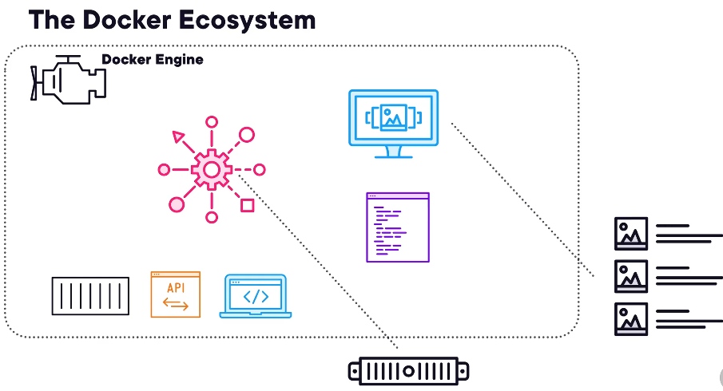
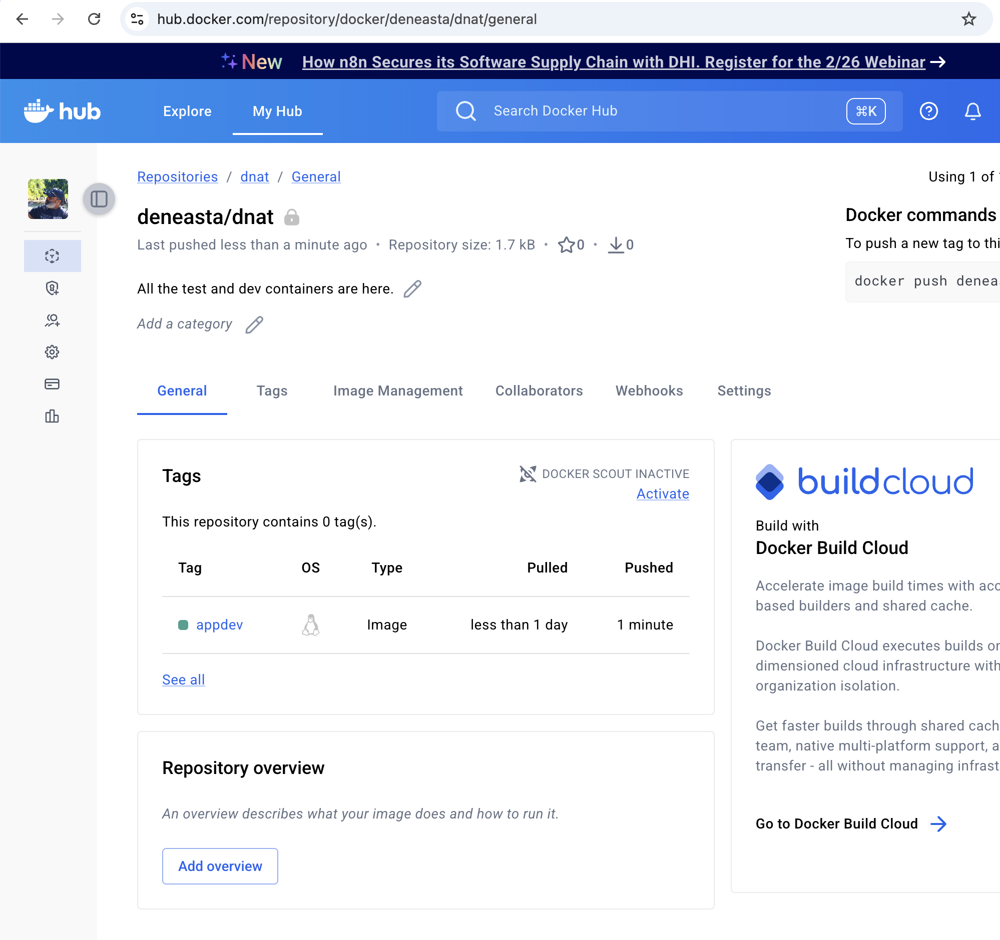
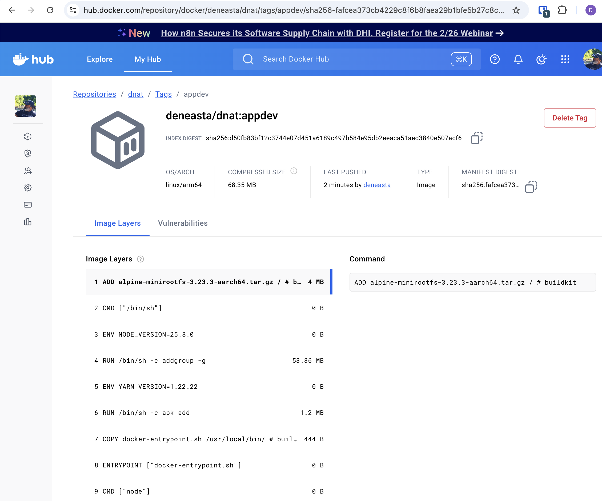

# Docker Basic Concepts and Configuration

Why Containers.

Automation
Fast Deployment
Modularity
Portability

Docker Ecosystem

Docker Engine
Docker CLI
API's

Docker Daemon.


Docker Desktop actually run in a Linux VM.

## Creating a simple docker container

Ane container will have its configuration defined in the Dockerfile.
This is the standard name given to a docker file.

For example, create a dockerfile with following configuration

```docker
FROM ubuntu:24.04

ENV DEBIAN_FRONTEND=noninteractive

RUN apt-get update && apt-get install -y apache2 && \
    apt-get clean && rm -rf /var/lib/apt/lists/*

COPY index.html /var/www/html/index.html
EXPOSE 80

CMD [ "apachectl" , "-D" , "FOREGROUND"]
```

This above configuration will create a docker container that is a web server running on port 80.
It will launch a file index.html as the home page of the server.
Contents of the html file

```html
<H1>Wclcome to the docker container on this MAC</H1>
```

Once the needed files are ready, we go ahead and build the container.
We can use the docker command ```docker buildx``` to create a docker container.
First check if the required extension is present or not.
```docker buildx version``` and ```docker buildx ls```

Example

```bash
[03-03-2026][16:37:59][√][docker]$ docker buildx version
github.com/docker/buildx v0.31.1-desktop.1 3d153e82f8d99923062781d390607dabe1679613
[03-03-2026][16:38:39][√][docker]$
[03-03-2026][16:37:54][√][docker]$ docker buildx ls
NAME/NODE           DRIVER/ENDPOINT     STATUS    BUILDKIT   PLATFORMS
default             docker
 \_ default          \_ default         running   v0.27.1    linux/amd64 (+2), linux/arm64, linux/ppc64le, linux/s390x, (2 more)
desktop-linux*      docker
 \_ desktop-linux    \_ desktop-linux   running   v0.27.1    linux/amd64 (+2), linux/arm64, linux/ppc64le, linux/s390x, (2 more)
[03-03-2026][16:37:59][√][docker]$
```

Build the docker container.
Command : ``` docker buildx build -t myserver . ```

Once the build is done the image will be listed and we can see them by runing the command
```docker images```. We can run the container using the command ```docker run -d -p 8080:80 myserver```. Once the container starts, we can check if we can reach to the localhost webserver.
```curl localhost:8080```

 ## Cleaning up the container

First check if the container is running or not. If its running, then stop and delete the container.
Commands :

```bash
docker stop <Container Name>
docker rm <Container Name>
```

Once this is done, list the images using ```docker image ls```
Once you see the image you want to delete, run ```docker image rm <Name of the Image>```

You can get some additional info about the docker engine by running the following commands.
```docker info```
Upon further filtering on the docker info output, you can find out the type of storage or network drivers configured for this environment.

```bash
[04-03-2026][10:35:57][√][~]$ docker info | grep -i storage
 Storage Driver: overlayfs
[04-03-2026][10:36:03][√][~]$
[04-03-2026][10:36:06][√][~]$
[04-03-2026][10:36:06][√][~]$ docker info | grep -i network
  Network: bridge host ipvlan macvlan null overlay
[04-03-2026][10:36:43][√][~]$
```

> Ctrl + P + Q will exit the container shell without killing the container.

Create an app in a container.

Command to build the container ```docker image build -t deneasta/dnat:appdev .```

```bash
[04-03-2026][19:09:08][√][container]$ docker image build -t deneasta/dnat:appdev .
[+] Building 1.4s (11/11) FINISHED                                                                                     docker:desktop-linux
 => [internal] load build definition from Dockerfile                                                                                   0.0s
 => => transferring dockerfile: 680B                                                                                                   0.0s
 => [internal] load metadata for docker.io/library/node:current-alpine                                                                 1.2s
 => [auth] library/node:pull token for registry-1.docker.io                                                                            0.0s
 => [internal] load .dockerignore                                                                                                      0.0s
 => => transferring context: 2B                                                                                                        0.0s
 => [1/5] FROM docker.io/library/node:current-alpine@sha256:636c5bc8fa6a7a542bc99f25367777b0b3dd0db7d1ca3959d14137a1ac80bde2           0.0s
 => => resolve docker.io/library/node:current-alpine@sha256:636c5bc8fa6a7a542bc99f25367777b0b3dd0db7d1ca3959d14137a1ac80bde2           0.0s
 => [internal] load build context                                                                                                      0.0s
 => => transferring context: 625B                                                                                                      0.0s
 => CACHED [2/5] RUN mkdir -p /usr/src/app                                                                                             0.0s
 => CACHED [3/5] COPY . /usr/src/app                                                                                                   0.0s
 => CACHED [4/5] WORKDIR /usr/src/app                                                                                                  0.0s
 => CACHED [5/5] RUN npm install                                                                                                       0.0s
 => exporting to image                                                                                                                 0.2s
 => => exporting layers                                                                                                                0.0s
 => => exporting manifest sha256:fafcea373cb4229c8f6b8faea29b1bfe5b27c8cb278eefa9dfbd3de7f7dd3601                                      0.0s
 => => exporting config sha256:b2981753672b48186ff591bd7a9a0b1704d2273a151325258ed14368a1d282e4                                        0.0s
 => => exporting attestation manifest sha256:023b3ac550ea2edebfcc7380a4f59647c15d77e4263c7eaab0c0bb9657708a13                          0.0s
 => => exporting manifest list sha256:d50fb83bf12c3744e07d451a6189c497b584e95db2eeaca51aed3840e507acf6                                 0.0s
 => => naming to docker.io/deneasta/dnat:appdev                                                                                        0.0s
 => => unpacking to docker.io/deneasta/dnat:appdev                                                                                     0.2s
[04-03-2026][19:09:32][√][container]$
```

Docker image ls will show this container image thats is build on your local machine.
```bash
[04-03-2026][19:12:19][√][container]$ docker image ls
IMAGE                                                                                                 ID             DISK USAGE   CONTENT SIZE   EXTRA
deneasta/dnat:appdev                                                                                  d50fb83bf12c        287MB         71.7MB
gcr.io/k8s-minikube/kicbase:v0.0.50                                                                   ffefe6978189       1.88GB          507MB
gcr.io/k8s-minikube/kicbase@sha256:eb4fec00e8ad70adf8e6436f195cc429825ffb85f95afcdb5d8d9deb576f3e93   eb4fec00e8ad       1.88GB          507MB    U
[04-03-2026][19:12:20][√][container]$
```

Now push the image into the docker hub. ```docker image push deneasta/dnat:appdev```
Output
```bash
[04-03-2026][19:13:21][√][container]$ docker image push deneasta/dnat:appdev
The push refers to repository [docker.io/deneasta/dnat]
5f12cfbc4624: Pushed
7f60c78a16ed: Pushed
31ca6f7e54cb: Pushed
76a2ec0242e7: Pushed
d8ad8cd72600: Mounted from library/redis
4f4fb700ef54: Mounted from library/redis
7fb4bb9f4624: Pushed
109558582081: Pushed
060204e62b89: Pushed
appdev: digest: sha256:d50fb83bf12c3744e07d451a6189c497b584e95db2eeaca51aed3840e507acf6 size: 856
[04-03-2026][19:14:32][√][container]$
```





We can now run the container as follows
Command : ```docker run -d -p 8000:8080 deneasta/dnat:appdev```
Output

```bash
04-03-2026][19:22:17][√][docker]$ docker run -d -p 8000:8080 deneasta/dnat:appdev
c56bb36d973a727a8c13ea4faa2d1811312a0bc619b5d03ddbf230a5933894f9
[04-03-2026][19:23:47][√][docker]$
[04-03-2026][19:23:49][√][docker]$
[04-03-2026][19:23:49][√][docker]$ docker ps -a
CONTAINER ID   IMAGE                                 COMMAND                  CREATED         STATUS                    PORTS                                                                                                                                  NAMES
c56bb36d973a   deneasta/dnat:appdev                  "node app.js"            6 seconds ago   Up 5 seconds              0.0.0.0:8000->8080/tcp, [::]:8000->8080/tcp                                                                                            infallible_easley
3a589568f7d0   gcr.io/k8s-minikube/kicbase:v0.0.50   "/usr/local/bin/entr…"   7 days ago      Exited (255) 3 days ago   127.0.0.1:55000->22/tcp, 127.0.0.1:55001->2376/tcp, 127.0.0.1:55002->5000/tcp, 127.0.0.1:55003->8443/tcp, 127.0.0.1:55004->32443/tcp   minikube
[04-03-2026][19:23:53][√][docker]$
```

We can check for the app by opening http://localhost:8000 on a web browser.


## Multi Container Setup.
This can be done using canonical multipass.

Commands
multipass launch docker --name node1
Output

```bash
[04-03-2026][17:02:01][√][~]$ multipass launch docker --name node1
*** Warning! Blueprints are deprecated and will be removed in a future release. ***

You can achieve similar results with cloud-init and other launch options.
Run `multipass help launch` for more info, or find out more at:
- https://documentation.ubuntu.com/multipass/en/latest/how-to-guides/manage-instances/launch-customized-instances-with-multipass-and-cloud-init/
- https://cloudinit.readthedocs.io

You'll need to add this to your shell configuration (.bashrc, .zshrc or so) for
aliases to work without prefixing with `multipass`:

PATH="$PATH:/Users/nebumathews/Library/Application Support/multipass/bin"
Mounted '/Users/nebumathews/multipass/node1' into 'node1:node1'
Launched: node1
[04-03-2026][17:05:07][√][~]$
```

Launch 5 nodes like above.
You can see the list of the nodes using the ecommand ```multipass node list```
You can get info on a spccific node by running ```multipass info node1```

You can login to the node by running ```multipass shell node1```

Once you are in the node1, you need to initialise the swarm.

command : ``docker swarm init --advertise-addr 192.168.2.2```

Output of the above command.
Here you can see that you need another command to add the node to manager.

Node1:

```bash
ubuntu@node1:~$ docker swarm init --advertise-addr 192.168.2.2
Swarm initialized: current node (tgmy16jfzxpi4j3gi06028bwy) is now a manager.

To add a worker to this swarm, run the following command:

    docker swarm join --token SWMTOKEN 192.168.2.2:2377

To add a manager to this swarm, run 'docker swarm join-token manager' and follow the instructions.
ubuntu@node1:~$
```

Command :
```bash
ubuntu@node1:~$ docker swarm join-token manager
To add a manager to this swarm, run the following command:

    docker swarm join --token SWMTOKEN 192.168.2.2:2377

ubuntu@node1:~$
```

When you run the above docker swarm join command on the second node, it will also join the manager.

Node2:
```bash
ubuntu@node2:~$ docker swarm join --token SWMTOKEN 192.168.2.2:2377
This node joined a swarm as a manager.
ubuntu@node2:~$
```

Node3:
```bash
ubuntu@node3:~$ docker swarm join --token SWMTOKEN 192.168.2.2:2377
This node joined a swarm as a manager.
ubuntu@node3:~$
```

IF you run the command ```docker node ls```, then you can see the managers.
```bash
ubuntu@node1:~$ docker node ls
ID                            HOSTNAME   STATUS    AVAILABILITY   MANAGER STATUS   ENGINE VERSION
tgmy16jfzxpi4j3gi06028bwy *   node1      Ready     Active         Leader           29.2.1
vme3ypezu5r0y0bvdmd9segqi     node2      Ready     Active         Reachable        29.2.1
y7l1f93nf7ge69tlubituhl42     node3      Ready     Active         Reachable        29.2.1
ubuntu@node1:~$
```

Now we need to add the worker to the cluster.
To see the token for the worker, run the command ```docker swarm join-token worker```
```bash
ubuntu@node1:~$ docker swarm join-token worker
To add a worker to this swarm, run the following command:

    docker swarm join --token SWMTOKEN 192.168.2.2:2377

ubuntu@node1:~$
```

Use the above command and token to add the worker.
Node4:
```bash
ubuntu@node4:~$ docker swarm join --token SWMTOKEN 192.168.2.2:2377
This node joined a swarm as a worker.
ubuntu@node4:~$
```

Node5:
```bash
ubuntu@node5:~$ docker swarm join --token SWMTOKEN 192.168.2.2:2377
This node joined a swarm as a worker.
ubuntu@node5:~$
```

Now, when you run ```docker node ls```, you will be able to see all the nodes in the cluster.

```bash
ubuntu@node1:~$ docker node ls
ID                            HOSTNAME   STATUS    AVAILABILITY   MANAGER STATUS   ENGINE VERSION
tgmy16jfzxpi4j3gi06028bwy *   node1      Ready     Active         Leader           29.2.1
vme3ypezu5r0y0bvdmd9segqi     node2      Ready     Active         Reachable        29.2.1
y7l1f93nf7ge69tlubituhl42     node3      Ready     Active         Reachable        29.2.1
6ss9sn0klcmwpyk5ngx0awhbi     node4      Ready     Active                          29.2.1
qsgyjsg246lem91hr319pv3ie     node5      Ready     Active                          29.2.1
ubuntu@node1:~$
```

You can also update each of the manager nodes to not take any workloads.
You have to run the command ```docker node update --availability drain node1```
```bash
ubuntu@node1:~$ docker node update --availability drain node1
node1
ubuntu@node1:~$ docker node update --availability drain node2
node2
ubuntu@node1:~$ docker node update --availability drain node3
node3
ubuntu@node1:~$
```

When you run ```docker node ls``` now, it will show the status of the Drain in the command output.
```bash
ubuntu@node1:~$ docker node ls
ID                            HOSTNAME   STATUS    AVAILABILITY   MANAGER STATUS   ENGINE VERSION
tgmy16jfzxpi4j3gi06028bwy *   node1      Ready     Drain          Leader           29.2.1
vme3ypezu5r0y0bvdmd9segqi     node2      Ready     Drain          Reachable        29.2.1
y7l1f93nf7ge69tlubituhl42     node3      Ready     Drain          Reachable        29.2.1
6ss9sn0klcmwpyk5ngx0awhbi     node4      Ready     Active                          29.2.1
qsgyjsg246lem91hr319pv3ie     node5      Ready     Active                          29.2.1
ubuntu@node1:~$
```

After this, we need to package each of the microservice as a service. This will ensure all the cool docker swarm features like scale-in, scale-out, stopping and starting etc are available to the app as if its a service.

### Create a Service (Manually)

You need to make sure that your repository is public. Private repos will not work.


```bash
ubuntu@node1:~$ docker service create --name web -p 8080:8080 --replicas 3 deneasta/dnat:appdev
xtsqr6c7a8d99acqjfpeg65oi
overall progress: 3 out of 3 tasks
1/3: running   [==================================================>]
2/3: running   [==================================================>]
3/3: running   [==================================================>]
verify: Service xtsqr6c7a8d99acqjfpeg65oi converged
ubuntu@node1:~$ docker service ls
ID             NAME      MODE         REPLICAS   IMAGE                  PORTS
xtsqr6c7a8d9   web       replicated   3/3        deneasta/dnat:appdev   *:8080->8080/tcp
ubuntu@node1:~$
```

Following command will also give some details.

```bash
ubuntu@node1:~$ docker service ps web
ID             NAME      IMAGE                  NODE      DESIRED STATE   CURRENT STATE           ERROR     PORTS
vtasv1kbrwui   web.1     deneasta/dnat:appdev   node5     Running         Running 3 minutes ago
ixxsgapconyh   web.2     deneasta/dnat:appdev   node5     Running         Running 3 minutes ago
unvy6vnw3fqc   web.3     deneasta/dnat:appdev   node4     Running         Running 3 minutes ago
ubuntu@node1:~$
```


If you run the command ```docker container ls``` then it will list the above containers.
It must be run on the worker command.

```bash
ubuntu@node5:~$ docker container ls
CONTAINER ID   IMAGE                    COMMAND         CREATED              STATUS              PORTS                                                             NAMES
c13a53d9fc23   deneasta/dnat:appdev     "node app.js"   About a minute ago   Up About a minute                                                                     web.1.vtasv1kbrwui7ih3nblzsci4p
943df9c8c4c2   deneasta/dnat:appdev     "node app.js"   About a minute ago   Up About a minute                                                                     web.2.ixxsgapconyhwso33q8egfu65
d9c05af9a65a   portainer/portainer-ce   "/portainer"    2 hours ago          Up 2 hours          8000/tcp, 9443/tcp, 0.0.0.0:9000->9000/tcp, [::]:9000->9000/tcp   portainer
ubuntu@node5:~$
```

Now in order to access the web page, you need to reach out to the swarm as the container is managed by the cluster. So, there is no point in running a localhost:8080.
Get one of the manager ip's by running the command ```multipass list```
```bash
[04-03-2026][19:37:38][√][~]$ multipass list
Name                    State             IPv4             Image
node1                   Running           192.168.2.2      Ubuntu 24.04 LTS
                                          172.17.0.1
                                          172.18.0.1
node2                   Running           192.168.2.3      Ubuntu 24.04 LTS
                                          172.17.0.1
                                          172.18.0.1
node3                   Running           192.168.2.4      Ubuntu 24.04 LTS
                                          172.17.0.1
                                          172.18.0.1
node4                   Running           192.168.2.5      Ubuntu 24.04 LTS
                                          172.17.0.1
                                          172.18.0.1
node5                   Running           192.168.2.6      Ubuntu 24.04 LTS
                                          172.17.0.1
                                          172.18.0.1
[04-03-2026][19:37:50][√][~]$
```

Now reach out to the app from browser as ```http://192.168.2.2:8080```

You can scale the nodes by running the scale commands. For example ```docker service scale web=5``` will increase the number to 5 containers.

```bash
ubuntu@node1:~$ docker service scale web=5
web scaled to 5
overall progress: 5 out of 5 tasks
1/5: running   [==================================================>]
2/5: running   [==================================================>]
3/5: running   [==================================================>]
4/5: running   [==================================================>]
5/5: running   [==================================================>]
verify: Service web converged
ubuntu@node1:~$
```

Now the number of containers are 5.
```bash
ubuntu@node1:~$ docker service ps web
ID             NAME      IMAGE                  NODE      DESIRED STATE   CURRENT STATE            ERROR     PORTS
vtasv1kbrwui   web.1     deneasta/dnat:appdev   node5     Running         Running 11 minutes ago
ixxsgapconyh   web.2     deneasta/dnat:appdev   node5     Running         Running 11 minutes ago
unvy6vnw3fqc   web.3     deneasta/dnat:appdev   node4     Running         Running 11 minutes ago
sgi4lvuoo1an   web.4     deneasta/dnat:appdev   node4     Running         Running 53 seconds ago
2v5jrqgn58u6   web.5     deneasta/dnat:appdev   node4     Running         Running 53 seconds ago
ubuntu@node1:~$
```

If you want to scale down, then following command.
```bash
ubuntu@node1:~$ docker service scale web=2
web scaled to 2
overall progress: 2 out of 2 tasks
1/2: running   [==================================================>]
2/2: running   [==================================================>]
verify: Service web converged
ubuntu@node1:~$ docker service ps web
ID             NAME      IMAGE                  NODE      DESIRED STATE   CURRENT STATE            ERROR     PORTS
vtasv1kbrwui   web.1     deneasta/dnat:appdev   node5     Running         Running 21 minutes ago
unvy6vnw3fqc   web.3     deneasta/dnat:appdev   node4     Running         Running 21 minutes ago
ubuntu@node1:~$
ubuntu@node1:~$ docker service ls
ID             NAME      MODE         REPLICAS   IMAGE                  PORTS
xtsqr6c7a8d9   web       replicated   2/2        deneasta/dnat:appdev   *:8080->8080/tcp
ubuntu@node1:~$
```

We can deploy the apps using the compose yaml file. This will ensure that the commands we used in the steps above are in a declarative file.

Use the training folder swarm for this.
Please ensure that you have built the image and pushed it to the docker registry.
Once done, you need to run the following command to deploy the cluster.

On your laptop, make sure that the multipass nodes are running ```multipass list```
If they are running, then its time to deploy the apps.
Before we go ahead and deploy the docker compose files, we need to ensure that the data on the host is available in the instance.
Multipass has a mount option or transfer option.
Mount option will make the local folder visible in the instance.
Before we go ahead and set this on a mad, we need to ensure that few pre-requisites are met.
1. multipass app and multipassd daemon service is given full disk access. MacOS will otherwise block multipass from accessing the folders.
2. Go to the Full Disk access in the Systems settings and give full access to multipass app and multipassd.
3. Go to the terminal and ensure that the daemon service is restated. 
4. Restart multipassd daemon: ```sudo launchctl kickstart -k system/com.canonical.multipassd```
5. Now, go ahead and restart the VM. In this case its node1. ```multipass restart node1```


Command : ```multipass mount /Users/nebumathews/Documents/work/ntegra/repos/training/docker/hands-on node1```
In this command the folder in the argument1 is mounted inside instance node1(argument2)
Check the mount point. Run the command ```multipass info node1```

Output
```bash
[05-03-2026][13:41:37][√][multi-container]$ multipass info node1
Name:           node1
State:          Running
Snapshots:      0
IPv4:           192.168.2.2
                172.17.0.1
                172.18.0.1
Release:        Ubuntu 24.04.4 LTS
Image hash:     99e1d482b958 (Ubuntu 24.04 LTS)
CPU(s):         2
Load:           0.08 0.12 0.13
Disk usage:     3.2GiB out of 38.7GiB
Memory usage:   468.2MiB out of 3.8GiB
Mounts:         /Users/nebumathews/multipass/node1                                      => node1
                    UID map: 502:default
                    GID map: 20:default
                /Users/nebumathews/Documents/work/ntegra/repos/training/docker/hands-on => /home/ubuntu/hands-on
                    UID map: 502:default
                    GID map: 20:default
[05-03-2026][13:41:44][√][multi-container]$
```

### Create a Service (Using Stack)

Login to the node1 or the manager node.
Check the mounted location on the instance by running the command ```mount```
Usually, it should be mounted in ```/home/ubuntu```

Go to the mounted location and run the command ```docker stack deploy -c compose.yml webcounter```
This will deploy the stack in the swarm cluster.

Command Output
```bash
ubuntu@node1:~/node1/swarm$ docker stack deploy -c compose.yml webcounter
Since --detach=false was not specified, tasks will be created in the background.
In a future release, --detach=false will become the default.
Creating network webcounter_counter-net
Creating service webcounter_redis
Creating service webcounter_web-fe
ubuntu@node1:~/node1/swarm$
ubuntu@node1:~/node1/swarm$ docker stack ls
NAME         SERVICES
webcounter   2
ubuntu@node1:~/node1/swarm$
```

We can see the details of the service webcounter below.
```bash
buntu@node1:~/node1/swarm$ docker stack services webcounter
ID             NAME                MODE         REPLICAS   IMAGE                      PORTS
j0pm0hgdvsyf   webcounter_redis    replicated   1/1        redis:alpine
nd6p9ginifmi   webcounter_web-fe   replicated   5/5        deneasta/dnat:swarm-demo   *:5001->8080/tcp
ubuntu@node1:~/node1/swarm$
```

We can also see the details of the tasks by running the command ```docker stack ps webcounter```
```bash
ubuntu@node1:~/node1/swarm$ docker stack ps webcounter
ID             NAME                  IMAGE                      NODE      DESIRED STATE   CURRENT STATE           ERROR     PORTS
9uzac7xb52x1   webcounter_redis.1    redis:alpine               node4     Running         Running 3 minutes ago
mlpzqjpr9xh1   webcounter_web-fe.1   deneasta/dnat:swarm-demo   node5     Running         Running 3 minutes ago
ynuj98eq6i8v   webcounter_web-fe.2   deneasta/dnat:swarm-demo   node4     Running         Running 3 minutes ago
tk349k2joan2   webcounter_web-fe.3   deneasta/dnat:swarm-demo   node5     Running         Running 3 minutes ago
losicmy6eybw   webcounter_web-fe.4   deneasta/dnat:swarm-demo   node5     Running         Running 3 minutes ago
twx7b19dlpry   webcounter_web-fe.5   deneasta/dnat:swarm-demo   node4     Running         Running 3 minutes ago
ubuntu@node1:~/node1/swarm$
```

Docker Deep Dive

Getting started with Kubernetes.


