# Docker Deep Dive

Getting into more details.

## Docker Architecture.

- Kernel Internals
- Docker related details
- Containers on MacOS

Docker is basically a client server architectire.

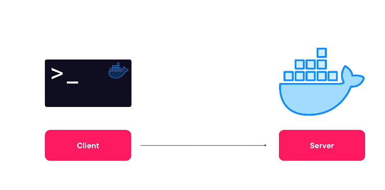

- docker build : Create OCI(Open Container Initiatives) images
- docker push : Pushes into the registry
- docker run : Runs the container.

### Containers

Isolated area of the OS with resource limits applied.
Control Groups impose the limits
NameSpaces : Carves the OS into virtual OS's

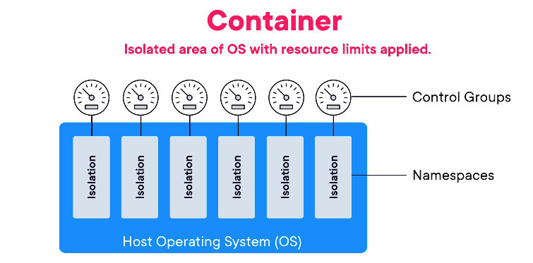

When docker into the picture, it made the control groups and Namespaces concepts a bit more abstract and erasier.

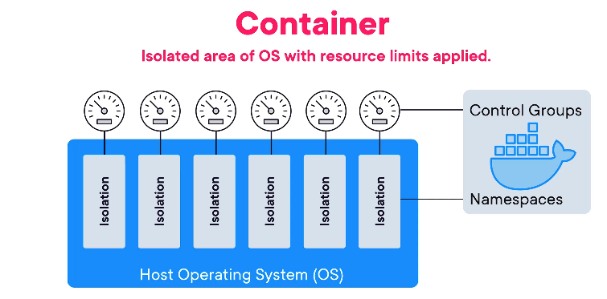

A Docker engine is like a Car Engine. It provides simple controls (CLI Commands) to manage the containers.
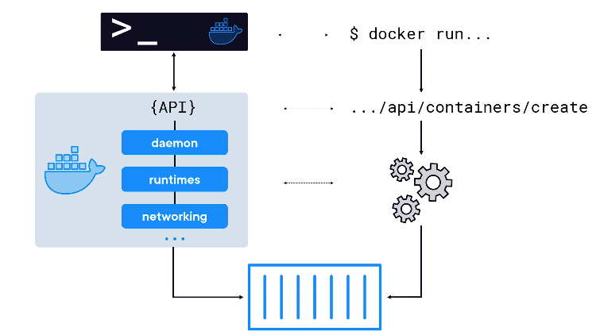

### Kernel Internals

Docker relies on the Linux kernel features to provide containerization. The key features include:

1. Namespaces: Namespaces provide isolation for various system resources, such as process IDs, network interfaces, and file systems. This allows each container to have its own isolated environment.

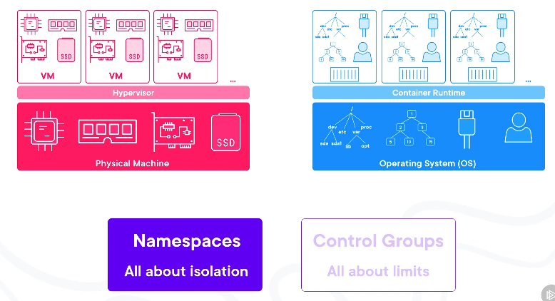

Each container has its own namespaces. for instance its own Process ID, Network, Filesustem etc.
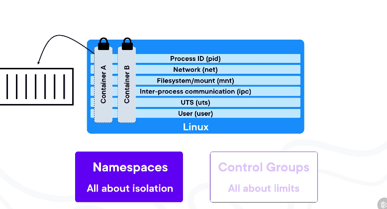

2. Control Groups : ITs all about limits.
In order to share and limit the resource usage on a specific VM or Host, it has to be limited. This is were we achieve using Control Groups.

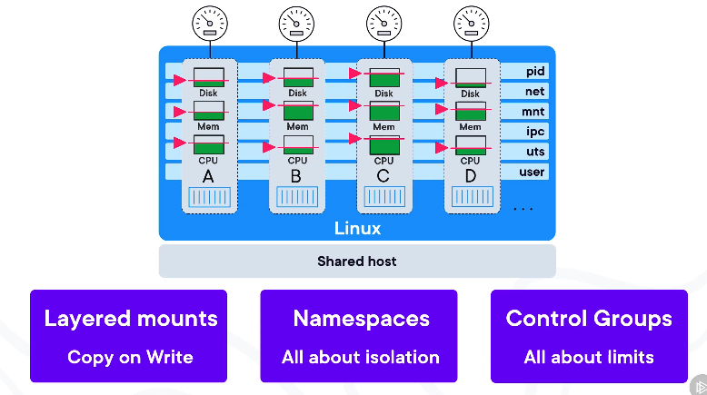

### How Docker hides these complexities

Docker provides a high-level API that abstracts away the complexities of managing namespaces and control groups directly. When you run a Docker container, the Docker engine automatically sets up the necessary namespaces and control groups for you.
For example, when you run a container, Docker will create a new set of namespaces for that container, which isolates it from other containers and the host system. It also sets up control groups to limit the resources that the container can use.
This abstraction allows developers and users to easily create and manage containers without needing to understand the underlying kernel features. Docker handles all of the complexities behind the scenes, making it easier for users to work with containers.

OCI Initiative

- Image Spec
- Runtime Spec

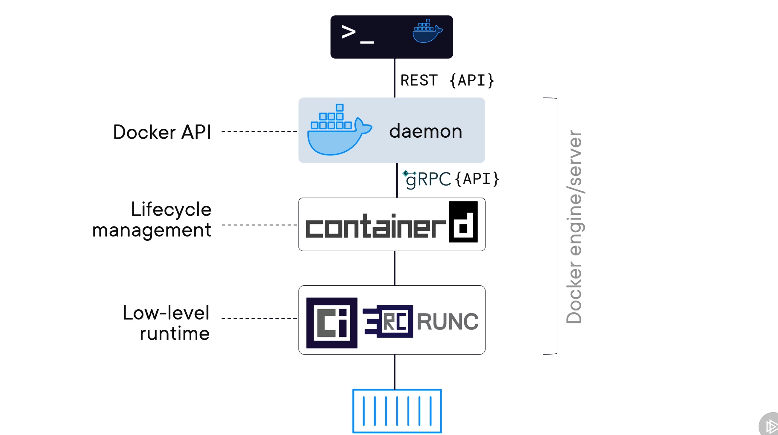

So the following will be the flow after the refactoring.

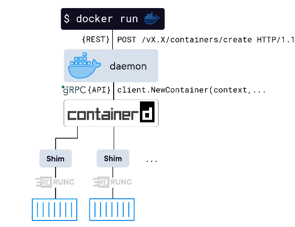

container-D is the CNCF process and RUNC is the OCI process. Docker just uses these.
So, restarting these services will not impact any running containers.

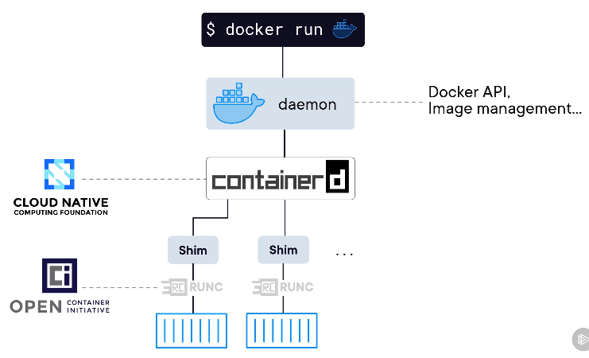

There is a one to one relationship between  SHIM process and runC. Once the container is lauynched, runC will die but the shim process will be alive.

Containers and the Host has to be of the same type. For example, if you have a Windows Host, the the container has to be a Windows Container and vice versa.

### Docker Images

Docker images are made up of layers. Each layer represents a set of changes to the file system. When you build a Docker image, each command in the Dockerfile creates a new layer. These layers are stacked on top of each other to create the final image.

When you run a container from an image, Docker uses a copy-on-write mechanism to create a new container layer on top of the image layers. This allows multiple containers to share the same underlying image layers, which can save disk space and improve performance.

Image Internals
Layerings
Registries

#### Images

It is made up of

- Base OS
- App
- Dependencies
- Config

Images are build time constructs. Similar to Classes in OOB.
Containers are runtime constructs. Similar to Objects in OOB.

Every container gets a writable layer when its spunup and this creates a place to store/write its dynamic data. So, we can say that a container is actually an Image plus a writeable layer.

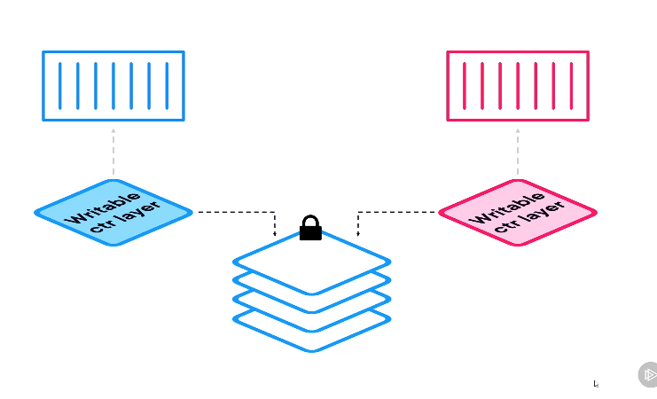

To get the image from the registry, we use docker pull command.
For example: ```docker pull redis```
This will pull the latest version of the Redis image from the Docker Hub registry. If you want to pull a specific version, you can specify the tag. For example: ```docker pull redis:6.0``` will pull the Redis image with version 6.0.

Command Output

```bash
[09-03-2026][16:05:13][√][docker-adv]$ docker pull redis
Using default tag: latest
latest: Pulling from library/redis
f3d7f1255eed: Pull complete
616fb95a872e: Pull complete
83426d9267bc: Pull complete
4f4fb700ef54: Pull complete
1ee39f16a53f: Pull complete
e0d7426568fc: Pull complete
3b66ab8c894c: Pull complete
4bb7e66c93a3: Download complete
4119f8557132: Download complete
Digest: sha256:1c054d54ecd1597bba52f4304bca5afbc5565ebe614c5b3d7dc5b7f8a0cd768d
Status: Downloaded newer image for redis:latest
docker.io/library/redis:latest
[09-03-2026][17:09:15][√][docker-adv]$
```

When this command is run, you can see different layers in the command output. Each one is these is a layer.
So, we pull a bunch of loosely connected layers and then stitch them together and this is done using the manifest file which tells docker to pull the right layers.

By default, docker command will always pull from docker hub.
Its a two step process, it will first pull the manifest and then pull layers.


The manifest file contains the metadata about the image, including the layers that make up the image, their sizes, and their digests. When you pull an image, Docker first retrieves the manifest file to determine which layers need to be downloaded. Then it downloads each layer based on the information in the manifest.

Fat Manifest
It is a manifesst of manifests. It has the details of each manifests.
Example:
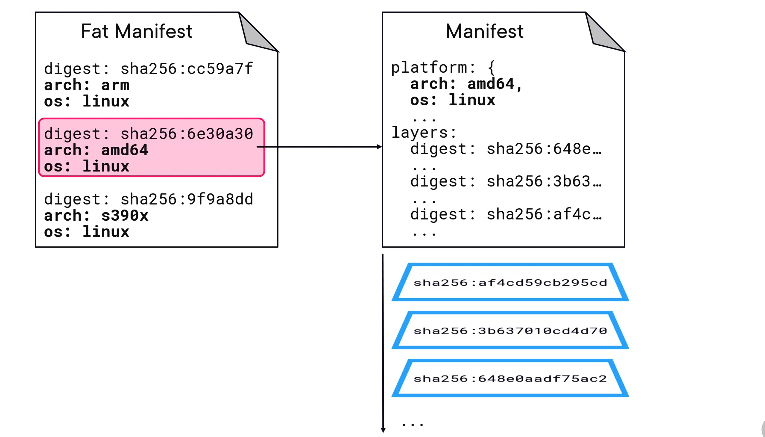

We can see the hashes of each downloaded images using the command ```docker images --digests```

Example:

```bash
[09-03-2026][17:09:15][√][docker-adv]$ docker images --digests
REPOSITORY                    TAG               DIGEST                                                                    IMAGE ID       CREATED       SIZE
deneasta/dnat                 swarm-demo        sha256:8d0e9fa89bee0bd8dce5125ab533819048d6f9533260e92530655d5f5b0cd395   8d0e9fa89bee   4 days ago    112MB
deneasta/dnat                 multicontainers   sha256:190a6d5568918c2dd957717d38ea9c910a2783e94648b4099e5bd15145bcea0a   190a6d556891   4 days ago    107MB
deneasta/dnat                 appdev            sha256:d50fb83bf12c3744e07d451a6189c497b584e95db2eeaca51aed3840e507acf6   d50fb83bf12c   4 days ago    287MB
redis                         latest            sha256:1c054d54ecd1597bba52f4304bca5afbc5565ebe614c5b3d7dc5b7f8a0cd768d   1c054d54ecd1   12 days ago   225MB
gcr.io/k8s-minikube/kicbase   v0.0.50           sha256:ffefe6978189e82227982f54b97fb3725fc1414883a54a0339111dac4870e7a7   ffefe6978189   2 weeks ago   1.88GB
gcr.io/k8s-minikube/kicbase   <none>            sha256:eb4fec00e8ad70adf8e6436f195cc429825ffb85f95afcdb5d8d9deb576f3e93   eb4fec00e8ad   2 weeks ago   1.88GB
[09-03-2026][17:17:23][√][docker-adv]$
```

Following command will give details of the manifest of the image redis : ```docker manifest inspect redis```

Example:

```bash
[09-03-2026][17:54:22][√][docker-adv]$ docker manifest inspect redis
{
   "schemaVersion": 2,
   "mediaType": "application/vnd.oci.image.index.v1+json",
   "manifests": [
      {
         "mediaType": "application/vnd.oci.image.manifest.v1+json",
         "size": 2286,
         "digest": "sha256:9bb8e98889679d1dcd42794248b5c7d480e69b7f08906bdd872981bf2c8f232f",
         "platform": {
            "architecture": "amd64",
            "os": "linux"
         }
      },
      ...

      {
         "mediaType": "application/vnd.oci.image.manifest.v1+json",
         "size": 2288,
         "digest": "sha256:b7e0bf9f5642e27acc72c1f031aa452c29f96f47ec89cf045df14918add7e836",
         "platform": {
            "architecture": "arm64",
            "os": "linux",
            "variant": "v8"
         }
      },
...
      }
   ]
}
[09-03-2026][17:55:12][√][docker-adv]$
```

Since the docker desktop is running inside a linux VM, if we checkd the architecure and version of linux in this VM, we can match it with the manifest output

```bash
[09-03-2026][17:58:51][√][docker-adv]$ docker run -it --privileged --pid=host debian nsenter -t 1 -m -u -i bash
root@docker-desktop:/#
root@docker-desktop:/# cat /etc/os-release
PRETTY_NAME="Docker Desktop"root@docker-desktop:/#
root@docker-desktop:/# uname -a
Linux docker-desktop 6.12.72-linuxkit #1 SMP Mon Feb 16 11:19:07 UTC 2026 aarch64 GNU/Linux
root@docker-desktop:/# exit
exit
[09-03-2026][17:59:15][√][docker-adv]$
```

Or your can also run the command ```docker info | grep -i -e ostype -e architecture -e storage```

```bash
[09-03-2026][17:55:12][√][docker-adv]$ docker info | grep -i -e ostype -e architecture -e storage
 Storage Driver: overlayfs
 OSType: linux
 Architecture: aarch64
[09-03-2026][17:57:11][√][docker-adv]$
```

### Registries

docker pull the container from the docker hub. By default docker uses docker hub.
You can ave a public or private OCI registry.

Official images are at the top of the registry.
The pull url will have the name of the repo url, the repo name and the tag.
The tag will define the exact image that needs to be pulled. If there is no tag, then the latest image will be pulled.

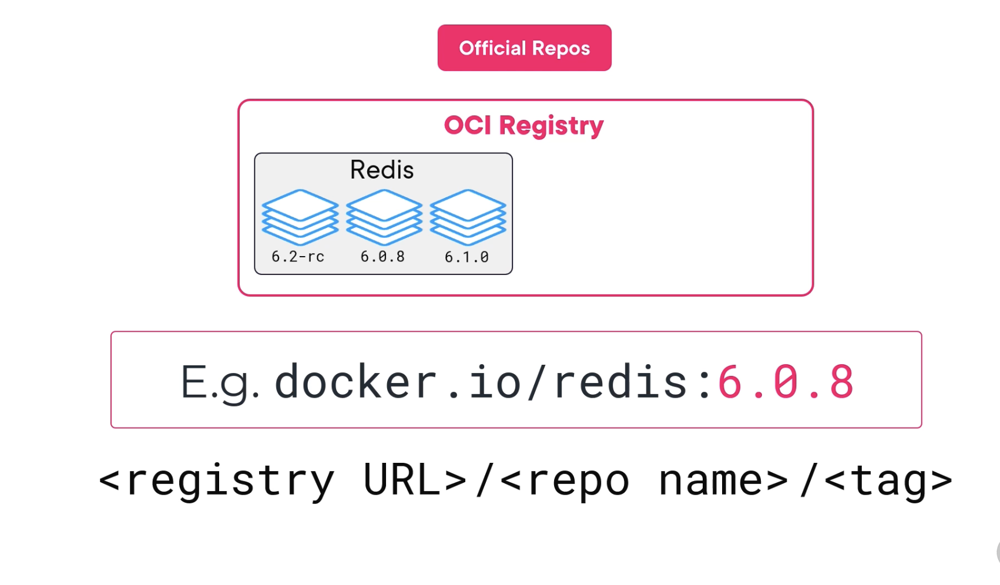

Unofficial images are not safe, so use it carefully.

### Hashes

There are two types of hashes. Content Hashes and Compression hashes.
When the images is pushed to the registry, it is compressed and then pushed. This will change the hash of the image at the destination.
We calculate the new hashes of the compressed content and put those into the manifest when pushing to the registry.

The registry uses the distribution hashes.

Distribution digests/hashes — the hashes that the registry uses to store and serve content (“as‑distributed”).

Content digests/hashes (DiffIDs) — the hashes the image config uses to describe each uncompressed layer (“as‑executed/expanded”).

### Building an Image

Dockerfile is a text file that contains instructions on how to build a Docker image. Each instruction in the Dockerfile creates a new layer in the image. When you build an image using a Dockerfile, Docker reads the instructions

Each instruction to build the image is kept in Dockerfile.
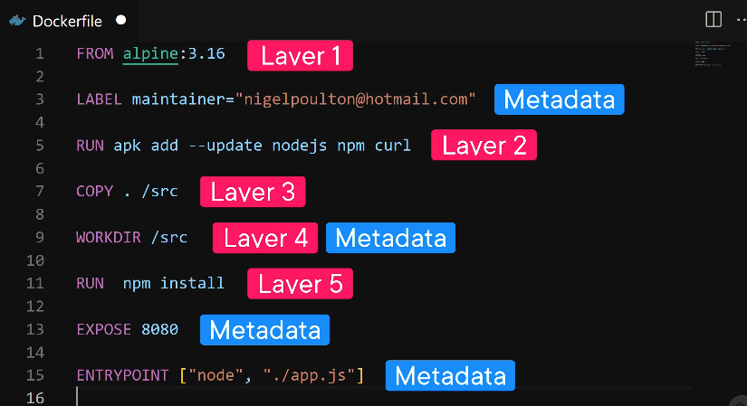

Usually it starts with the FROM keyword.
This tell which base image to use. This also forms the layer1 in the imnage.\

LABEL : is the metadata fo the image. 
RUN : is the command that needs to be run when building the image. This will form layer 2 in the image.
CMD : is the command that needs to be run when the container is started. This will not
form a layer in the image. It is just a instruction to run when the container is started.
EXPOSE : is the port that needs to be exposed when the container is run.
WORKDIR : is the working directory for the container. This will form layer 3 in the
image.
COPY : is the command to copy files from the host to the container. This will form layer
4 in the image.
ENTRYPOINT : is the command that needs to be run when the container is started. This will not
form a layer in the image. It is just a instruction to run when the container is started.
VOLUME : is the command to create a volume for the container. This will not form a layer in the image. It is just a instruction to create a volume when the container is started.
ENV : is the command to set environment variables for the container. This will form layer 5
in the image.
ARG : is the command to set build time variables for the image. This will not form a layer in the image. It is just a instruction to set build time variables when the image is built.
ONBUILD : is the command to set instructions that will be run when the image is used as
a base image for another image. This will not form a layer in the image. It is just a instruction to set instructions that will be run when the image is used as a base image for another image.
SHELL : is the command to set the default shell for the container. This will not form
a layer in the image. It is just a instruction to set the default shell for the container.

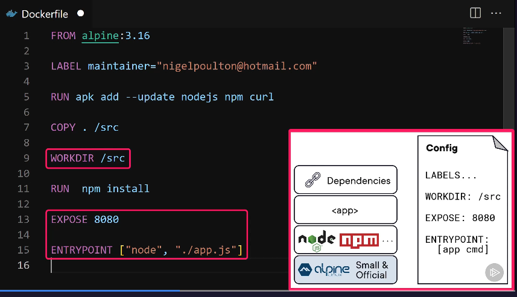

We can build an image from local source or from aremote source like github. ```docker build -t <Repository Name>:<App Name> <Github URL>```
IF you need to know the history of the container image ```docker history <Repository Name>:<App Name>```
docker inspect will also show the details of the image alongside the meetadata like expose, label etc.

 We can create a dockerfile with multiple modules in the config.

 Example:
 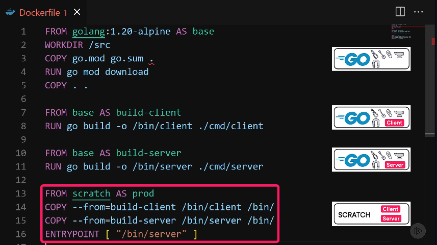
Folder Name: multi-stage

Command to build the container: ```docker build -t multi:stage .```

```bash
[10-03-2026][14:57:27][√][multi-stage]$ docker build -t multi:stage .
[+] Building 11.4s (15/15) FINISHED                                                                            docker:desktop-linux
 => [internal] load build definition from Dockerfile                                                                           0.0s
 => => transferring dockerfile: 407B                                                                                           0.0s
 => [internal] load metadata for docker.io/library/golang:1.26-alpine                                                          1.9s
 => [auth] library/golang:pull token for registry-1.docker.io                                                                  0.0s
 => [internal] load .dockerignore                                                                                              0.0s
 => => transferring context: 2B                                                                                                0.0s
 => [base 1/5] FROM docker.io/library/golang:1.26-alpine@sha256:2389ebfa5b7f43eeafbd6be0c3700cc46690ef842ad962f6c5bd6be49ed82  2.2s
 => => resolve docker.io/library/golang:1.26-alpine@sha256:2389ebfa5b7f43eeafbd6be0c3700cc46690ef842ad962f6c5bd6be49ed82039    0.0s
 => => sha256:4901bef231fb8a6d26e9c2ceb808c5c0ed8319bb7a5f6b5a284cac28d8f72b8e 126B / 126B                                     0.3s
 => => sha256:49db9bb2f958b7444a4f28145af7a815dd0a47fec1608d03e2f1c673b3aa858b 64.11MB / 64.11MB                               1.3s
 => => sha256:62764d53541d11f63129956ccd8b52d20597aca289f431759deb77ea2275f569 298.85kB / 298.85kB                             0.7s
 => => extracting sha256:62764d53541d11f63129956ccd8b52d20597aca289f431759deb77ea2275f569                                      0.0s
 => => extracting sha256:49db9bb2f958b7444a4f28145af7a815dd0a47fec1608d03e2f1c673b3aa858b                                      0.9s
 => => extracting sha256:4901bef231fb8a6d26e9c2ceb808c5c0ed8319bb7a5f6b5a284cac28d8f72b8e                                      0.0s
 => => extracting sha256:4f4fb700ef54461cfa02571ae0db9a0dc1e0cdb5577484a6d75e68dc38e8acc1                                      0.0s
 => [internal] load build context                                                                                              0.0s
 => => transferring context: 11.85kB                                                                                           0.0s
 => [base 2/5] WORKDIR /src                                                                                                    0.1s
 => [base 3/5] COPY go.mod go.sum .                                                                                            0.0s
 => [base 4/5] RUN go mod download                                                                                             1.5s
 => [base 5/5] COPY . .                                                                                                        0.0s
 => [build-client 1/1] RUN go build -o /bin/client ./cmd/client                                                                5.2s
 => [build-server 1/1] RUN go build -o /bin/server ./cmd/server                                                                5.2s
 => [prod 1/2] COPY --from=build-client /bin/client /bin/                                                                      0.0s
 => [prod 2/2] COPY --from=build-server /bin/server /bin/                                                                      0.0s
 => exporting to image                                                                                                         0.3s
 => => exporting layers                                                                                                        0.2s
 => => exporting manifest sha256:85a5fc2cf92038a4a7c5593b00ea6b0c8f8dc992cfe341716f2cc84966e4472d                              0.0s
 => => exporting config sha256:2cece1bf80bcf7c9401d2bff56e9164311abd3a3148b5ab620761b592fd869bf                                0.0s
 => => exporting attestation manifest sha256:9f1634527c4af7d96dbefc36c3e225c6586e51ce30547943cd7fc90c4502c458                  0.0s
 => => exporting manifest list sha256:d3bb1327fdae03553ae4080d8bd52a01900be37bede07bea6995ba3cb65492ea                         0.0s
 => => naming to docker.io/library/multi:stage                                                                                 0.0s
 => => unpacking to docker.io/library/multi:stage                                                                              0.1s
[10-03-2026][14:58:03][√][multi-stage]$
```

#### Checking the image history

```bash
[10-03-2026][14:58:03][√][multi-stage]$ docker images
                                                                                                                i Info →   U  In Use
IMAGE                                                                               ID             DISK USAGE   CONTENT SIZE   EXTRA
debian:latest                                                                       3615a749858a        209MB         52.8MB    U
deneasta/dnat:appdev                                                                d50fb83bf12c        287MB         71.7MB    U
deneasta/dnat:multicontainers                                                       190a6d556891        107MB         25.8MB
deneasta/dnat:swarm-demo                                                            8d0e9fa89bee        112MB           28MB
gcr.io/k8s-minikube/kicbase:v0.0.50                                                 ffefe6978189       1.88GB          507MB
gcr.io/k8s-minikube/kicbase@sha256:eb4fec00e8ad70adf8e6436f195cc429825ffb85f95afcdb5d8d9deb576f3e93
                                                                                    eb4fec00e8ad       1.88GB          507MB    U
multi:stage                                                                         d3bb1327fdae       28.5MB           10MB
[10-03-2026][14:59:51][√][multi-stage]$ docker history multi:stage
IMAGE          CREATED              CREATED BY                          SIZE      COMMENT
d3bb1327fdae   About a minute ago   ENTRYPOINT ["/bin/server"]          0B        buildkit.dockerfile.v0
<missing>      About a minute ago   COPY /bin/server /bin/ # buildkit   9.24MB    buildkit.dockerfile.v0
<missing>      About a minute ago   COPY /bin/client /bin/ # buildkit   9.23MB    buildkit.dockerfile.v0
[10-03-2026][14:59:58][√][multi-stage]$
```

If we check the layers, they are minimal

```bash
[10-03-2026][14:59:59][√][multi-stage]$ docker inspect multi:stage
[
    {
        "Id": "sha256:d3bb1327fdae03553ae4080d8bd52a01900be37bede07bea6995ba3cb65492ea",
        "RepoTags": [
            "multi:stage"
        ],
        "RepoDigests": [
            "multi@sha256:d3bb1327fdae03553ae4080d8bd52a01900be37bede07bea6995ba3cb65492ea"
        ],
        "Comment": "buildkit.dockerfile.v0",
        "Created": "2026-03-10T14:58:03.240931799Z",
        "Config": {
            "Env": [
                "PATH=/usr/local/sbin:/usr/local/bin:/usr/sbin:/usr/bin:/sbin:/bin"
            ],
            "Entrypoint": [
                "/bin/server"
            ],
            "WorkingDir": "/"
        },
        "Architecture": "arm64",
        "Os": "linux",
        "Size": 10026782,
        "RootFS": {
            "Type": "layers",
            "Layers": [
                "sha256:f7156739efbecf989dfef048bb996746e4ee0915dab082933ee300a00326e6f7",
                "sha256:fcbc41502f24f04eb23dbb3ed4b859c50040d885e65d7617a306e7b2ea3fe6ea"
            ]
        },
        "Metadata": {
            "LastTagTime": "2026-03-10T14:58:03.45743659Z"
        },
        "Descriptor": {
            "mediaType": "application/vnd.oci.image.index.v1+json",
            "digest": "sha256:d3bb1327fdae03553ae4080d8bd52a01900be37bede07bea6995ba3cb65492ea",
            "size": 855
        },
        "Identity": {
            "Build": [
                {
                    "Ref": "ldm1pp5w7p4skvoakhbjn8p1x",
                    "CreatedAt": "2026-03-10T14:58:03.512242215Z"
                }
            ]
        }
    }
]
```

These produces much leaner and smaller images suitable for production.

### Containers: Atomic unit of Scheduling

This is the Atomic unit of scheduling.
Container is when an image is running on the VM or BM.

When a container is started, it creates a thin writeable layer on to the image and this will be storing the ephemeral state of the container.
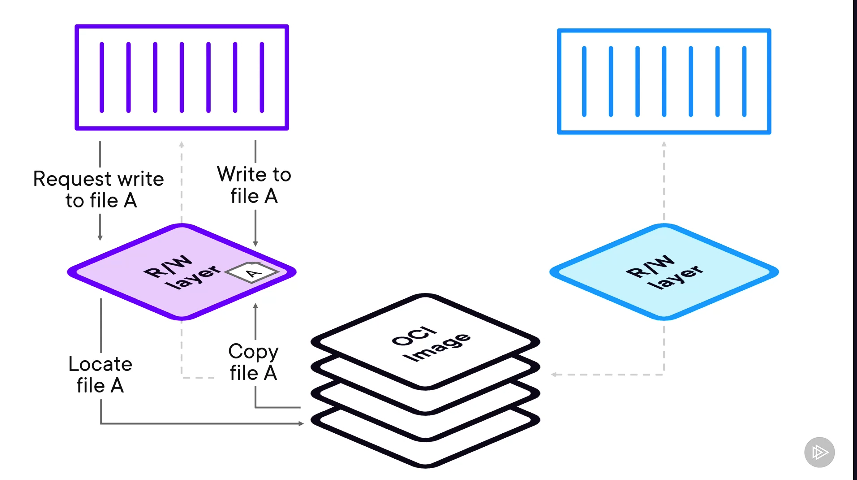

If there are multiple containers and each of them have their own R/W layer. If a container has anything to write to a file in the image, then first it will take a copy of that file from the image and puts it in the R/W layer and then makes the changes. This is called copy-on-write.

From an OS POV, each  container is isolated on a VM or BM.
From a lifecycle perspective, we can start, stop or pause a container. Till the container is explicitely deleted, it never goes away. Even if we stop the container.
The container has to match with the kernel of the host. So, a linux container can only run on a linux host.

Containers are

- execution environments
- should be immutable : any changes must be done to the image and not to the running container.
- should be ephemeral

Example:

```bash
[10-03-2026][15:16:13][√][multi-stage]$ docker run -it alpine sh
Unable to find image 'alpine:latest' locally
latest: Pulling from library/alpine
Digest: sha256:25109184c71bdad752c8312a8623239686a9a2071e8825f20acb8f2198c3f659
Status: Downloaded newer image for alpine:latest
/ #
/ # ps -elf
PID   USER     TIME  COMMAND
    1 root      0:00 sh
    7 root      0:00 ps -elf
/ #
```

#### Managing Containers

```bash
10-03-2026][15:18:10][√][multi-stage]$ docker run -d alpine sleep 30
d22910c3f68523f8c1cfcc1b1b73a05aaa239352c3e7ae2be0e27f231ccf3774
[10-03-2026][15:18:35][√][multi-stage]$ docker ps
CONTAINER ID   IMAGE     COMMAND      CREATED         STATUS         PORTS     NAMES
d22910c3f685   alpine    "sleep 30"   3 seconds ago   Up 2 seconds             frosty_sammet
[10-03-2026][15:18:38][√][multi-stage]$
[10-03-2026][15:18:39][√][multi-stage]$
[10-03-2026][15:18:39][√][multi-stage]$ docker run -d alpine sleep 30
0abe3382c89c48edf66ed339ccc78c5dd310553f4dd1c1893b4b77f26a6f8304
[10-03-2026][15:18:43][√][multi-stage]$ docker ps
CONTAINER ID   IMAGE     COMMAND      CREATED         STATUS         PORTS     NAMES
0abe3382c89c   alpine    "sleep 30"   1 second ago    Up 1 second              boring_proskuriakova
d22910c3f685   alpine    "sleep 30"   9 seconds ago   Up 8 seconds             frosty_sammet
[10-03-2026][15:18:44][√][multi-stage]$
```

#### Entering a container.

```bash
[10-03-2026][15:21:20][√][multi-stage]$ docker run -d alpine sleep 300
2a34f78f367d8af0d3f94f4a865e88d47b768b67786b5d9a1c5b74b60250c899
[10-03-2026][15:21:29][√][multi-stage]$
[10-03-2026][15:21:29][√][multi-stage]$
[10-03-2026][15:21:30][√][multi-stage]$
[10-03-2026][15:21:30][√][multi-stage]$ docker ps
CONTAINER ID   IMAGE     COMMAND       CREATED         STATUS         PORTS     NAMES
2a34f78f367d   alpine    "sleep 300"   2 seconds ago   Up 2 seconds             gifted_chebyshev
[10-03-2026][15:21:31][√][multi-stage]$ docker exec -it 2a34 sh
/ # pwd
/
/ # uname -a
Linux 2a34f78f367d 6.12.72-linuxkit #1 SMP Mon Feb 16 11:19:07 UTC 2026 aarch64 Linux
/ # ps -ef
PID   USER     TIME  COMMAND
    1 root      0:00 sleep 300
    7 root      0:00 sh
   14 root      0:00 ps -ef
/ # exit
[10-03-2026][15:21:57][√][multi-stage]$
```

If you want to create a quick web container do the following : ```docker run -d --name web -p 5005:80 nginx```

Outoput:

```bash
[10-03-2026][15:25:55][√][multi-stage]$ docker run -d --name web -p 5005:80 nginx
Unable to find image 'nginx:latest' locally
latest: Pulling from library/nginx
f2c05cdfb149: Pull complete
4a89256e588a: Pull complete
c813174c999b: Pull complete
901e94f777d1: Pull complete
2668e3434976: Pull complete
3b66ab8c894c: Pull complete
e88d7844c33d: Pull complete
3c9c97ab7d80: Download complete
35dee7ece046: Download complete
Digest: sha256:0236ee02dcbce00b9bd83e0f5fbc51069e7e1161bd59d99885b3ae1734f3392e
Status: Downloaded newer image for nginx:latest
2db788d4c9ba8cabd8bcbac919d2577cccff468bf6b7d2113de6c5f2d6c31709
[10-03-2026][15:26:31][√][multi-stage]$
```

This will create an nginx container and run it on port 5005 on the localhost. check this by running ```docker port web```

output

```bash
[10-03-2026][15:26:31][√][multi-stage]$ docker port web
80/tcp -> 0.0.0.0:5005
80/tcp -> [::]:5005
[10-03-2026][15:28:09][√][multi-stage]$
```

Check this on the localhost by opening it in a browser.
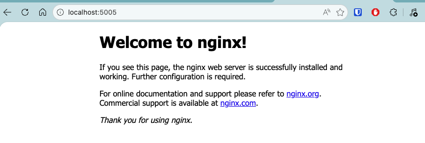

## Build a Secure Swarm

It does most of the things that K8s do but some features are missing.

### Swarm Theory

Swarm is a clustering and scheduling tool for Docker containers. It allows you to manage a cluster of Docker engines as a single virtual system. With Swarm, you can deploy and manage your applications across multiple Docker hosts, providing high availability and scalability.

Swarm uses a manager-worker architecture. The manager nodes are responsible for managing the cluster and making scheduling decisions, while the worker nodes are responsible for running the containers. You can have multiple manager nodes for high availability, and they use a consensus algorithm to maintain the state of the cluster.

SWARMKIT manages clustering and Orchestration. It is developed by moby project.
The decision to pick up a node to run a container is decided by the swarm.

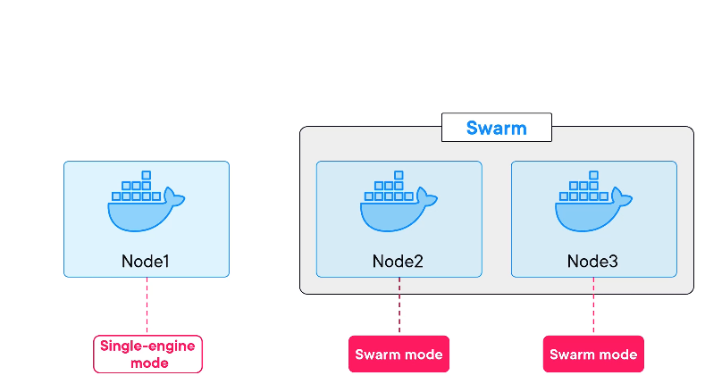

The First node in the swarm is the first manager in ths swarm. 
It is automatically selected as the leader. It will also have a root ca.
The manager nodes will have the TLS certificates to manage the swarm and worker nodes will have the TLS certificates to join the swarm.

This will be stored in the Cluster Store.
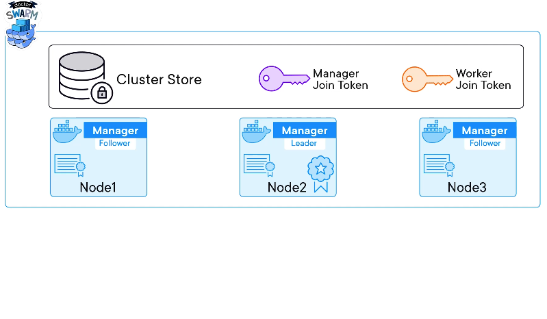

You can also add workers, where all the workloads are runninn. However, it is also possible to run the workloads on the manager as well. you need to explicitelly say not to use the manager for running the workload.

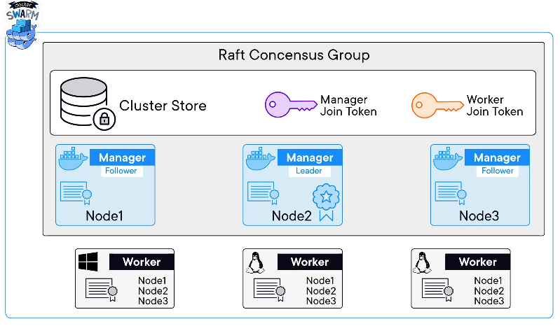
The manager nodes will have the TLS certificates to manage the swarm and worker nodes will have the TLS certificates to join the swarm.

### Creating Swarm Hands-On

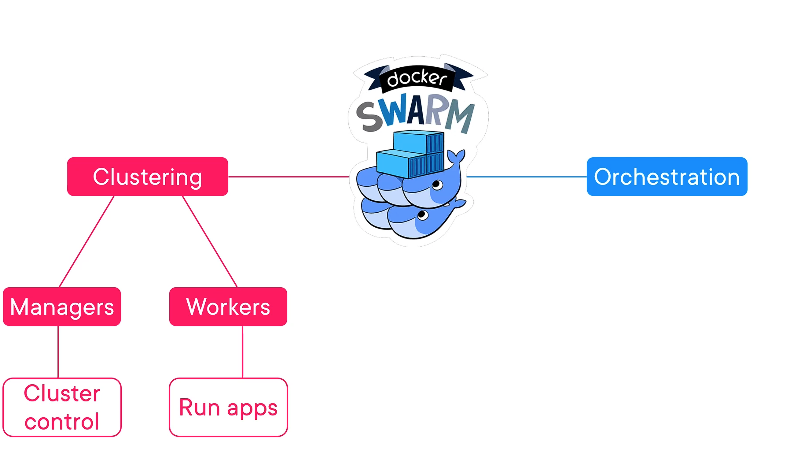

To build a secure swarm, you need to follow these steps:

1. Initialize the swarm: You can initialize the swarm using the command `docker swarm init`. This will create a new swarm and make the current node the manager.

We have the following setup.
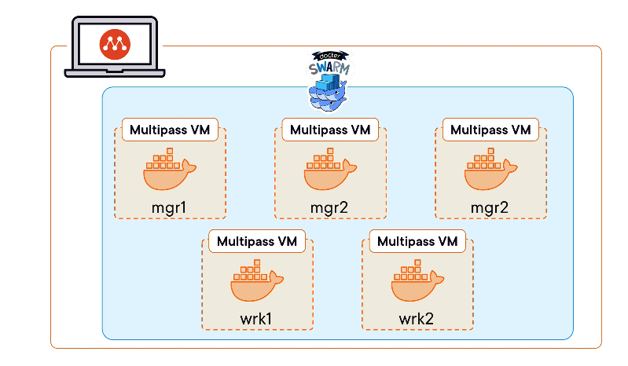

We can use canonical multipass to create the setup.

```bash
multipass launch docker --name mgr1
multipass launch docker --name mgr2
multipass launch docker --name mgr3
multipass launch docker --name wrk1
multipass launch docker --name wrk2
```

Once they are created, get the details using ```multipass ls```

```bash
[11-03-2026][15:10:36][√][~]$ multipass ls
Name                    State             IPv4             Image
mgr1                    Running           192.168.2.17     Ubuntu 24.04 LTS
                                          172.17.0.1
mgr2                    Running           192.168.2.18     Ubuntu 24.04 LTS
                                          172.17.0.1
mgr3                    Running           192.168.2.19     Ubuntu 24.04 LTS
                                          172.17.0.1
wrk1                    Running           192.168.2.20     Ubuntu 24.04 LTS
                                          172.17.0.1
wrk2                    Running           192.168.2.21     Ubuntu 24.04 LTS
                                          172.17.0.1
[11-03-2026][15:10:40][√][~]$
```

### Initialise a swarm

initialise a swarm : ```docker swarm init```
When you initialise the swarm, you will get the instructions to add more nodes.

Example:

```bash
ubuntu@mgr1:~$ docker swarm init
Swarm initialized: current node (b5cn8oh2r3kttu2uzx7jmw7rs) is now a manager.

To add a worker to this swarm, run the following command:

    docker swarm join --token SWMTOKEN 192.168.2.17:2377

To add a manager to this swarm, run 'docker swarm join-token manager' and follow the instructions.
ubuntu@mgr1:~$
```

Once its initialised, we can check the status of the swarm by running ```docker info | grep -i swarm```

Example:

```bash
ubuntu@mgr1:~$ docker info | grep -i swarm
 Swarm: active
ubuntu@mgr1:~$
```

When we check the docker network using the command ```docker network ls```
it will show a new network with overlay driver and scope as swarm.

Example:

```bash
ubuntu@mgr1:~$ docker network ls
NETWORK ID     NAME              DRIVER    SCOPE
445b8c0b616c   bridge            bridge    local
d0c774096c4f   docker_gwbridge   bridge    local
2c391c9987c8   host              host      local
cmqszvcv1fjc   ingress           overlay   swarm
a6fece2a1580   none              null      local
ubuntu@mgr1:~$
```

We can check for the list of nodes here with ```docker node ls`` command

```bash
ubuntu@mgr1:~$ docker node ls
ID                            HOSTNAME   STATUS    AVAILABILITY   MANAGER STATUS   ENGINE VERSION
b5cn8oh2r3kttu2uzx7jmw7rs *   mgr1       Ready     Active         Leader           29.3.0
ubuntu@mgr1:~$
```

Before we add the new node mgr2 to the swarm, we will need the manager join token.
We can get this from mgr1 node using command ```docker swarm join-token manager```

Example:

```bash
ubuntu@mgr1:~$ docker swarm join-token manager
To add a manager to this swarm, run the following command:

    docker swarm join --token SWMTOKEN 192.168.2.17:2377

ubuntu@mgr1:~$
```

Now, we can go to the node2 : mgr1 and run the above command.
Now, the new node mgr2 is now part of the. swarm.

example:

```bash
ubuntu@mgr2:~$ docker swarm join --token SWMTOKEN 192.168.2.17:2377
This node joined a swarm as a manager.
ubuntu@mgr2:~$
```

Again, we add another manager to the cluster using the same command as above.

```bash
ubuntu@mgr3:~$     docker swarm join --token SWMTOKEN 192.168.2.17:2377
This node joined a swarm as a manager.
ubuntu@mgr3:~$
```

When we run ```docker node ls` from manager1: mgr1 node, we can see all the manager nodes now.

```bash
ubuntu@mgr1:~$ docker node ls
ID                            HOSTNAME   STATUS    AVAILABILITY   MANAGER STATUS   ENGINE VERSION
b5cn8oh2r3kttu2uzx7jmw7rs *   mgr1       Ready     Active         Leader           29.3.0
kp24grzclgmsy78p9kp4vcku2     mgr2       Ready     Active         Reachable        29.3.0
70l1i9epg4oazdgiq3is83gyv     mgr3       Ready     Active         Reachable        29.3.0
ubuntu@mgr1:~$
```

Similarly, we can add worker nodes to the swarm. This time we run the command ```docker swarm join-token worker```

Example:

```bash
ubuntu@mgr1:~$ docker swarm join-token worker
To add a worker to this swarm, run the following command:

    docker swarm join --token SWMTOKEN 192.168.2.17:2377

ubuntu@mgr1:~$
```

Now, we can go to the Worker Node : wrk1 and run the above command.

Example:

```bash
ubuntu@wrk1:~$ docker swarm join --token SWMTOKEN 192.168.2.17:2377
This node joined a swarm as a worker.
ubuntu@wrk1:~$
```

We run the same command on worker node2: wrk2

```bash
ubuntu@wrk2:~$ docker swarm join --token SWMTOKEN 192.168.2.17:2377
This node joined a swarm as a worker.
ubuntu@wrk2:~$
```

Now, we can list all the nodes in the cluster by running the command ```docker node ls```
Example:

```bash
ubuntu@mgr1:~$ docker node ls
ID                            HOSTNAME   STATUS    AVAILABILITY   MANAGER STATUS   ENGINE VERSION
b5cn8oh2r3kttu2uzx7jmw7rs *   mgr1       Ready     Active         Leader           29.3.0
kp24grzclgmsy78p9kp4vcku2     mgr2       Ready     Active         Reachable        29.3.0
70l1i9epg4oazdgiq3is83gyv     mgr3       Ready     Active         Reachable        29.3.0
hzmin4pjgzec7ie6psfz5jgmk     wrk1       Ready     Active                          29.3.0
bepwu1f0k7wpjbur76753xzqd     wrk2       Ready     Active                          29.3.0
ubuntu@mgr1:~$
```

Please remember: ```docker node ls`` will not work on the worker nodes.

If there is a need to rotate the token, then it can be rotated by running the command ```docker swarm join-token worker --rotate```.
This doesnt mean that the old nodes that are in the cluster are kicked out. The new rotated token will only be applicable to the new nodes taht will be joining the cluster.
It also means, the old token used by the worker node wrk1 is no longer active and relevant. It cannot be used to add the new node.

We can also check the client certificate on the manager node to understand certain details from the swarm.
Check the Subject, OU and CN details.
command ```sudo openssl x509 -in /var/lib/docker/swarm/certificates/swarm-node.crt --text```
Exapmle:

```bash
ubuntu@mgr1:~$ sudo openssl x509 -in /var/lib/docker/swarm/certificates/swarm-node.crt --text
Certificate:
    Data:
        Version: 3 (0x2)
        Serial Number:
            40:66:e1:5a:5d:7e:fc:8e:20:ff:d3:53:35:40:6f:97:a4:d5:04:22
        Signature Algorithm: ecdsa-with-SHA256
        Issuer: CN = swarm-ca
        Validity
            Not Before: Mar 11 14:29:00 2026 GMT
            Not After : Jun  9 15:29:00 2026 GMT
        Subject: O = hupzcxzptjl1399jdd6dk8b8t, OU = swarm-manager, CN = b5cn8oh2r3kttu2uzx7jmw7rs
        Subject Public Key Info:
            Public Key Algorithm: id-ecPublicKey
                Public-Key: (256 bit)
                pub:
                    04:79:91:92:cc:01:46:80:e8:fc:a2:8a:31:b2:c0:
                    6d:8a:6b:28:5e:90:69:c0:fe:b6:09:e8:b8:8e:67:
                    61:be:2a:66:b1:d0:37:6f:5d:6e:82:71:16:8d:83:
                    6b:98:b0:fd:ca:d7:fe:19:0f:82:3a:8a:55:a0:b9:
                    52:e8:94:32:ad
                ASN1 OID: prime256v1
                NIST CURVE: P-256
        X509v3 extensions:
            X509v3 Key Usage: critical
                Digital Signature, Key Encipherment
            X509v3 Extended Key Usage:
                TLS Web Server Authentication, TLS Web Client Authentication
            X509v3 Basic Constraints: critical
                CA:FALSE
            X509v3 Subject Key Identifier:
                A5:04:3C:6B:86:C7:17:5C:91:08:AB:BC:52:B0:02:64:93:4B:0F:F2
            X509v3 Authority Key Identifier:
                1D:6E:5E:8D:90:79:14:E2:26:AB:2C:83:CD:2C:21:4B:C7:6A:51:8F
            X509v3 Subject Alternative Name:
                DNS:swarm-manager, DNS:b5cn8oh2r3kttu2uzx7jmw7rs, DNS:swarm-ca
    Signature Algorithm: ecdsa-with-SHA256
    Signature Value:
        30:45:02:21:00:ae:40:10:56:10:1d:af:25:c0:4d:16:d7:96:
        83:56:3f:2e:7f:b6:fc:f2:fa:69:a1:5f:55:56:90:b9:fb:b7:
        2d:02:20:41:35:d0:55:51:a6:f1:54:fe:12:d4:6f:5e:5d:e9:
        14:f3:7d:8f:88:86:e4:bc:9b:ab:aa:52:54:11:74:96:6a
-----BEGIN CERTIFICATE-----
MIICNTCCAdugAwIBAgIUQGbhWl1+/I4g/9NTNUBvl6TVBCIwCgYIKoZIzj0EAwIw
EzERMA8GA1UEAxMIc3dhcm0tY2EwHhcNMjYwMzExMTQyOTAwWhcNMjYwNjA5MTUy
OTAwWjBgMSIwIAYDVQQKExlodXB6Y3h6cHRqbDEzOTlqZGQ2ZGs4Yjh0MRYwFAYD
VQQLEw1zd2FybS1tYW5hZ2VyMSIwIAYDVQQDExliNWNuOG9oMnIza3R0dTJ1eng3
am13N3JzMFkwEwYHKoZIzj0CAQYIKoZIzj0DAQcDQgAEeZGSzAFGgOj8oooxssBt
imsoXpBpwP62Cei4jmdhvipmsdA3b11ugnEWjYNrmLD9ytf+GQ+COopVoLlS6JQy
raOBvzCBvDAOBgNVHQ8BAf8EBAMCBaAwHQYDVR0lBBYwFAYIKwYBBQUHAwEGCCsG
AQUFBwMCMAwGA1UdEwEB/wQCMAAwHQYDVR0OBBYEFKUEPGuGxxdckQirvFKwAmST
Sw/yMB8GA1UdIwQYMBaAFB1uXo2QeRTiJqssg80sIUvHalGPMD0GA1UdEQQ2MDSC
DXN3YXJtLW1hbmFnZXKCGWI1Y244b2gycjNrdHR1MnV6eDdqbXc3cnOCCHN3YXJt
LWNhMAoGCCqGSM49BAMCA0gAMEUCIQCuQBBWEB2vJcBNFteWg1Y/Ln+2/PL6aaFf
VVaQufu3LQIgQTXQVVGm8VT+EtRvXl3pFPN9j4iG5Lybq6pSVBF0lmo=
-----END CERTIFICATE-----
ubuntu@mgr1:~$
```

In this above output, lets extract relevant fields
```Subject: O = hupzcxzptjl1399jdd6dk8b8t, OU = swarm-manager, CN = b5cn8oh2r3kttu2uzx7jmw7rs```

If we check the swarm tokens

```bash
ubuntu@mgr1:~$ docker swarm join-token worker --quiet
SWMTOKEN
ubuntu@mgr1:~$ docker swarm join-token manager --quiet
SWMTKN-1-5ehgrd25f68k0i3n56gwvn5n4bwn87g918fol6p4imbro19js6-7xtjy9rnhbn7f0padxd1z1mwa
ubuntu@mgr1:~$
```

Now, we can check the swarm join token on the worker node and manager node to see the difference. The first part is the swarm token and the second bit identifies the worker and manager.

Restarting an old manager or restoring an old backup can create issues. To prevent this, docker has a command to lock a swarm. It is called auto lock,
It stops the restarted managers from automatically rejoining the swarm and subsequently loading the encryption keys and depcrypting the RAFT logs.
It will also stop you from automatically restoring an old copy of the cluster config.

To enable auto lock, run the command ```docker swarm update --autolock=true```
This will give you an unlock key. Keep this safe.

```bash
ubuntu@mgr1:~$ docker swarm update --autolock=true
Swarm updated.
To unlock a swarm manager after it restarts, run the `docker swarm unlock`
command and provide the following key:

    SWMKEY-1-grerjyrmaxq9t2JjatIrpQL8pGJIPGYfrlSK/Xsuo+M

Remember to store this key in a password manager, since without it you
will not be able to restart the manager.
ubuntu@mgr1:~$
```

Till you unlock the swarm using ```docker swarm unlock``` command, you cannot restart any managers.
If you go to anothe manager node, and run the command ```docker node ls```, it will ask you to unlock first.

Example:

```
ubuntu@mgr2:~$ docker node ls
Error response from daemon: Swarm is encrypted and needs to be unlocked before it can be used. Please use "docker swarm unlock" to unlock it.
ubuntu@mgr2:~$ docker swarm unlock
Enter unlock key:
ubuntu@mgr2:~$ docker node ls
ID                            HOSTNAME   STATUS    AVAILABILITY   MANAGER STATUS   ENGINE VERSION
b5cn8oh2r3kttu2uzx7jmw7rs     mgr1       Ready     Active         Leader           29.3.0
kp24grzclgmsy78p9kp4vcku2 *   mgr2       Ready     Active         Reachable        29.3.0
70l1i9epg4oazdgiq3is83gyv     mgr3       Ready     Active         Reachable        29.3.0
hzmin4pjgzec7ie6psfz5jgmk     wrk1       Ready     Active                          29.3.0
bepwu1f0k7wpjbur76753xzqd     wrk2       Ready     Active                          29.3.0
ubuntu@mgr2:~$
```

## Container Networking

Types of container networks.

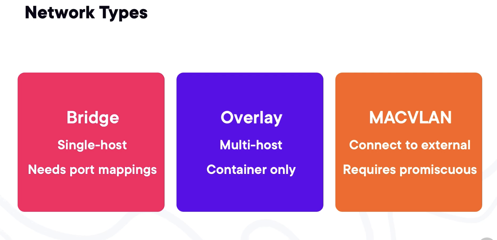

### Bridge Network Also called Single host network

This is the default network created by docker when you install it. It is a private internal network on the host. When you run a container, it will be connected to this network by default. This network allows containers to communicate with each other using their IP addresses or container names. However, this network is only accessible within the host and cannot be accessed from outside.

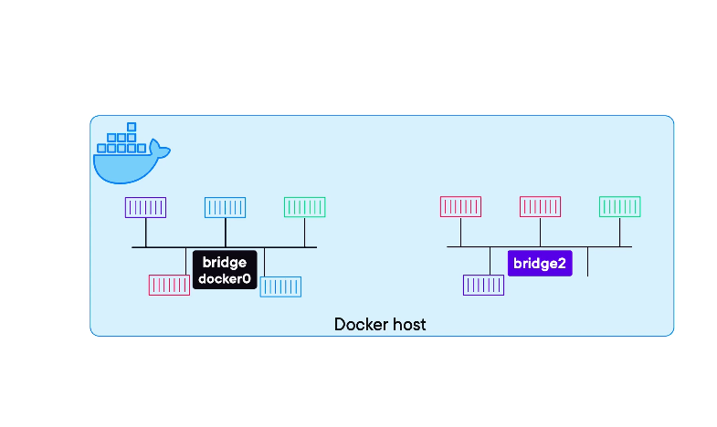

### Overlay Networks also called multi-host networks

It is a single network that spans across nodes.
This network allows containers to communicate with each other across different hosts in the swarm. It uses VXLAN to encapsulate the network traffic between hosts. This network is only accessible within the swarm and cannot be accessed from outside.

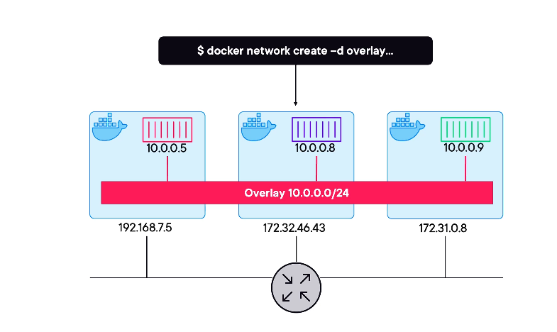

Enabled encryption as well.
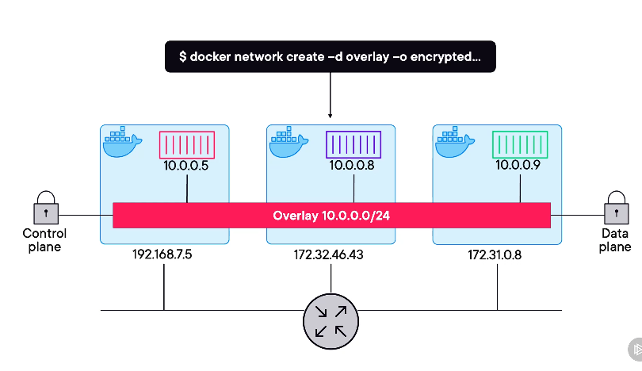

### MACVLAN or Transparent

It gives every containers its own MAC and IP on the network. But itrequires promiscuous mode on the network.

### Networks - Hands on

Lets use the above swarm to work with this.

If we run a command ```docker network ls`` from the manager1 node from the above docker cluster/swarm, we can see the network name called bridge.

Example:

```bash
ubuntu@mgr1:~$ docker network ls
NETWORK ID     NAME              DRIVER    SCOPE
445b8c0b616c   bridge            bridge    local
d0c774096c4f   docker_gwbridge   bridge    local
2c391c9987c8   host              host      local
cmqszvcv1fjc   ingress           overlay   swarm
a6fece2a1580   none              null      local
ubuntu@mgr1:~$
```

Here the network with name ```bridge``` is the bridge network.
We can get the details of this network using the command ```docker network inspect bridge```

Example:

```bash
ubuntu@mgr1:~$ docker network inspect bridge
[
    {
        "Name": "bridge",
        "Id": "445b8c0b616ca9c635f0a235aa5e18974a68269fa413960235a0129544ff7dbb",
        "Created": "2026-03-11T14:58:01.396027558Z",
        "Scope": "local",
        "Driver": "bridge",
        "EnableIPv4": true,
        "EnableIPv6": false,
        "IPAM": {
            "Driver": "default",
            "Options": null,
            "Config": [
                {
                    "Subnet": "172.17.0.0/16",
                    "Gateway": "172.17.0.1"
                }
            ]
        },
        "Internal": false,
        "Attachable": false,
        "Ingress": false,
        "ConfigFrom": {
            "Network": ""
        },
        "ConfigOnly": false,
        "Options": {
            "com.docker.network.bridge.default_bridge": "true",
            "com.docker.network.bridge.enable_icc": "true",
            "com.docker.network.bridge.enable_ip_masquerade": "true",
            "com.docker.network.bridge.host_binding_ipv4": "0.0.0.0",
            "com.docker.network.bridge.name": "docker0",
            "com.docker.network.driver.mtu": "1500"
        },
        "Labels": {},
        "Containers": {
            "9ec587f8d958587e3ec57466ee31af0a23ac90c7b7f04eb28ba547f7c69c11df": {
                "Name": "portainer",
                "EndpointID": "e7c84e719ab88e7a2db4b6174aebc9c3b3e7ebb3835762f44f16cacf2c12379b",
                "MacAddress": "c2:c2:91:3a:9b:ea",
                "IPv4Address": "172.17.0.2/16",
                "IPv6Address": ""
            }
        },
        "Status": {
            "IPAM": {
                "Subnets": {
                    "172.17.0.0/16": {
                        "IPsInUse": 4,
                        "DynamicIPsAvailable": 65532
                    }
                }
            }
        }
    }
]
ubuntu@mgr1:~$
```

Now, lets run a container on this node. We are not specifying any network here, so it will be a local container.

Example:

```bash
ubuntu@mgr1:~$ docker run --rm -d alpine sleep 1d
Unable to find image 'alpine:latest' locally
latest: Pulling from library/alpine
d8ad8cd72600: Pull complete
cb94f19e6ea6: Download complete
37093440b0e0: Download complete
Digest: sha256:25109184c71bdad752c8312a8623239686a9a2071e8825f20acb8f2198c3f659
Status: Downloaded newer image for alpine:latest
69fce74d40cfb91f09817e0663a5e1a4ed04ff1321b2c1226f8efd5f035141d5
ubuntu@mgr1:~$ docker ps
CONTAINER ID   IMAGE                    COMMAND        CREATED         STATUS         PORTS                                                             NAMES
69fce74d40cf   alpine                   "sleep 1d"     5 seconds ago   Up 4 seconds                                                                     vibrant_pike
9ec587f8d958   portainer/portainer-ce   "/portainer"   2 hours ago     Up 2 hours     8000/tcp, 9443/tcp, 0.0.0.0:9000->9000/tcp, [::]:9000->9000/tcp   portainer
ubuntu@mgr1:~$
```

If you run the command ```docker netowrk inspect bridge```, you can see the new container in the Containers block.

```bash
        "Containers": {
            "69fce74d40cfb91f09817e0663a5e1a4ed04ff1321b2c1226f8efd5f035141d5": {
                "Name": "vibrant_pike",
                "EndpointID": "74ba8ae139a46e54f2c6ef23d8ebd859171538cea734a7710589bde9e5975e39",
                "MacAddress": "fa:14:2f:49:7a:8c",
                "IPv4Address": "172.17.0.3/16",
                "IPv6Address": ""
            },
            "9ec587f8d958587e3ec57466ee31af0a23ac90c7b7f04eb28ba547f7c69c11df": {
                "Name": "portainer",
                "EndpointID": "e7c84e719ab88e7a2db4b6174aebc9c3b3e7ebb3835762f44f16cacf2c12379b",
                "MacAddress": "c2:c2:91:3a:9b:ea",
                "IPv4Address": "172.17.0.2/16",
                "IPv6Address": ""
            }
        },
```

Now, lets create another web server container.

```bash
ubuntu@mgr1:~$ docker run -d --name web -p 8080:80 nginx
Unable to find image 'nginx:latest' locally
latest: Pulling from library/nginx
a87363d30ab0: Pull complete
2e1e80a9149a: Pull complete
7e3a4af256ee: Pull complete
3b66ab8c894c: Pull complete
d456cad1d0ff: Pull complete
fbeac1abb084: Pull complete
fca7a914ec95: Pull complete
91b7c54c9127: Download complete
a50bc5888f62: Download complete
Digest: sha256:bc45d248c4e1d1709321de61566eb2b64d4f0e32765239d66573666be7f13349
Status: Downloaded newer image for nginx:latest
2e8e3714e3c9da057a984085879615bbc0bf19cd0f6ec13e121f2d8aa289ce6b
ubuntu@mgr1:~$
```

Now, the nginx run the web service on port 80 and we are saying in the above command to map this port 80 to the port 8080 on the host, in this case mgr1 node.
If i run the command ```docker port <container name>``` as in ```docker port web```
I can see the mapping as below

```bash
ubuntu@mgr1:~$ docker port web
80/tcp -> 0.0.0.0:8080
80/tcp -> [::]:8080
ubuntu@mgr1:~$
```

This means that the nginx web server running inside the container is accessible on port 8080 of the host machine (mgr1). We can access this web server by opening a web browser and navigating to `http://<host-ip>:8080`. In this case, since we are running it on the local machine, we can use `http://localhost:8080` if its your local laptop. But since mgr1 is running as a multipass node, we can get the ip of the multipass node mgr1 by running the command ```multipass info <node name>``` as in ```multipass info mgr1```
Details below

```bash
[11-03-2026][16:51:48][√][~]$ multipass info mgr1
Name:           mgr1
State:          Running
Snapshots:      0
IPv4:           192.168.2.17
                172.17.0.1
                172.18.0.1
Release:        Ubuntu 24.04.4 LTS
Image hash:     99e1d482b958 (Ubuntu 24.04 LTS)
CPU(s):         2
Load:           0.04 0.07 0.03
Disk usage:     3.5GiB out of 38.7GiB
Memory usage:   504.1MiB out of 3.8GiB
Mounts:         /Users/nebumathews/multipass/mgr1 => mgr1
                    UID map: 502:default
                    GID map: 20:default
[11-03-2026][16:51:53][√][~]$
```

Now, we have the IP on the node as ```192.168.2.17```, so now in your browser, ```http://192.168.2.17:8080``` should do the trick as seed in the below snapshot.

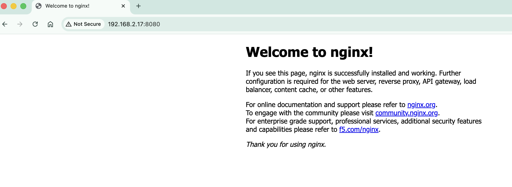

Now, this is not an ideal situation because we may have multiple containers and they all need this king of mapping and some may overlap as well, different services or containers can't share the same port on the same host.

Let go ahead and create a bridge network using the command ```docker network create -d bridge golden-gate```, the name ```golden-gate``` can be anything.

Example:

```bash
ubuntu@mgr1:~$ docker network create -d bridge golden-gate
28e6acc6fd8ebf6b85c5070b4428165ae6100ef89559c433f239236d5877f6c0
ubuntu@mgr1:~$

ubuntu@mgr1:~$ docker network ls
NETWORK ID     NAME              DRIVER    SCOPE
445b8c0b616c   bridge            bridge    local
d0c774096c4f   docker_gwbridge   bridge    local
28e6acc6fd8e   golden-gate       bridge    local
2c391c9987c8   host              host      local
cmqszvcv1fjc   ingress           overlay   swarm
a6fece2a1580   none              null      local
ubuntu@mgr1:~$
```

Now, we can run a container and connect it to this network using the command ```docker run --rm -d --network golden-gate alpine sleep 1d```

Lets inspect the new network ```golden-gate``` and here we see the new container is running in that new network. lets run the command ```docker network inspect golden-gate```

Example:

```bash
ubuntu@mgr1:~$ docker network inspect golden-gate
[
    {
        "Name": "golden-gate",
        "Id": "28e6acc6fd8ebf6b85c5070b4428165ae6100ef89559c433f239236d5877f6c0",
        "Created": "2026-03-11T16:59:03.733521583Z",
        "Scope": "local",
        "Driver": "bridge",
        "EnableIPv4": true,
        "EnableIPv6": false,
        "IPAM": {
            "Driver": "default",
            "Options": {},
            "Config": [
                {
                    "Subnet": "172.19.0.0/16",
                    "Gateway": "172.19.0.1"
                }
            ]
        },
        "Internal": false,
        "Attachable": false,
        "Ingress": false,
        "ConfigFrom": {
            "Network": ""
        },
        "ConfigOnly": false,
        "Options": {},
        "Labels": {},
        "Containers": {
            "7f0c66a803176c8dba218cd8f0c9df19362394199bad46f7e02f75ce2d6485b2": {
                "Name": "sweet_noyce",
                "EndpointID": "9747248afb35fe56cd407a5b655834617d4d5fbe163b52d8343fc40fa34a557a",
                "MacAddress": "1a:0f:e6:f1:e9:cc",
                "IPv4Address": "172.19.0.2/16",
                "IPv6Address": ""
            }
        },
        "Status": {
            "IPAM": {
                "Subnets": {
                    "172.19.0.0/16": {
                        "IPsInUse": 4,
                        "DynamicIPsAvailable": 65532
                    }
                }
            }
        }
    }
]
ubuntu@mgr1:~$
```

Now, lets look into overlay networks. they only works with swarm mode. Once we create this network, it will be available to each and every node in the swarm netowrk,
creating an overlay network is easy ```docker network create -d overlay myoverlaynw```

Example:

```bash
ubuntu@mgr1:~$ docker network create -d overlay myoverlaynw
0fnw4r9m66vfwwmnmmpouc4yb
ubuntu@mgr1:~$ docker network ls
NETWORK ID     NAME              DRIVER    SCOPE
445b8c0b616c   bridge            bridge    local
d0c774096c4f   docker_gwbridge   bridge    local
28e6acc6fd8e   golden-gate       bridge    local
2c391c9987c8   host              host      local
cmqszvcv1fjc   ingress           overlay   swarm
0fnw4r9m66vf   myoverlaynw       overlay   swarm
a6fece2a1580   none              null      local
ubuntu@mgr1:~$
```

After this we crate a new service called pinger using the command ```docker service create -d --name pinger --replicas 2 --network myoverlaynw alpine sleep 1d```

Example:

```bash
ubuntu@mgr1:~$ docker service create -d --name pinger --replicas 2 --network myoverlaynw alpine sleep 1d
16s7uyotalv49aidl1c3oji4b
ubuntu@mgr1:~$ docker service ls
ID             NAME      MODE         REPLICAS   IMAGE           PORTS
16s7uyotalv4   pinger    replicated   2/2        alpine:latest
```

We can also see where these containers are running by running ``docker service ps <service name>``` as in ```docker service ps pinger```
Example:

```bash
ubuntu@mgr1:~$ docker service ps pinger
ID             NAME       IMAGE           NODE      DESIRED STATE   CURRENT STATE            ERROR     PORTS
p5d9jfn9tkgo   pinger.1   alpine:latest   mgr2      Running         Running 17 seconds ago
yrovvusjstvl   pinger.2   alpine:latest   mgr1      Running         Running 20 seconds ago
ubuntu@mgr1:~$
```

Lets login to node2:mgr2 and check the network config ```docker network inspect myoverlaynw```
Example:

```bash
ubuntu@mgr2:~$ docker network inspect myoverlaynw
[
    {
        "Name": "myoverlaynw",
        "Id": "0fnw4r9m66vfwwmnmmpouc4yb",
        "Created": "2026-03-11T17:10:25.307450299Z",
        "Scope": "swarm",
        "Driver": "overlay",
        "EnableIPv4": true,
        "EnableIPv6": false,
        "IPAM": {
            "Driver": "default",
            "Options": null,
            "Config": [
                {
                    "Subnet": "10.0.1.0/24",
                    "Gateway": "10.0.1.1"
                }
            ]
        },
        "Internal": false,
        "Attachable": false,
        "Ingress": false,
        "ConfigFrom": {
            "Network": ""
        },
        "ConfigOnly": false,
        "Options": {
            "com.docker.network.driver.overlay.vxlanid_list": "4097"
        },
        "Labels": {},
        "Peers": [
            {
                "Name": "5dfe6b84c546",
                "IP": "192.168.2.18"
            },
            {
                "Name": "ebd5fa61946d",
                "IP": "192.168.2.17"
            }
        ],
        "Containers": {
            "77211a0dc3997e9b790d7c2be7aca3586529c19006a706ad391e8a0dbb5837b5": {
                "Name": "pinger.1.p5d9jfn9tkgon2w5zbl3bh2qo",
                "EndpointID": "cea9e4871fb38dcc734b1ad58d434d512b3911d1fa0832af296c4a0df685887e",
                "MacAddress": "02:42:0a:00:01:03",
                "IPv4Address": "10.0.1.3/24",
                "IPv6Address": ""
            },
            "lb-myoverlaynw": {
                "Name": "myoverlaynw-endpoint",
                "EndpointID": "e5e030911644179fffa8c8dadd428b043d021af9b195833029bad2d09e701d8d",
                "MacAddress": "02:42:0a:00:01:05",
                "IPv4Address": "10.0.1.5/24",
                "IPv6Address": ""
            }
        },
        "Status": {
            "IPAM": {
                "Subnets": {
                    "10.0.1.0/24": {
                        "IPsInUse": 8,
                        "DynamicIPsAvailable": 248
                    }
                }
            }
        }
    }
]
ubuntu@mgr2:~$
```

Now, we can see that the ip of this container in this case is ```10.0.1.3```. Now, lets login to the node1: mgr1 and login to the same container.
We can run ```docker ps``` and locate the alpine container in the pinger service. Now, lets login to the container and run the ping command and try to reach the container in the node2:mgr2

Example:

```bash
ubuntu@mgr1:~$ docker ps
CONTAINER ID   IMAGE                    COMMAND                  CREATED          STATUS          PORTS                                                             NAMES
092b3d197762   alpine:latest            "sleep 1d"               4 minutes ago    Up 4 minutes                                                                      pinger.2.yrovvusjstvl1jwn8oj3e38k0
7f0c66a80317   alpine                   "sleep 1d"               13 minutes ago   Up 13 minutes                                                                     sweet_noyce
2e8e3714e3c9   nginx                    "/docker-entrypoint.…"   27 minutes ago   Up 27 minutes   0.0.0.0:8080->80/tcp, [::]:8080->80/tcp                           web
69fce74d40cf   alpine                   "sleep 1d"               34 minutes ago   Up 34 minutes                                                                     vibrant_pike
9ec587f8d958   portainer/portainer-ce   "/portainer"             2 hours ago      Up 2 hours      8000/tcp, 9443/tcp, 0.0.0.0:9000->9000/tcp, [::]:9000->9000/tcp   portainer
ubuntu@mgr1:~$ docker exec -it 092b3d197762 sh
/ # ping 10.0.1.3
PING 10.0.1.3 (10.0.1.3): 56 data bytes
64 bytes from 10.0.1.3: seq=0 ttl=64 time=2.315 ms
64 bytes from 10.0.1.3: seq=1 ttl=64 time=1.457 ms
64 bytes from 10.0.1.3: seq=2 ttl=64 time=1.151 ms
^C
--- 10.0.1.3 ping statistics ---
3 packets transmitted, 3 packets received, 0% packet loss
round-trip min/avg/max = 1.151/1.641/2.315 ms
/ #
```

We can see that the container on Node1:mgr1 is able to reach the container on Node2:mgr2.

## Network services

Service discovery and load balancing,

### Service Discovery

Every new service in the swarm gets a name and this name is registered with the swarms inbuilt DNS. Each container use DNS for service discovery.

In a swarm, we wrap the the containers in a construct called service. This ensures that cardinality and many other properties.

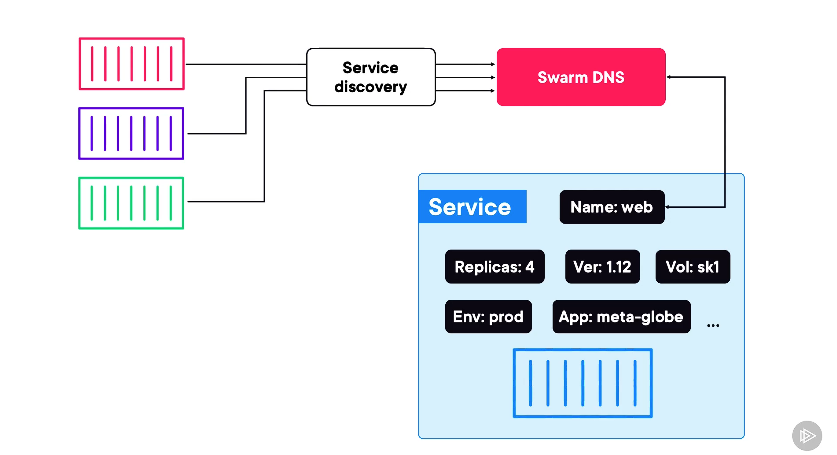

Lets create two services ping and pong in the. swarm with 3 replicas.

Example:

```bash
ubuntu@mgr1:~$ docker service create -d --name ping --replicas 3 --network myoverlaynw alpine sleep 1d
ih9udzmftb4mu71yed5edomsp
ubuntu@mgr1:~$ docker service create -d --name pong --replicas 3 --network myoverlaynw alpine sleep 1d
am0dtts04kyjgiulfbx6n83q6
ubuntu@mgr1:~$ docker service ls
ID             NAME      MODE         REPLICAS   IMAGE           PORTS
ih9udzmftb4m   ping      replicated   3/3        alpine:latest
am0dtts04kyj   pong      replicated   2/3        alpine:latest
ubuntu@mgr1:~$
ubuntu@mgr1:~$ docker service ps ping
ID             NAME      IMAGE           NODE      DESIRED STATE   CURRENT STATE            ERROR     PORTS
29ogif3hmk0u   ping.1    alpine:latest   mgr2      Running         Running 39 seconds ago
tvfufi8x492j   ping.2    alpine:latest   mgr3      Running         Running 36 seconds ago
3k5j6y8mvuw6   ping.3    alpine:latest   mgr1      Running         Running 39 seconds ago
ubuntu@mgr1:~$ docker service ps pong
ID             NAME      IMAGE           NODE      DESIRED STATE   CURRENT STATE            ERROR     PORTS
jh707cue23h7   pong.1    alpine:latest   wrk1      Running         Running 28 seconds ago
xog2535jq7ew   pong.2    alpine:latest   wrk2      Running         Running 28 seconds ago
nn8n5okx2pe8   pong.3    alpine:latest   mgr3      Running         Running 32 seconds ago
ubuntu@mgr1:~$
```

Now, we will try to reach to service pong from the container in service ping.
Ping service is in nodes mgr1, mgr2 and mgr3.
Lets login to the container on mgr1 and try to reach the pong service thats running on wrk1, wrk2 and mgr3.
Example:

```bash
ubuntu@mgr1:~$ docker ps
CONTAINER ID   IMAGE                    COMMAND                  CREATED          STATUS          PORTS                                                             NAMES
1e56b21af659   alpine:latest            "sleep 1d"               5 minutes ago    Up 5 minutes                                                                      ping.3.3k5j6y8mvuw6ovnzsxhedboma
7f0c66a80317   alpine                   "sleep 1d"               26 minutes ago   Up 26 minutes                                                                     sweet_noyce
2e8e3714e3c9   nginx                    "/docker-entrypoint.…"   40 minutes ago   Up 40 minutes   0.0.0.0:8080->80/tcp, [::]:8080->80/tcp                           web
69fce74d40cf   alpine                   "sleep 1d"               48 minutes ago   Up 48 minutes                                                                     vibrant_pike
9ec587f8d958   portainer/portainer-ce   "/portainer"             3 hours ago      Up 3 hours      8000/tcp, 9443/tcp, 0.0.0.0:9000->9000/tcp, [::]:9000->9000/tcp   portainer
ubuntu@mgr1:~$ docker exec -it 1e56b21af659 sh
/ #
/ # ping pong
PING pong (10.0.1.14): 56 data bytes
64 bytes from 10.0.1.14: seq=0 ttl=64 time=0.749 ms
64 bytes from 10.0.1.14: seq=1 ttl=64 time=0.108 ms
64 bytes from 10.0.1.14: seq=2 ttl=64 time=0.220 ms
^C
--- pong ping statistics ---
3 packets transmitted, 3 packets received, 0% packet loss
round-trip min/avg/max = 0.108/0.359/0.749 ms
/ # exit
ubuntu@mgr1:~$
```

But always remember, if the services are on different overlay networks, then they cannot talk to each other.

### Load balancing

First one is the ingress load balanging. External client can hit any of the nodes and they can reach to the service.

Now, lets create another service called web using the ngins container.
command : ```docker service create --name web --network myoverlaynw --replicas 2 -d -p 5001:80 nginx```
Example:L

```bash
ubuntu@mgr1:~$ docker service create --name web --network myoverlaynw --replicas 2 -d -p 5001:80 nginx
qcb5upmfg8263lhkeeodl4erb
ubuntu@mgr1:~$ docker service ls
ID             NAME      MODE         REPLICAS   IMAGE           PORTS
ih9udzmftb4m   ping      replicated   3/3        alpine:latest
am0dtts04kyj   pong      replicated   3/3        alpine:latest
qcb5upmfg826   web       replicated   2/2        nginx:latest    *:5001->80/tcp
ubuntu@mgr1:~$
ubuntu@mgr1:~$ docker service ps web
ID             NAME      IMAGE          NODE      DESIRED STATE   CURRENT STATE                ERROR     PORTS
gvu6v34ms4tf   web.1     nginx:latest   wrk2      Running         Running about a minute ago
x8eq860eotu9   web.2     nginx:latest   mgr1      Running         Running about a minute ago
ubuntu@mgr1:~$
```

Now, its runing on wrk2 and mgr1 nodes. We can also check the port details as below

```bash
ubuntu@mgr1:~$ docker service inspect web --pretty
ID:  qcb5upmfg8263lhkeeodl4erb
Name:  web
Service Mode: Replicated
 Replicas: 2
Placement:
UpdateConfig:
 Parallelism: 1
 On failure: pause
 Monitoring Period: 5s
 Max failure ratio: 0
 Update order:      stop-first
RollbackConfig:
 Parallelism: 1
 On failure: pause
 Monitoring Period: 5s
 Max failure ratio: 0
 Rollback order:    stop-first
ContainerSpec:
 Image:  nginx:latest@sha256:bc45d248c4e1d1709321de61566eb2b64d4f0e32765239d66573666be7f13349
 Init:  false
Resources:
Networks: 0fnw4r9m66vfwwmnmmpouc4yb
Endpoint Mode: vip
Ports:
 PublishedPort = 5001
  Protocol = tcp
  TargetPort = 80
  PublishMode = ingress
ubuntu@mgr1:~$
```

Now lets try to reach this service from one of the nodes where the service is not running. Lets choose node mgr3.
Lets get the IP of this node from ```multipass ls``` command.

We get the ip of the node mgr3 and launch the web server from the browser and we can hit the nginx endpoint.
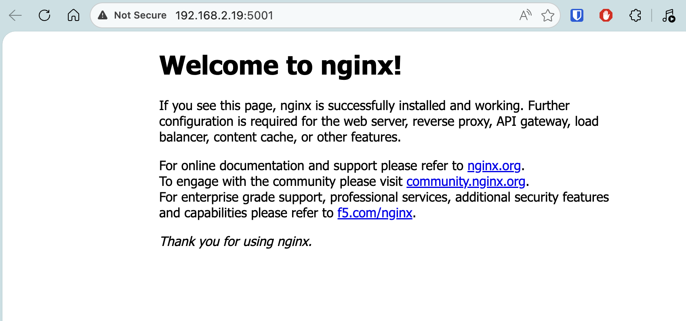

In this case the swarm is loadbalancing the ingress request through the two nodes where the service is running.

## Volumes and Persistent Data

Containers and usually stateless, immutable and this is the undelying property. But, in some situations, we need some persistent data in a container. This makes them stateful and even though a container is by design ephemeral, we need to ensure that the data is persistent.

To achieve this, we have docker volumes. Docker volumes are a way to persist data outside of the container's filesystem. They are managed by docker and can be shared between containers. They can also be used to store data on the host machine.

Its important to note that, each volume lifecycle should be independent of the container lifecycle.

Its possible to mount a volume to a container and if the container fails, the volume lives.

### Types of volumes

1. Host Volumes: These are volumes that are stored on the host machine. They are created using the ```-v``` or ```--mount``` flag when running a container. They can be used to share data between the host and the container or between multiple containers.

Volume command is available as an independent subcommand in docker cli.
```docker volume ls``` will list all the volumes in the docker subsystem.

Example:

```bash
ubuntu@mgr1:~$ docker volume ls
DRIVER    VOLUME NAME
local     portainer_data
ubuntu@mgr1:~$
ubuntu@mgr1:~$

```

We can create a volume using the command ```docker volume create <Name>```

Example:

```bash
ubuntu@mgr1:~$ docker volume create myvol
myvol
ubuntu@mgr1:~$ docker volume ls
DRIVER    VOLUME NAME
local     myvol
local     portainer_data
ubuntu@mgr1:~$
ubuntu@mgr1:~$ sudo ls -l /var/lib/docker/volumes
total 32
brw------- 1 root root  8, 1 Mar 11 14:58 backingFsBlockDev
-rw------- 1 root root 32768 Mar 12 10:33 metadata.db
drwx-----x 3 root root  4096 Mar 12 10:33 myvol
drwx-----x 3 root root  4096 Mar 11 14:58 portainer_data
ubuntu@mgr1:~$
```

We can also locate the volume on the local disk at ```/var/lib/docker/volumes```
We can also delete a volume using ```docker volume rm <volume name>```

### Working with containers and volumes

This can be done at the time of creating a container.
As an example thefollowing command will create a container with a volume. In this situation if the volume is not existing, it will be created fresh.

```docker run -d -it --name voltest --mount source=voltest,target=/vol alpine```
Please Note: The mount option should not have any spaces when providing the key value pairs.

In this above command, we are creating an alpine container and it is created with a volume called voltest and it is mounted within the container at /vol mount point.

```bash
ubuntu@mgr1:~$ docker run -d -it --name voltest --mount source=voltest,target=/vol alpine
92799bad1324f33a7fd3786d37f8304c8cb7e279dd0dabeea1f0eb904f3caefa
ubuntu@mgr1:~$
ubuntu@mgr1:~$ docker run -d -it --name voltest --mount source=voltest,target=/vol alpine
92799bad1324f33a7fd3786d37f8304c8cb7e279dd0dabeea1f0eb904f3caefa
ubuntu@mgr1:~$
ubuntu@mgr1:~$ docker volume ls
DRIVER    VOLUME NAME
local     myvol
local     portainer_data
local     voltest
ubuntu@mgr1:~$ docker ps
CONTAINER ID   IMAGE                    COMMAND                  CREATED          STATUS          PORTS                                                             NAMES
92799bad1324   alpine                   "/bin/sh"                54 seconds ago   Up 53 seconds                                                                     voltest
82eb473751dc   alpine:latest            "sleep 1d"               2 minutes ago    Up 2 minutes                                                                      ping.3.8cot1xoz8o6zki3ql005yrctp
cc2fe4d9dc9c   nginx:latest             "/docker-entrypoint.…"   17 hours ago     Up 17 hours     80/tcp                                                            web.2.x8eq860eotu9etxyptb2nt0t4
2e8e3714e3c9   nginx                    "/docker-entrypoint.…"   18 hours ago     Up 18 hours     0.0.0.0:8080->80/tcp, [::]:8080->80/tcp                           web
9ec587f8d958   portainer/portainer-ce   "/portainer"             20 hours ago     Up 20 hours     8000/tcp, 9443/tcp, 0.0.0.0:9000->9000/tcp, [::]:9000->9000/tcp   portainer
ubuntu@mgr1:~$
```

Now we have a new volume created by the container. This will be available locally on the node at ```/var/lib/docker/volumes``` as shown in the following output.

```bash
ubuntu@mgr1:~$ sudo ls -al /var/lib/docker/volumes
total 44
drwx-----x  5 root root  4096 Mar 12 10:41 .
drwx--x--- 12 root root  4096 Mar 11 14:58 ..
brw-------  1 root root  8, 1 Mar 11 14:58 backingFsBlockDev
-rw-------  1 root root 32768 Mar 12 10:41 metadata.db
drwx-----x  3 root root  4096 Mar 12 10:33 myvol
drwx-----x  3 root root  4096 Mar 11 14:58 portainer_data
drwx-----x  3 root root  4096 Mar 12 10:41 voltest
ubuntu@mgr1:~$
```

We can mount a volume to a container using the ```-v``` or ```--mount``` flag when running a container.

Lets login to the container and check the location of the volume.

```bash
/ # mount | grep vol
/dev/sda1 on /vol type ext4 (rw,relatime,discard,errors=remount-ro,commit=30)
/ # df -kh
Filesystem                Size      Used Available Use% Mounted on
overlay                  37.7G      3.4G     34.3G   9% /
tmpfs                    64.0M         0     64.0M   0% /dev
shm                      64.0M         0     64.0M   0% /dev/shm
/dev/sda1                37.7G      3.4G     34.3G   9% /vol
/dev/sda1                37.7G      3.4G     34.3G   9% /etc/resolv.conf
/dev/sda1                37.7G      3.4G     34.3G   9% /etc/hostname
/dev/sda1                37.7G      3.4G     34.3G   9% /etc/hosts
tmpfs                     1.9G         0      1.9G   0% /proc/acpi
tmpfs                    64.0M         0     64.0M   0% /proc/interrupts
tmpfs                    64.0M         0     64.0M   0% /proc/kcore
tmpfs                    64.0M         0     64.0M   0% /proc/keys
tmpfs                    64.0M         0     64.0M   0% /proc/latency_stats
tmpfs                     1.9G         0      1.9G   0% /proc/scsi
tmpfs                    64.0M         0     64.0M   0% /proc/timer_list
tmpfs                     1.9G         0      1.9G   0% /sys/firmware
/ #
```

Lets create a file called newfile in the container at ```/vol``` location. 

```bash
/vol # df -kh > newfile
/vol # mount >> newfile
/vol # ls -al
total 12
drwxr-xr-x    2 root     root          4096 Mar 12 10:48 .
drwxr-xr-x    1 root     root          4096 Mar 12 10:41 ..
-rw-r--r--    1 root     root          3279 Mar 12 10:48 newfile
/vol # pwd
/vol
/vol #
```

This can then be verified on the host next.

```bash
ubuntu@mgr1:~$ sudo ls -al /var/lib/docker/volumes/voltest
total 12
drwx-----x 3 root root 4096 Mar 12 10:41 .
drwx-----x 5 root root 4096 Mar 12 10:41 ..
drwxr-xr-x 2 root root 4096 Mar 12 10:46 _data
ubuntu@mgr1:~$ sudo ls -al /var/lib/docker/volumes/voltest/_data
total 12
drwxr-xr-x 2 root root 4096 Mar 12 10:46 .
drwx-----x 3 root root 4096 Mar 12 10:41 ..
-rw-r--r-- 1 root root 3279 Mar 12 10:46 newfile
ubuntu@mgr1:~$
```

Next, we will validate the persistence of the volume after the container is deleted and a new one is created.

We stop the container and delete it.

```bash
ubuntu@mgr1:~$ docker stop voltest
voltest
ubuntu@mgr1:~$ docker rm voltest
voltest
ubuntu@mgr1:~$
```

Lets create a new container with the same volume but mounted at a different mount point in the container.
```docker run -d -it --name apptest --mount source=voltest,target=/app nginx```

Example:

```bash
ubuntu@mgr1:~$
ubuntu@mgr1:~$ docker run -d -it --name apptest --mount source=voltest,target=/app nginx
a3e383739e4dcfcbdb89897dcaf202b619a610ad7fe6d07be6f32c536a962f25
ubuntu@mgr1:~$ docker exec -it apptest sh
# cd /app
# ls -al
total 12
drwxr-xr-x 2 root root 4096 Mar 12 10:48 .
drwxr-xr-x 1 root root 4096 Mar 12 11:15 ..
-rw-r--r-- 1 root root 3279 Mar 12 10:48 newfile
#
```

While the container is running, the volume cannot be deleted but once the container is stopped and not running anymore, the same volume can be deleted.
Lets see this.
stop and delete the container
remove the volume and check it one the host.

```bash
ubuntu@mgr1:~$ docker stop apptest
apptest
ubuntu@mgr1:~$ docker rm apptest
apptest
ubuntu@mgr1:~$ docker volume ls
DRIVER    VOLUME NAME
local     myvol
local     portainer_data
local     voltest
ubuntu@mgr1:~$ docker volume rm voltest
voltest
ubuntu@mgr1:~$ sudo ls -al /var/lib/docker/volumes/
total 40
drwx-----x  4 root root  4096 Mar 12 11:18 .
drwx--x--- 12 root root  4096 Mar 11 14:58 ..
brw-------  1 root root  8, 1 Mar 11 14:58 backingFsBlockDev
-rw-------  1 root root 32768 Mar 12 11:18 metadata.db
drwx-----x  3 root root  4096 Mar 12 10:33 myvol
drwx-----x  3 root root  4096 Mar 11 14:58 portainer_data
ubuntu@mgr1:~$
```

## Docker Compose

What is it?
Its a config driven approach to deploy multicontainer app or a microservice app.
Its a tool for defining and running multi-container Docker applications. With Compose, you use a YAML file to configure your application’s services. Then, with a single command, you create and start all the services from your configuration.

The docker compose file is a yaml file and it is usually named as ```docker-compose.yml``` and it is used to define the services, networks and volumes for a multi-container application.

The basic structure of a docker-compose file is as follows:

```yaml
version: '3'
services:
    service1:
        image: image1
        ports:
        - "port1:port1"
        volumes:
        - volume1:/path/in/container
        networks:
        - network1
    service2:
        image: image2
        ports:
        - "port2:port2"
        volumes:
        - volume2:/path/in/container
        networks:
        - network1
networks:
    network1:
volumes:
    volume1:
    volume2:
```

In this file, we define two services, service1 and service2. Each service has its own image, ports, volumes and networks. We also define a network called network1 and two volumes called volume1 and volume2.

We can use the app defined in docker-compose folder.
We run the command ```docker compose up```
This will bring up all the resources mentioned in the compose.yaml file
Details below.

```bash
ubuntu@mgr1:~$ docker ps
CONTAINER ID   IMAGE                    COMMAND                  CREATED          STATUS          PORTS                                                             NAMES
b6744f96df7b   redis:alpine             "docker-entrypoint.s…"   25 seconds ago   Up 24 seconds   6379/tcp                                                          docker-compose-redis-1
643f58e9c6c5   docker-compose-web-fe    "python app/app.py p…"   25 seconds ago   Up 24 seconds   0.0.0.0:5001->8080/tcp, [::]:5001->8080/tcp                       docker-compose-web-fe-1
9ec587f8d958   portainer/portainer-ce   "/portainer"             21 hours ago     Up 21 hours     8000/tcp, 9443/tcp, 0.0.0.0:9000->9000/tcp, [::]:9000->9000/tcp   portainer
ubuntu@mgr1:~$
ubuntu@mgr1:~$ docker volume ls
DRIVER    VOLUME NAME
local     docker-compose_counter-vol
local     myvol
local     portainer_data
ubuntu@mgr1:~$ docker network ls
NETWORK ID     NAME                         DRIVER    SCOPE
445b8c0b616c   bridge                       bridge    local
6cfeb17383ce   docker-compose_counter-net   bridge    local
d0c774096c4f   docker_gwbridge              bridge    local
28e6acc6fd8e   golden-gate                  bridge    local
2c391c9987c8   host                         host      local
a6fece2a1580   none                         null      local
ubuntu@mgr1:~$ docker image ls
IMAGE                           ID             DISK USAGE   CONTENT SIZE   EXTRA
docker-compose-web-fe:latest    112b00ef21c2        107MB         25.8MB    U
portainer/portainer-ce:latest   3267f1869e0f        230MB           55MB    U
redis:alpine                    2afba59292f2        133MB         34.8MB    U
ubuntu@mgr1:~$
```

Some additional command.

```bash
ubuntu@mgr1:~/mgr1/docker-compose$ docker compose up --detach
[+] up 2/2
 ✔ Container docker-compose-web-fe-1 Running                                                                                      0.0s
 ✔ Container docker-compose-redis-1  Running                                                                                      0.0s
ubuntu@mgr1:~/mgr1/docker-compose$
ubuntu@mgr1:~/mgr1/docker-compose$ docker compose ls
NAME                STATUS              CONFIG FILES
docker-compose      running(2)          /home/ubuntu/mgr1/docker-compose/compose.yaml
ubuntu@mgr1:~/mgr1/docker-compose$
```

we can bring the setup down using ```dfoker compose down```

```bash
ubuntu@mgr1:~/mgr1/docker-compose$ docker compose down
[+] down 3/3
 ✔ Container docker-compose-web-fe-1  Removed                                                                                     0.2s
 ✔ Container docker-compose-redis-1   Removed                                                                                     0.1s
 ✔ Network docker-compose_counter-net Removed                                                                                     0.1s
ubuntu@mgr1:~/mgr1/docker-compose$
```

We can do the normal licecycle commands using ```docker compose``` sub command.

```bash
ubuntu@mgr1:~/mgr1/docker-compose$
ubuntu@mgr1:~/mgr1/docker-compose$ docker compose stop
[+] stop 2/2
 ✔ Container docker-compose-web-fe-1 Stopped                                                                                      0.1s
 ✔ Container docker-compose-redis-1  Stopped                                                                                      0.1s
ubuntu@mgr1:~/mgr1/docker-compose$ docker compose start
[+] start 2/2
 ✔ Container docker-compose-web-fe-1 Started                                                                                      0.1s
 ✔ Container docker-compose-redis-1  Started                                                                                      0.1s
ubuntu@mgr1:~/mgr1/docker-compose$
```

## Docker Stacks

Docker stack is a higher level abstraction over docker compose. It is used to deploy a multi-container application on a swarm cluster. It uses the same compose file format as docker compose but it is deployed on a swarm cluster.

The basic structure of a docker stack file is similar to docker compose file but it is deployed on a swarm cluster.

```yaml
version: '3'
services:
    service1:
        image: image1
        ports:
        - "port1:port1"
        volumes:
        - volume1:/path/in/container
        networks:
        - network1
    service2:
        image: image2
        ports:
        - "port2:port2"
        volumes:
        - volume2:/path/in/container
        networks:
        - network1
networks:
    network1:
volumes:
    volume1:
    volume2:
```

In this file, we define two services, service1 and service2. Each service has its own image, ports, volumes and networks. We also define a network called network1 and two volumes called volume1 and volume2.

Please remember : Stack doesnt allow build on the fly. So, you need to ensure that the image is pre-built and declaed in the yaml file.

To deploy a stack, we use the command ```docker stack deploy -c <compose file> <stack name>```

We will use the example from ```docker-stacks```

Before we proceed with the stacks deployment, we need to build the image for the frontend and then push it to the docker hub. This way, we can reference the image in the compose.yaml file.
Steps

1. Build the image : ```docker image build -t deneasta/dnat:myapp .```
2. List the image: ```docker image ls```, this will show the image as ```deneasta/dnat:myapp```
3. Push the Image : ```docker image push deneasta/dnat:myapp```. Once this is successful, you can see it in the docker hub.
4. Reference the Image in compose.yaml : ```image: deneasta/dnat:myapp```

After this, we are ready to run the deploy command. Please ensure that you have a docker swarm ready with manager and worker nodes.
IF there is no docker swarm ready, then create one.

1. With multipass, create 5 nodes. 3 managers and 2 workers.
2. Login into the multipass node mgr1 and run the command ```docker swarm init```
3. run the command ```docker swarm join-token manager```, this will show the token required by the managers to join the swarm. Use this command and run on other two manager nodes mgr2 and mgr3
4. run the command ```docker swarm join-token worker```, this will show the token required by the workers to join the swarm. Use this command and run on the worker nodes wrk1 and wrk2
5. run the command ```docker node ls``` to list all the nodes in the cluster or swarm.

Once the swarm is ready, we are ready to deploy the stack.  You need to go to the location where the compose.yaml file is present. 

We use the command ```docker stack deploy -c compose.yaml <Name of the Stack>```

Example:

```bash
ubuntu@mgr1:~/mgr1/docker-stacks$ docker stack deploy -c compose.yaml myStack
Since --detach=false was not specified, tasks will be created in the background.
In a future release, --detach=false will become the default.
Creating network myStack_counter-net
Creating service myStack_web-fe
Creating service myStack_redis
ubuntu@mgr1:~/mgr1/docker-stacks$
```

We can get the details of the stack and the details by running the commands

1. docker stack ls
2. docker stack ps myStack

```bash
ubuntu@mgr1:~/mgr1/docker-stacks$ docker stack ls
NAME      SERVICES
myStack   2
ubuntu@mgr1:~/mgr1/docker-stacks$ docker stack ps myStack
ID             NAME               IMAGE                 NODE      DESIRED STATE   CURRENT STATE                ERROR     PORTS
te3bhyddruoa   myStack_redis.1    redis:alpine          wrk2      Running         Running about a minute ago
f87itxrcc83w   myStack_web-fe.1   deneasta/dnat:myapp   wrk2      Running         Running about a minute ago
vedl7hxjxk2w   myStack_web-fe.2   deneasta/dnat:myapp   wrk1      Running         Running about a minute ago
1s89xuwyaock   myStack_web-fe.3   deneasta/dnat:myapp   wrk2      Running         Running about a minute ago
xnssez7ympq7   myStack_web-fe.4   deneasta/dnat:myapp   wrk1      Running         Running about a minute ago
ubuntu@mgr1:~/mgr1/docker-stacks$
```

Edit the compose.yaml to do the scaleout or scaledown. Never try to change it from the command line with docker command. This can cause drift.
You can remove the stack using ```docker stack rm <stack name>```
But this doesnt mean, the volumes are deleted. So, this is another operation that needs to be done after the stack is deleted.

## Github Opencontainers Link

https://github.com/opencontainers

## How to access the VM in the docker desktop

The Docker desktop runs a linux VM and sometimes, you may need to access it from your local macos.
You can use the following process to do it.
This launches a Debian container but then uses nsenter to jump into PID 1 of the Docker Desktop VM — effectively giving you a shell inside the Linux VM itself.

```bash
[09-03-2026][17:31:32][√][docker-adv]$ docker run -it --privileged --pid=host debian nsenter -t 1 -m -u -i bash
Unable to find image 'debian:latest' locally
latest: Pulling from library/debian
ac9148dc57ca: Pull complete
f4c32db62c40: Download complete
Digest: sha256:3615a749858a1cba49b408fb49c37093db813321355a9ab7c1f9f4836341e9db
Status: Downloaded newer image for debian:latest
root@docker-desktop:/#
root@docker-desktop:/# docker info | grep -i storage
bash: docker: command not found
root@docker-desktop:/#
root@docker-desktop:/# ls -l //var/lib/docker
total 48
drwx--x--x 5 root root 4096 Mar  3 16:22 buildkit
drwx--x--- 5 root root 4096 Mar  9 17:31 containers
-rw------- 1 root root   36 Feb 19 11:28 engine-id
drwxr-xr-x 2 root root 4096 Feb 19 11:28 jfs
drwxr-x--- 3 root root 4096 Feb 19 11:28 network
drwx------ 3 root root 4096 Feb 19 11:28 plugins
drwx--x--- 3 root root 4096 Feb 25 13:22 rootfs
drwx------ 2 root root 4096 Mar  9 17:31 runtimes
drwxr-xr-x 2 root root 4096 Feb 19 11:28 stats
drwx------ 2 root root 4096 Feb 19 11:28 swarm
drwx------ 2 root root 4096 Mar  9 17:31 tmp
drwx-----x 3 root root 4096 Mar  9 17:31 volumes
root@docker-desktop:/#
```

Use official images
Keep images small
Build custom images from small official base images.
Reference Exact image tags (try not to pull latest).
